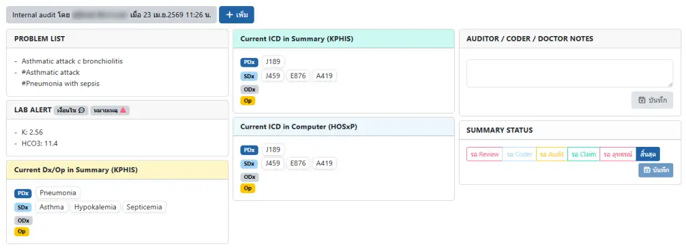
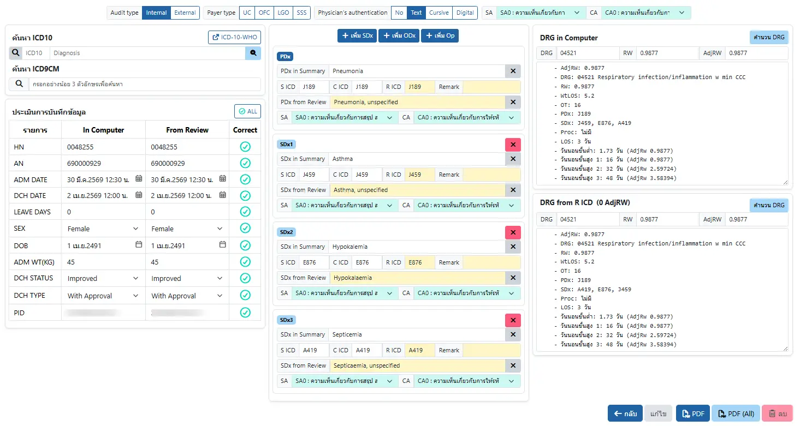

# ระบบประเมินการให้รหัสโรคผู้ป่วยใน SA/CA (Summary/Coding Audit)

ระบบสำหรับประเมินการให้รหัสโรค โดยใช้ข้อมูลการให้รหัสโรคใน HOSxP, คำวินิจฉัยโดยแพทย์ใน KPHIS และรหัสโรคใน KPHIS เพื่อให้ Auditor ประเมิน Summary Audit (SA) และ Coding Audit (CA) รวมถึงเปรียบเทียบ AdjRW จากการให้รหัสโรคดังกล่าวด้วย 

- ปุ่ม `+ เพิ่ม` : เพิ่มการ Audit ใหม่ (เวชระเบียน สามารถมีการ Audit ได้หลายครั้ง)
- กล่อง `PROBLEM LIST` : แสดง Problem list ทั้งหมดในเวชระเบียน (คัดรายการที่ซ้ำกันออกแล้ว) เช่นเดียวกับในระบบ [บันทึกการสรุปเวชระเบียน (In-Patient Summary)](ipd/summary.md)
- กล่อง `LAB ALERT` : แสดง Lab Alert ที่พบในเวชระเบียน เช่นเดียวกับในระบบ [บันทึกการสรุปเวชระเบียน (In-Patient Summary)](ipd/summary.md)
- กล่อง `Current Dx/Op on Summary (KPHIS)` : แสดงรายการ `คำวินิจฉัยโรค` ตามการสรุปเวชระเบียนใน KPHIS
- กล่อง `Current ICD in Summary (KPHIS)` : แสดงรายการ `รหัสโรค` ที่ Coder ได้ให้ไว้ใน KPHIS
- กล่อง `Current ICD in Computer (HOSxP)` : แสดงรายการ `รหัสโรค` ที่ Coder ได้ให้ไว้ใน HOSxP
- กล่อง `AUDITOR / CODER / DOCTOR NOTE` : ระบบข้อความสำหรับสื่อสารระหว่าง Auditor, Coder และแพทย์ผู้สรุปเวชระเบียน เช่นเดียวกับในระบบ [บันทึกการสรุปเวชระเบียน (In-Patient Summary)](ipd/summary.md)
- กล่อง `SUMMARY STATUS` : สำหรับกำหนดสถานะของเวชระเบียน เพื่อดำเนินการต่อไป

- `Audit Type` : กำหนดรายการ Audit แบบ Internal หรือ External audit
- `Payer Type` : กำหนดกองทุนเงินชดเชยค่ารักษาพยาบาล ได้แก่ `UC`(หลักประกันสุขภาพแห่งชาติ), `OFC`(เบิกได้/กรมบัญชีกลาง), `LGO`(สวัสดิการพนักงานส่วนท้องถิ่น) และ `SSS`(ประกันสังคม)
- `Physician's authentication` : กำหนดวิธีลงนามของแพทย์ ได้แก่ `No`(ไม่ได้ลงนาม), `Text`(ชื่อ-สกุล), `Cursive`(ลายเซ็น) และ `Digital`(ลายเซ็นติจิทัล),
- `SA` : การประเมิน Summary Audit ในภาพรวมของเวชระเบียน
- `CA` : การประเมิน Coding Audit ในภาพรวมของเวชระเบียน
- `ค้นหา` : กล่องสำหรับค้นหา รหัสโรค ICD10 และ ICD9CM
- `ประเมินการบันทึกข้อมูล` : รายการประเมินข้อมูลทั่วไปในเวชระเบียน
- การประเมิน PDx, SDx, ODx และ Op : บันทึกผลการประเมิน Summary Audit และ Coding Audit ในแต่ละการวินิจฉัย
- `DRG in Computer` : คำนวน DRG จากข้อมูล `In Computer` ทั้งหมด
- `DRG from R ICD` : คำนวน DRG จากการให้รหัสของ Auditor

ท่านสามารถลากข้อความ จากกล่อง `Current Dx/Op on Summary (KPHIS)`, `Current ICD in Summary (KPHIS)` และ `Current ICD in Computer (HOSxP)` ลงมายัง การประเมิน PDx, SDx, ODx และ Op ได้

และท่านก็สามารถลากข้อความ ใน `??? in Summary`, `S ICD`, `C ICD`, `R ICD`, `??? from Review` จาก PDx/SDx/ODx/Op หนึ่ง สลับกับอีก PDx/SDx/ODx/Op ได้ด้วย 

