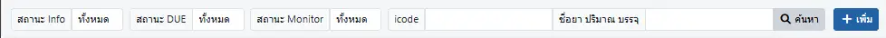
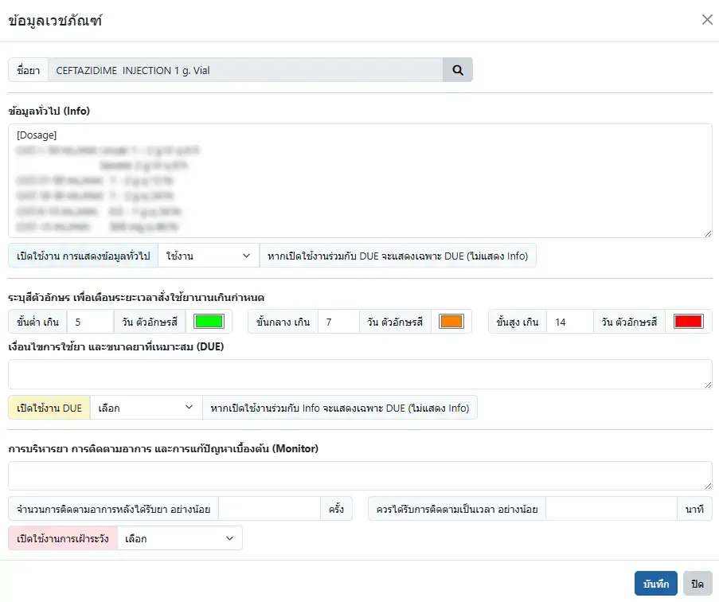
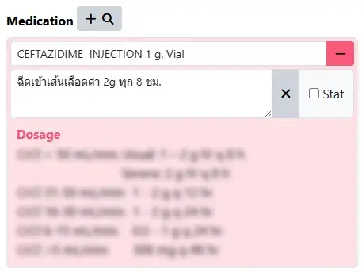
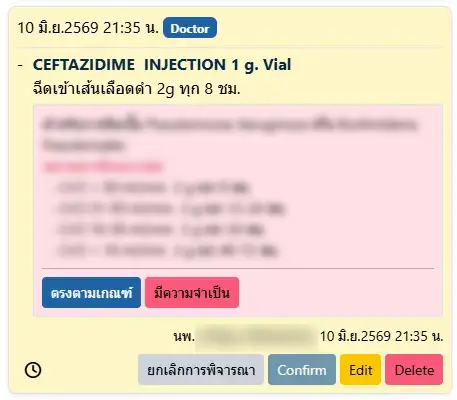
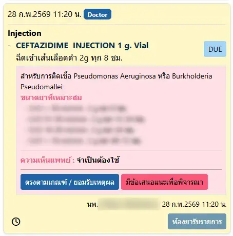
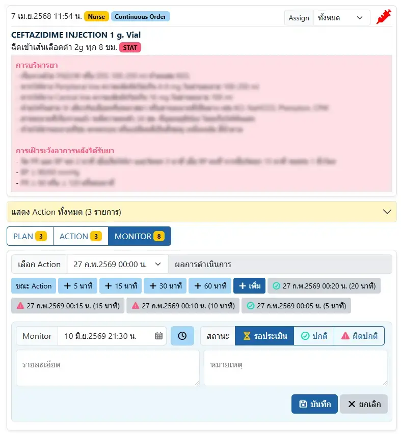

# Drug Information

ระบบสำหรับบันทึกรายละเอียดเวชภัณฑ์ยา 3 ด้าน
1. `ข้อมูลทั่วไป (Info)` : เป็นข้อมูลยา ที่จะแสดงเมื่อเลือกเวชภัณฑ์ยานั้นใน Order เพื่อเป็นข้อมูลให้รับทราบเท่านั้น
2. `เงื่อนไขการใช้ยา และขนาดยาที่เหมาะสม (DUE)` : เป็นข้อมูลเงื่อนไข ที่จะแสดงเมื่อเลือกเวชภัณฑ์ยานั้นใน Order และแพทย์ต้องยืนยัน หรือให้เหตุผลประกอบหากผิดเงื่อนไข รวมถึงเภสัชกรสามารถให้ความเห็นเพิ่มเติมให้แพทย์พิจาณาการใช้ยาต่อได้ด้วย
3. `การบริหารยา การติดตามอาการ และการแก้ปัญหาเบื้องต้น (Monitor)` : เป็นข้อมูลการบริหารยา ที่จะแสดงขณะเจ้าหน้าที่ให้บริการ (Action ใน Index Action) รวมถึงจำนวน/ระยะเวลาการติดตาม ที่เจ้าหน้าที่ต้องบันทึกใน Monitor (ใน Index Monitor)

ตัวกรองในการค้นหา ได้แก่
* `สถานะ Info` : เปิด/ปิด การใช้งาน `ข้อมูลทั่วไป (Info)`
* `สถานะ DUE` : เปิด/ปิด การใช้งาน `เงื่อนไขการใช้ยา และขนาดยาที่เหมาะสม (DUE)`
* `สถานะ Monitor` : เปิด/ปิด การใช้งาน `การบริหารยา การติดตามอาการ และการแก้ปัญหาเบื้องต้น (Monitor)`
* `icode` : ค้นหาด้วยรหัสเวชภัณฑ์ใน HOSxP
* `ชื่อยา ปริมาณ บรรจุ` : ค้นหาด้วยชื่อยา ปริมาณ หรือบรรจุ
* <i class="fas fa-magnifying-glass" style="color:orange;"></i> `ค้นหา` : เพื่อสั่งการค้นหา
* <i class="fas fa-plus" style="color:orange;"></i> `เพิ่ม` : เพิ่มรายการใหม่ 

ตัวอย่าง การเพิ่มรายการใหม่

ตัวอย่าง การแสดง `ข้อมูลทั่วไป (Info)` ขณะแพทย์เลือกยาที่เปิดใช้งาน

ตัวอย่าง การแสดง `เงื่อนไขการใช้ยา และขนาดยาที่เหมาะสม (DUE)` ก่อนที่แพทย์จะยืนยันรายการ ต้องพิจารณาว่า `ตรงตามเกณฑ์` หรือ `มีความจำเป็น` และให้เหตุผลประกอบความจำเป็นนั้น

ตัวอย่าง การแสดง `เงื่อนไขการใช้ยา และขนาดยาที่เหมาะสม (DUE)` ก่อนที่เภสัชกร จะรับรายการ โดยเภสัชกรสามารถ `มีข้อเสนอแนะเพื่อพิจารณา` ให้แพทย์พิจารณาใหม่ (โดยยังไม่รับรายการ) ได้

ตัวอย่าง การแสดง `การบริหารยา การติดตามอาการ และการแก้ปัญหาเบื้องต้น (Monitor)` เมื่อเจ้าหน้าที่ให้บริการ รวมถึงการ Monitor

ท่านสามารถระบุการเตือนการใช้เวชภัณฑ์ยา เกินเวลาที่กำหนดได้ ด้วยการตั้งค่าจำนวนวัน

`ชั้นต่ำ` `ขั้นกลาง` และ `ขั้นสูง`

ระบบจะแสดงชื่อเวชภัณฑ์ยาด้วยสีที่กำหนดใน Order

ท่านสามารถใช้ อักษรก้ามปู

`[`, `]` ครอบตัวอักษรที่ต้องการ เช่น `[Dosage]`

ระบบจะแสดงข้อความด้วย ตัวหนา + สีแดง ขณะแสดงผล เช่น Dosage

