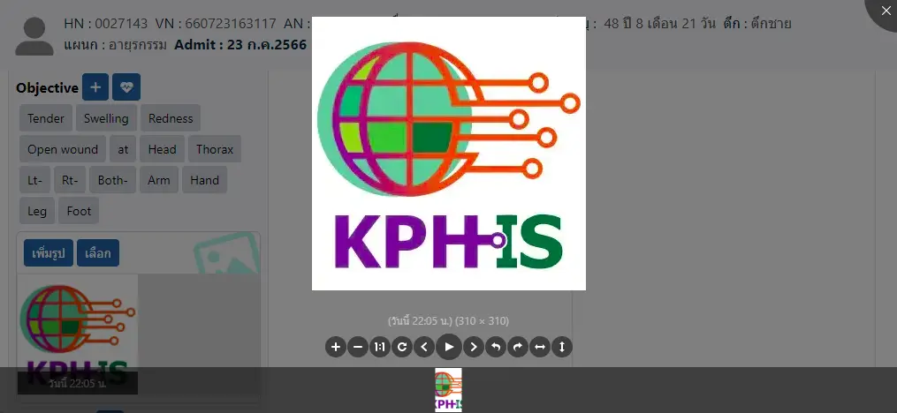
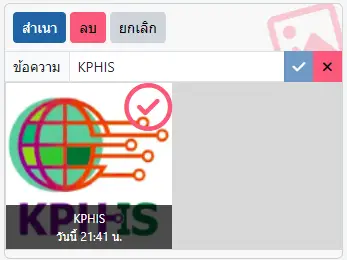

# ระบบรูปภาพ

ปัจจุบัน กล่องรูปภาพ สามารถใช้งานได้ที่
* [บันทึกคำสั่งแพทย์](opd-er/order.md) ในส่วน Progress Note หัวข้อ Objective
* [บันทึกความก้าวหน้าทางการพยาบาล (Nurse Note)](shared/focus-note.md) ในส่วน Assessment และ Evaluation
* [ขอคำปรึกษา (Consult)](ipd/consult.md) ในส่วน การปรึกษา และ การตอบกลับ
* [ประวัติผู้ป่วย ER](opd-er/medical-history.md)
* เมนู `Setting` <i class="fa fa-arrow-circle-right"></i> `Image Cache` สำหรับค้นหารูปภาพสำรองที่บันทึกไว้ในเครื่อง

## เพิ่มรูป
* คลิกที่ปุ่ม `เพิ่มรูป`
* เลือกรูปที่ต้องการจากแฟ้มรูปภาพ หรือถ่ายรูปด้วยกล้องหลัง (กรณีใช้งานบน Smart Phone หรือ Tablet)

    

## แสดงรูปภาพ
* คลิกที่รูป เพื่อแสดงภาพ พร้อมเครื่องมือ ย่อ, ขยาย, เต็มจอ, กลับด้าน, ตะแคง

    

## เลือกรูป
* คลิกที่ปุ่ม `เลือก`

    

* คลิกรูปที่ต้องการ จะมีเครื่องหมาย <i class="fa fa-check-circle-o" style="color:red;"></i>  
คลิกที่รูปอีกครั้ง จะเป็นการยกเลิกการเลือก  
หรือกดปุ่ม `ทั้งหมด` เพื่อเลือกรูปทั้งหมดในกล่อง
* หากเลือกเพียงภาพเดียว ท่านสามารถเพิ่มหรือแก้ไข `ข้อความ` ประกอบภาพได้

    

* ท่านสามารถเลือก
    - `สำเนา` ภาพที่เลือก เพื่อ `วาง` ในกล่องรูปภาพอื่นได้

        

    - <i class="fa fa-file-pdf-o" style="color:orange;"></i> `Full` : แสดงตัวอย่างรายงาน PDF แบบ 1 ภาพ ใน 1 หน้า A4
    - <i class="fa fa-file-pdf-o" style="color:orange;"></i> `Half` : แสดงตัวอย่างรายงาน PDF แบบ 2 ภาพ (บน-ล่าง) ใน 1 หน้า A4
    - <i class="fa fa-file-pdf-o" style="color:orange;"></i> `2-Cols` : แสดงตัวอย่างรายงาน PDF แบบ 2 Columns ใน 1 หน้า A4
    - `ลบ` ภาพที่เลือก ออกจากกล่อง
        

        หลังจาก `ลบ` ภาพยังคงอยู่ในระบบ  
        ท่านสามารถไป `เลือก` ภาพมาใช้ได้อีกครั้ง  
        ด้วย เมนู `Setting` <i class="fa fa-arrow-circle-right"></i> `Image Cache`
        
