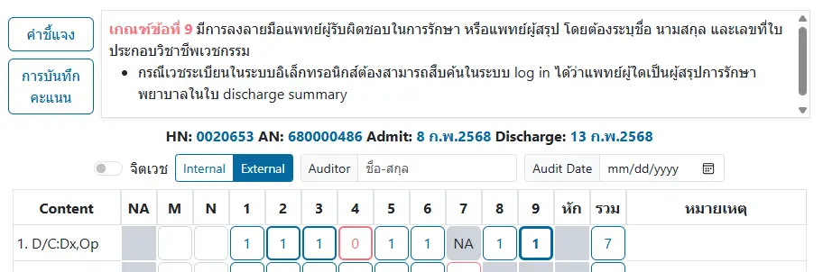
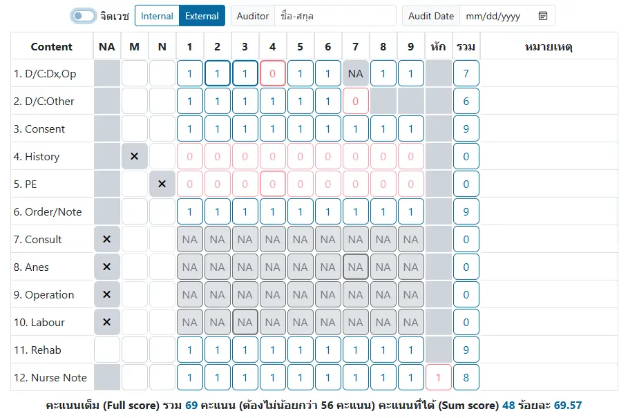

# ระบบทบทวนเวชระเบียนผู้ป่วยใน (IPD Medical Record Audit: MRA)

แสดง MRA ของ `AN` ที่เลือกไว้, ประกอบด้วย 3 ส่วน ได้แก่
* เลือกการประเมิน MRA ด้วยปุ่ม `+ เพิ่ม` และปุ่มรายการ MRA ที่ได้ประเมินไว้แล้ว
* กล่องแสดงคู่มือการประเมิน ในส่วน `คำชี้แจง`, `การบันทึกคะแนน` และเกณฑ์ตามข้อที่เลือกในตาราง
* ตารางการให้คะแนน

อ้างอิงเกณฑ์จาก คู่มือการตรวจประเมินคุณภาพเวชระเบียน (Medical Record Audit Guideline) 2563
โดยสถาบันรับรองคุณภาพสถานพยาบาล (องค์กรมหาชน), สภาการพยาบาล, กรมบัญชีกลาง, สำนักงานประกันสังคม และสำนักงานหลักประกันสุขภาพแห่งชาติ

<u>ตัวอย่าง</u> แสดงคู่มือของหัวข้อที่ 1.D/C:Dx,Op เกณฑ์ข้อที่ 9

ระบบ จะแสดงเกณฑ์ให้ท่านโดยอัตโนมัติ เมื่อคลิกที่ปุ่มตามเกณฑ์
และปุ่มในตารางที่ถูกเลือก จะมีขอบหนา และตัวอักษรเป็นตัวหนา

หากท่านใช้จอแสดงผลที่มีความกว้าง ไม่น้อยกว่า 1750px
ระบบจะแสดงรายงานที่ต้องใช้ตามเกณฑ์ให้ ที่ด้านขวาของจอ

## ตารางการให้คะแนน
ประกอบด้วย
* ตัวเลือก `จิตเวช` สำหรับเลือกเกณฑ์การประเมิน `ผู้ป่วยในปกติ` หรือ `ผู้ป่วยในจิตเวช`
* ตัวเลือก `Internal`,`External` สำหรับเลือกการประเมิน ภายในองค์กร หรือจากภายนอกองค์กร
* กล่องบันทึก `Auditor` และ `Audit Date` สำหรับการประเมินภายนอกเท่านั้น (การประเมินภายใน ระบบจะใช้ข้อมูลผู้ใช้งาน และวันที่ปัจจุบันโดยอัตโนมัติ)
* ตารางการให้คะแนน
    1. ผู้ป่วยใน: มี 12 หัวข้อ และสามารถ `NA` ได้ 5 หัวข้อ
    2. ผู้ป่วยในจิตเวช: มี 11 หัวข้อ และสามารถ `NA` ได้ 4 หัวข้อ

<u>ตัวอย่าง</u> แสดงตาราง ที่กำหนด `NA` ในหัวข้อที่ 7,8,9 และ 10, ยกเลิก `NA` ในหัวข้อที่ 11, ให้ `M` ในหัวข้อที่ 4, ให้ `N` ในหัวข้อที่ 5,
ให้ `NA` ในหัวข้อที่ 1 เกณฑ์ข้อที่ 7, ให้ `0` ในหัวข้อที่ 1 เกณฑ์ข้อที่ 4 และหัวข้อที่ 2 เกณฑ์ข้อที่ 7 และมีการหักคะแนนในหัวข้อที่ 12

## วิธีการให้คะแนน
- การคลิกที่ปุ่ม ครั้งแรก จะแสดงเกณฑ์การให้คะแนน ในกล่องแสดงคู่มือด้านบน (ปุ่มจะมีขอบหนา และตัวอักษรเป็นตัวหนา)
- การคลิกทีปุ่ม ครั้งต่อมา จะเปลี่ยนค่าในปุ่ม
    1. ปุ่ม `NA` ทำให้ทุกรายการในหัวข้อ กลายเป็น `NA` หรือยกเลิกการ `NA`
    1. ปุ่ม `M` (Missing),`N` (No) ทำให้ทุกรายการในหัวข้อ มีคะแนน `1` หรือ `0`
    1. ปุ่มให้คะแนน จาก `1` <i class="fa fa-arrow-circle-right"></i> `0` <i class="fa fa-arrow-circle-right"></i> `NA` (เฉพาะเกณฑ์ที่่สามารถ `NA` ได้) ตามลำดับ
    1. ปุ่มหักคะแนน จาก `0` <i class="fa fa-arrow-circle-right"></i> `1` เพื่อหักคะแนน

ปุ่มคะแนน ที่สามารถ `NA` ได้ จะมีขอบหนากว่าปุ่มคะแนนทั่วไป

ปุ่มคะแนน ในหัวข้อที่กำหนดค่า `NA`,`M` หรือ `N` ไว้ (มีเครื่องหมาย <i class="fa fa-times"></i>) จะแก้ไขไม่ได้ทั้งหัวข้อ จนกว่าจะยกเลิก `NA`,`M` และ `N`

ไม่สามารถเลือก `M` และ `N` พร้อมกัน ในหัวข้อเดียวกัน

