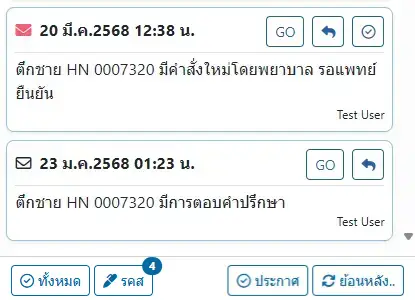

# ระบบข้อความ
แสดงจำนวนข้อความใหม่ที่ยังไม่ได้อ่าน ที่เมนูด้านขวา ใกล้กับชื่อผู้ใช้

เมื่อคลิกที่เมนูรูปจดหมาย จะมีเมนูย่อย ได้แก่

* ประกาศ : กล่องจดหมาย ประกาศจากระบบ
* หอผู้ป่วย : กล่องจดหมาย ถึงหอผู้ป่วยที่ท่านลงทะเบียนไว้
* แผนก : กล่องจดหมาย ถึงแผนกที่ท่านลงทะเบียนไว้
* ส่วนตัว : กล่องจดหมาย ถึงท่านโดยเฉพาะ
* <i class="fa fa-pencil-square-o"></i> : เขียนข้อความใหม่
* <i class="fa fa-cog"></i> : ตั้งค่าการรับข่าวสาร

## การตั้งค่า

* เลือกหอผู้ป่วย และแผนก ที่ท่านต้องการรับข่าวสาร (เลือกได้หลายหอผู้ป่วย/แผนก)
* กดปุ่ม <i class="fa fa-save"></i> บันทึก

การตั้งค่านี้ ผูกพันกับผู้ใช้งาน  
ไม่ได้จดจำไว้ในเครื่อง

## การเขียนข้อความ

* `ข้อความ` : เนื้อหาข้อความที่ต้องการส่ง
* `ถึงเจ้าหน้าที่` : ระบุเจ้าหน้าที่ปลายทาง
* `ถึงหอผู้ป่วย` : ระบุหอผู้ป่วยปลายทาง
* `ถึงแผนก` : ระบุแผนกปลายทาง
* `แนบ URL` : ระบุ ที่ตั้งเวปไซต์ (URL) ที่ต้องการแนบพร้อมข้อความ รองรับที่ตั้งภายในและภายนอกโปรแกรม

ท่านสามารถส่งข้อความเดียว ไปถึงเจ้าหน้าที่ ถึงหอผู้ป่วย และแผนก ได้ในคราวเดียวกัน    
หากท่านไม่ระบุเจ้าหน้าที่, หอผู้ป่วย, แผนก ระบบจะส่งเป็นประกาศ ถึงผู้ใช้งานทุกคนในระบบ

การแนบ URL มี 2 รูปแบบ ได้แก่
1. `ภายใน` จะต้องมีเครื่องหมาย `#` นำหน้า เช่น `#/info`
1. `ภายนอก`  จะต้องเป็น URL ที่ถูกต้องตามมาตรฐาน นำหน้าด้วย `http://` หรือ `https://`

ปุ่ม <i class="fa fa-magic"></i> ในการแนบ URL  
จะสำเนาที่ตั้ง (URL) ปัจจุบันของโปรแกรม ให้โดยอัตโนมัติ

## การจัดการข้อความ

* <i class="fa fa-envelope" style="color:red;"></i> : ข้อความที่ `ยังไม่ได้อ่าน`
* <i class="fa fa-envelope"></i> : ข้อความที่ `อ่านแล้ว`
* `GO` : ไปยัง URL ที่แนบ
* <i class="fa fa-reply"></i> : ตอบกลับ
* <i class="fa fa-check-circle-o"></i> : กำหนดว่า `อ่านแล้ว`

ปุ่มด้านล่าง
* <i class="fa fa-check-circle-o"></i> ทั้งหมด : กำหนดว่า `อ่านแล้ว` ทั้งหมดทุกหัวข้อ
* <i class="fa fa-pencil"></i> รคส : เปิดหน้าต่าง ยืนยันการ รคส (สำหรับแพทย์)
* <i class="fa fa-check-circle-o"></i> ประกาศ : กำหนดว่า `อ่านแล้ว` ทั้งหมดในหัวข้อ `ประกาศ`
* <i class="fa fa-refresh"></i> ย้อนหลัง.. : โหลดข้อความเก่า

การกดปุ่ม `GO` หรือ ตอบกลับด้วยปุ่ม <i class="fa fa-reply"></i>  
จะถือว่า `อ่านแล้ว` โดยอัตโนมัติ

## การตอบกลับ
การตอบกลับ สามารถอ้างอิงข้อความได้เพียง 1 ชั้น เช่น User อ้างอิงข้อความของ Test User ในการตอบกลับ  
ส่งไปหา TEST DOCTOR ดังรูป

TEST DOCTOR จะได้รับข้อความ ดังรูป

