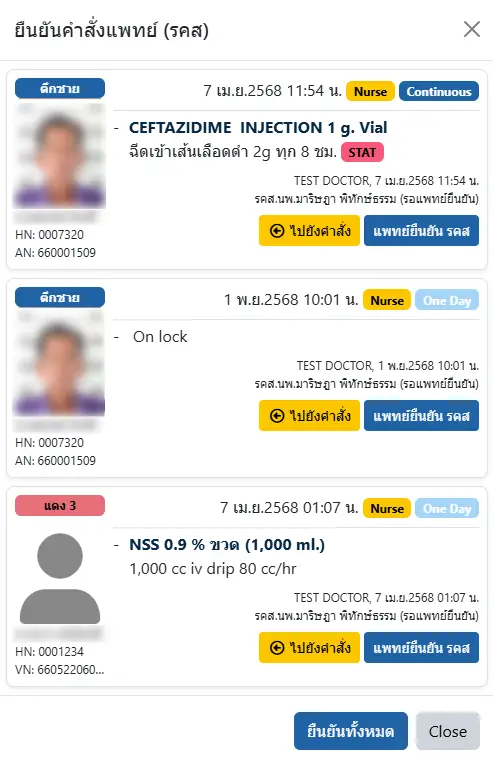

# ระบบจัดการ รคส
แสดงจำนวนคำสั่ง รคส.ที่ยังไม่ได้รับการยืนยัน ที่เมนูด้านขวา ใกล้กับชื่อผู้ใช้ และท่านสามารถกดปุ่ม <i class="fas fa-arrows-rotate"></i> เพื่อให้ระบบนับจำนวนรายการ รคส ของท่านให้อีกครั้ง

เมื่อคลิกที่เมนู <i class="fas fa-marker"></i> รคส ระบบจะแสดงหน้าต่างรายการคำสั่ง รคส ทั้งในระบบผู้ป่วยในและผู้ป่วยอุบัติเหตุและฉุกเฉิน ในหน้าต่างเดียวกัน

แพทย์สามารถ `ไปยังคำสั่ง` เพื่อดูรายละเอียดในแฟ้มผู้ป่วย หรือกดปุ่ม `แพทย์ยืนยัน รคส` เพื่อยืนยันรายการที่ต้องการ หรือกดปุ่ม `ยืนยันทั้งหมด` ด้านล่าง เพื่อยืนยันทุกรายการก็ได้