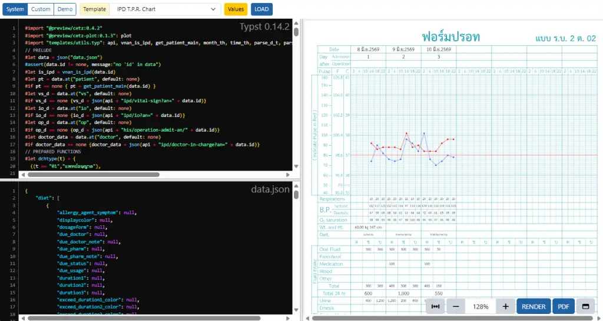
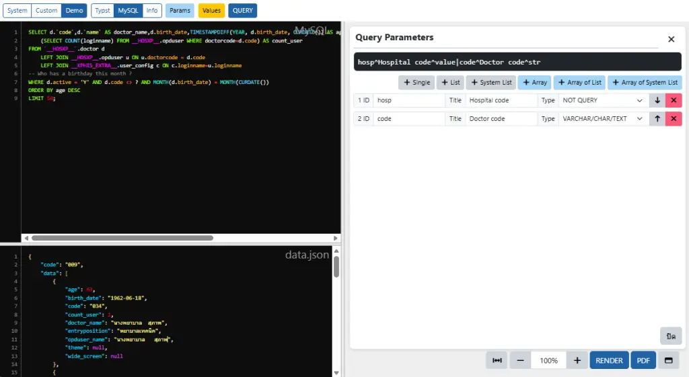
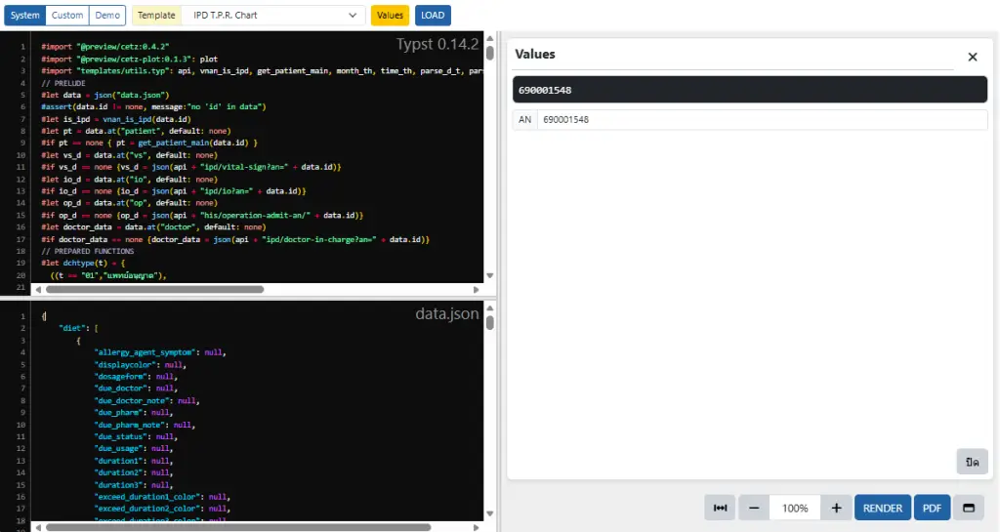

# ระบบออกแบบเอกสาร

ระบบสำหรับทดลองสร้างรายงาน โดยอ้างอิงจากรายงานในระบบ
- รายงาน เขียนด้วยภาษา [Typst](https://typst.app/docs)
- ชุดข้อมูล ในรูปแบบ [json](https://www.json.org/)

ประกอบด้วย 4 ส่วน ได้แก่
1. เครื่องมือด้านบน ประกอบด้วย
    * `System / Custom / Demo` : สำหรับเลือกประเภทรายงาน
    * `Typst / MySQL / Info` : สำหรับเลือกการแสดงผล code ด้านบนซ้าย
    * `Template` : สำหรับเลือกรายงานที่ต้องการ
    * `Params` : สำหรับแสดงรายการ parameters
    * `Values` : สำหรับแสดงรายการ values
    * `QUERY` : ปุ่มสำหรับเรียกข้อมูล `data.json` จากเครื่องแม่ข่ายด้วย MySQL, Params และ Values ที่ระบุ 
    * `LOAD` : ปุ่มสำหรับเรียกข้อมูล `Report` และ `ID`/`AN`/`VN` จากเครื่องแม่ข่าย

1. หน้าต่างด้าน`ซ้ายบน` สามารถแสดง code 3 ประเภท ได้แก่
    - `Typst` สำหรับแก้ไขรายงาน ด้วยภาษา [Typst](https://typst.app/docs)
    - `MySQL` สำหรับแก้ไข MySQL ที่จะแทนที่ `__HOSXP__`, `__KPHIS__`, `__KPHIS_LOG__`, `__KPHIS_EXTRA__` ด้วยชื่อฐานข้อมูลจาก config
    - `Info` สำหรับแสดงคุ่มือการใช้รายงานนั้นๆ
1. `data.json` : หน้าต่างด้าน`ซ้ายล่าง` สำหรับแก้ไขชุดข้อมูล [json](https://www.json.org/)
1. ตัวอย่างรายงาน : หน้าต่างด้าน`ขวา` สำหรับแสดงตัวอย่างรายงาน
1. เครื่องมือแสดงรายงานด้านล่างขวา
    * <i class="fas fa-arrow-left" style="color:orange;"></i><i class="fas fa-arrow-right" style="color:orange;"></i> : ปุ่มสำหรับปรับขนาดรายงานให้เต็มความกว้าง
    * `[-][100%][+]` : ปุ่มสำหรับย่อและขยายขนาดของตัวอย่างรายงาน
    * `RENDER` : ปุ่มสำหรับสร้างรายงานและแสดงบนหน้าจอ
    * `PDF` : ปุ่มสำหรับสร้างรายงาน เป็นไฟล์ PDF
    * <i class="fas fa-window-maximize" style="color:orange;"></i> : ปุ่มสำหรับปิด/เปิดส่วนแสดงรายงาน

ตัวอย่างการกรอก parameters

ระบบจะนำ parameter ป้อนให้ Parameterized Query ตามลำดับ `?` ใน MySQL โดย parameter มี 6 ชนิด ได้แก่
- `Single` : ใช้ร่วมกับ `?` โดยตรง
- `List` : ใช้ร่วมกับ `?` ด้วย `Value` และ `Label` ที่กำหนดไว้
- `System List` : ใช้ร่วมกับ `?` ด้วย `Value` และ `Label` จากตารางใน HOSxP และ KPHIS
- `Array` : ใช้ร่วมกับ `IN (?)` ด้วย values หลายค่าได้ เช่นเดียวกับ `IN (?,?,?)`
- `Array of List` : ใช้ร่วมกับ `IN (?)` ด้วย `Value` และ `Label` ที่กำหนดไว้
- `Array of System List` : ใช้ร่วมกับ `IN (?)` ด้วย `Value` และ `Label` จากตารางใน HOSxP และ KPHIS

ตัวอย่างการกรอก values

- values สำหรับ parameter ชนิด `Single`, `List` และ `System List` มีได้เพียงค่าเดียว
- values สำหรับ parameter ชนิด `Array`, `Array of List` และ `Array of System List` มีได้หลายค่า คั่นด้วย `,`

ท่านสามารถสร้างรายงานด้วย Typst เต็มรูปแบบ  
ได้ที่ <a href="https://typst.app" target="_blank">https://typst.app</a>

