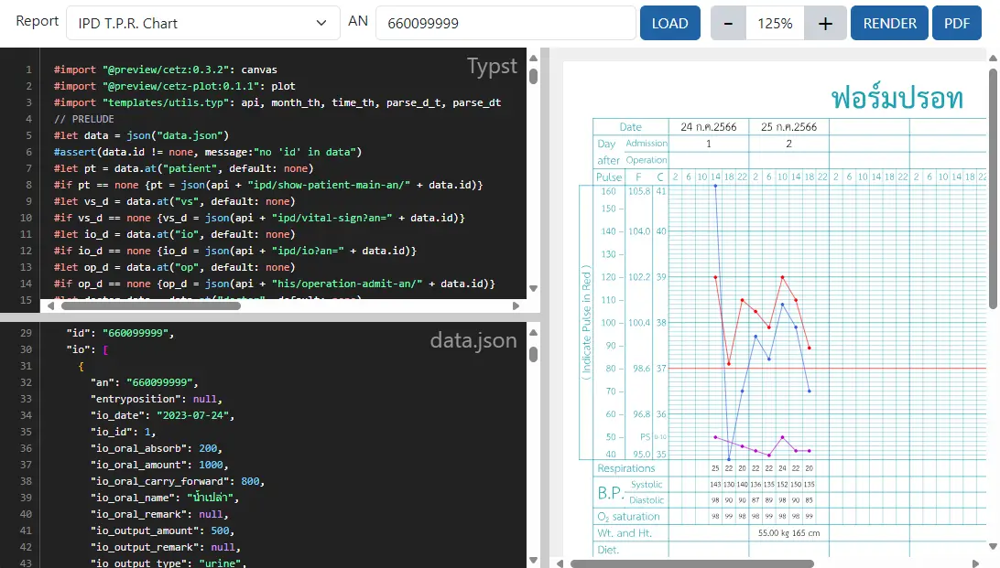

# ระบบออกแบบเอกสาร

ระบบสำหรับทดลองสร้างรายงาน โดยอ้างอิงจากรายงานในระบบ
- รายงาน เขียนด้วยภาษา [Typst](https://typst.app/docs)
- ชุดข้อมูล ในรูปแบบ [json](https://www.json.org/)

ประกอบด้วย 4 ส่วน ได้แก่
1. เครื่องมือด้านบน ประกอบด้วย
    * `Report` : สำหรับเลือกรายงานที่มีในระบบ
    * `ID`/`AN`/`VN` : สำหรับระบุแหล่งข้อมูล เช่น รายงานผู้ป่วยใน ใช้ AN ในการระบุแหล่งข้อมูล
    * `LOAD` : ปุ่มสำหรับเรียกข้อมูล `Report` และ `ID`/`AN`/`VN` จากเครื่องแม่ข่าย
    * `[-][100%][+]` : ปุ่มสำหรับย่อและขยายขนาดของตัวอย่างรายงาน
    * `RENDER` : ปุ่มสำหรับสร้างรายงานและแสดงบนหน้าจอ
    * `PDF` : ปุ่มสำหรับสร้างรายงาน เป็นไฟล์ PDF
1. `Typst` : หน้าต่างด้าน`ซ้ายบน` สำหรับแก้ไขรายงาน ด้วยภาษา [Typst](https://typst.app/docs)
1. `data.json` : หน้าต่างด้าน`ซ้ายล่าง` สำหรับแก้ไขชุดข้อมูล [json](https://www.json.org/)
1. ตัวอย่างรายงาน : หน้าต่างด้าน`ขวา` สำหรับแสดงตัวอย่างรายงาน

ท่านสามารถสร้างรายงานด้วย Typst เต็มรูปแบบ  
ได้ที่ <a href="https://typst.app" target="_blank">https://typst.app</a>

