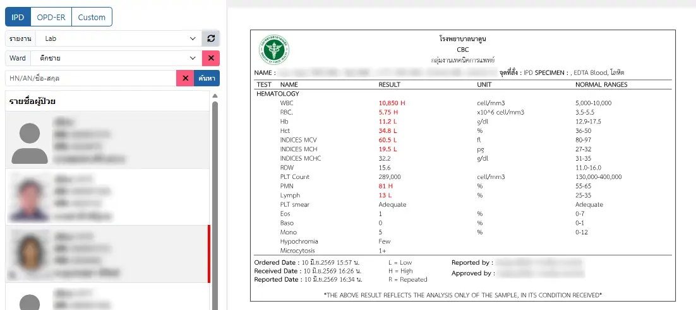
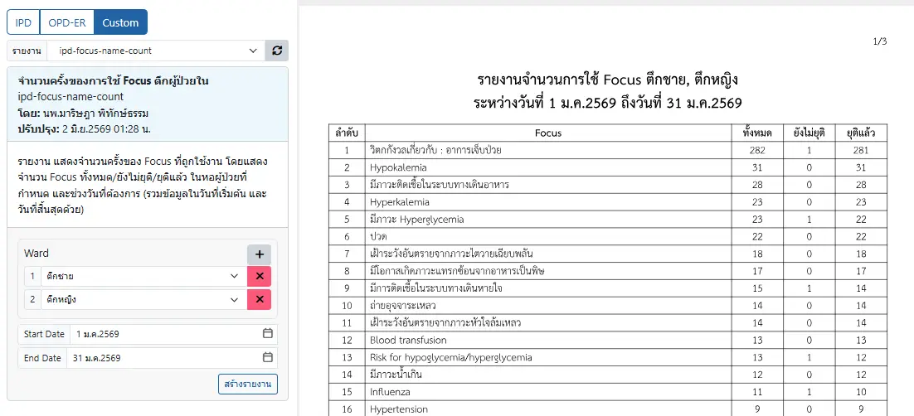

# ระบบแสดงรายงาน (Report Viewer)

ระบบสำหรับแสดงรายงาน ประกอบด้วย 2 ประเภท
1. รายงาน IPD / OPD-ER

เป็นรายงานในระบบ ที่สามารถแก้ไขได้โดยผู้ดูแลระบบเท่านั้น ผู้ใช้งานเพียงเลือก `รายงาน`, `Ward` ที่ต้องการ ระบบจะแสดงรายการผู้ป่วยให้ท่านเลือก และแสดงรายงานเมื่อคลิกที่รายการผู้ป่วยที่ต้องการ

2. รายงาน Custom

เป็นรายงานที่สร้างขึ้นเองจาก [ระบบออกแบบเอกสาร (Report Designer)](report-designer.md) โดยที่ผู้ใช้งานเพียงกรอกข้อมูลที่รายงานต้องการ ระบบจะสร้างรายงานให้ 
