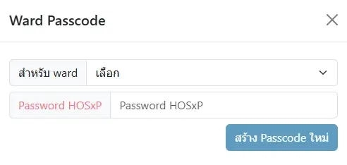

# การใช้งานทั่วไป

## การเข้าสู่ระบบ

1. กรอก `username` และ `password` ด้วยชื่อและรหัสผ่านเดียวกับการเข้าใช้งาน HOSxP
1. กดปุ่ม `เข้าสู่ระบบ`

โปรแกรมมีการตรวจสภาพการการเชื่อมต่อกับเครื่องแม่ข่ายตลอดเวลา หากขาดการเชื่อมต่อ ระบบจะให้ท่าน `ออกจากระบบ` โดยอัตโนมัติ

## การใช้งานระบบต่างๆ

ประกอบด้วยเมนูย่อย ได้แก่ `แพทย์`,`พยาบาล`,`เภสัชกร`,`อื่นๆ`,`Setting`,`ข้อความ` และ `ผู้ใช้งาน`
<!-- ANCHOR: service-visibility -->

ในหนังสือเล่มนี้ จะแสดงทุกระบบของ KPHIS  
แต่ในการใช้งานจริง บางเครื่องมือหรือปุ่มกด จะ `ไม่ปรากฏให้เห็น`  
หากระบบ `ไม่ได้เปิดให้บริการ` หรือท่าน `ไม่มีสิทธิการใช้งาน` ระบบนั้น

<!-- ANCHOR_END: service-visibility -->
### เมนูเจ้าหน้าที่ `แพทย์`

* `รายการผู้ป่วยใน` : แสดงรายการผู้ป่วยใน ที่ยังไม่จำหน่าย จำแนกจาก `แผนก`, [passcode](#ward-passcode), `แพทย์เจ้าของไข้`, `แพทย์ผู้ตอบ Consult` และ `HN, AN, ชื่อ-สกุล` ผู้ป่วย
* `Order ล่วงหน้า` : แสดงรายการ `ใบ Order` หรือ `Template`(Order สั้นๆ ที่สามารถใช้ซ้ำได้) ที่สร้างไว้ล่วงหน้า ด้วยการ `เพิ่มใบ Order ใหม่`
* `รายการผู้ป่วย Consult` : แสดงรายการผู้ป่วยที่มีการขอ `คำปรึกษา` เข้ามา จำแนกตาม `แผนกที่รับ Consult`, `แพทย์ผู้รับ Consult`, `แพทย์ผู้ตอบ Consult` และ `HN, AN, ชื่อ-สกุล` ผู้ป่วย
* [รายการผู้ป่วย ER](opd-er/order-list.md) : แสดงรายการ `ผู้ป่วยนอก/อุบัติเหตุ` ที่เข้าสู่ระบบแล้ว ด้วยการ `เพิ่มใบ Order ใหม่` และยังไม่จำหน่าย จำแนกตาม `วันที่บันทึกรายการ`, `วันที่ส่งตรวจ`, `HN`, `QN`, `เตียง`, และ `สถานะ` ผู้ป่วย

### เมนูเจ้าหน้าที่ `พยาบาล`

* `รายการผุ้ป่วยใน` : แสดงรายการผู้ป่วยใน ที่ยังไม่จำหน่าย จำแนกจาก `แผนก`, [passcode](#ward-passcode), `แพทย์เจ้าของไข้`, และ `HN, AN, ชื่อ-สกุล` ผู้ป่วย
* `IPD Vital Sign` : แสดงรายการผู้ป่วยใน จำแนกตาม `หน่วยงาน` และสามารถบันทึกข้อมูล `Vital Sign` ผู้ป่วยได้
* `IPD Nurse Planning` : แสดงรายการ `แผนการพยาบาล` ผู้ปวยใน จำแนกตาม `แผนก`, `วันที่`, `สุถานะ` และ `HN, AN, ชื่อ-สกุล` ผู้ป่วย
* `Order ล่วงหน้า` : แสดงรายการ `ใบ Order` หรือ `Template`(Order สั้นๆ ที่สามารถใช้ซ้ำได้) ที่สร้างไว้ล่วงหน้า ด้วยการ `เพิ่มใบ Order ใหม่`
* `รายการผุ้ป่วย Consult` : แสดงรายการผู้ป่วยที่มีการขอ `คำปรึกษา` เข้ามา จำแนกตาม `แผนกที่รับ Consult`, `แพทย์ผู้รับ Consult`, `แพทย์ผู้ตอบ Consult` และ `HN, AN, ชื่อ-สกุล` ผู้ป่วย
* [รายการผู้ป่วย ER](opd-er/order-list.md) : แสดงรายการ `ผู้ป่วยนอก/อุบัติเหตุ` ที่เข้าสู่ระบบแล้ว ด้วยการ `เพิ่มใบ Order ใหม่` และยังไม่จำหน่าย จำแนกตาม `วันที่บันทึกรายการ`, `วันที่ส่งตรวจ`, `HN`, `QN`, `เตียง`, และ `สถานะ` ผู้ป่วย
* `ER Vital Sign` : แสดงรายการผู้ป่วยนอก/อุบัติเหตุ สามารถบันทึกข้อมูล `Vital Sign` ผู้ป่วยได้
* `ER Nurse Planning` : แสดงรายการ `แผนการพยาบาล` ผู้ปวยนอก/อุบัติเหตุ จำแนกตาม `วันที่`, `สุถานะ` และ `HN, AN, ชื่อ-สกุล` ผู้ป่วย

### เมนูเจ้าหน้าที่ `เภสัชกร` 

* `Screen ใบสั่งยา` : โปรแกรม Screen ใบสั่งยา ซึ่งสามารถแสดง การแพ้ยา, Drug Interaction, แจ้งเตือนการใช้ยาซ้ำซ้อน รวมถึง แสดงประวัติผู้ป่วยเรียงตามใบสั่งยา และประวัติผลการตรวจทางห้องปฏิบัติการที่สำคัญ
* `IPD Order` : แสดงรายการใบสั่งยาผู้ป่วยใน โดยสามารถ Update อัตโนมัติ พร้อมเสียงเตือน จำแนกตาม `แผนก`, `แพทย์เจ้าของไข้`, `ช่วงวันที่ Order` และ `HN, AN, ชื่อ-สกุล` ผู้ป่วย
* `รายการผู้ป่วยใน` : แสดงรายการผู้ป่วยใน ที่ยังไม่จำหน่าย จำแนกจาก `แผนก`, `แพทย์เจ้าของไข้`, `การประเมินข้อมูลแพ้ยาใบแรกรับ` และ `HN, AN, ชื่อ-สกุล` ผู้ป่วย
* `Order ล่วงหน้า` : แสดงรายการ `ใบ Order` หรือ `Template`(Order สั้นๆ ที่สามารถใช้ซ้ำได้) ที่สร้างไว้ล่วงหน้า ด้วยการ `เพิ่มใบ Order ใหม่`
* `ER Order` : แสดงรายการใบสั่งยาผู้ป่วยนอก/อุบัตเหตุ โดยสามารถ Update อัตโนมัติ พร้อมเสียงเตือน จำแนกตาม `แพทย์เจ้าของไข้`, `ช่วงวันที่ Order` และ `HN, VN, ชื่อ-สกุล` ผู้ป่วย
* [รายการผู้ป่วย ER](opd-er/order-list.md) : แสดงรายการ `ผู้ป่วยนอก/อุบัติเหตุ` ที่เข้าสู่ระบบแล้ว และยังไม่จำหน่าย จำแนกตาม `วันที่บันทึกรายการ`, `วันที่ส่งตรวจ`, `HN`, `QN`, `เตียง`, และ `สถานะ` ผู้ป่วย

### เมนูเจ้าหน้าที่ `อื่นๆ`  

* `รายการผู้ป่วยใน` : แสดงรายการผู้ป่วยใน ที่ยังไม่จำหน่าย จำแนกจาก `แผนก`, [passcode](#ward-passcode), `แพทย์เจ้าของไข้` และ `HN, AN, ชื่อ-สกุล` ผู้ป่วย
* `Order ล่วงหน้า` : แสดงรายการ `ใบ Order` หรือ `Template`(Order สั้นๆ ที่สามารถใช้ซ้ำได้) ที่สร้างไว้ล่วงหน้า ด้วยการ `เพิ่มใบ Order ใหม่`
* [รายการผู้ป่วย ER](opd-er/order-list.md) : แสดงรายการ `ผู้ป่วยนอก/อุบัติเหตุ` ที่เข้าสู่ระบบแล้ว และยังไม่จำหน่าย จำแนกตาม `วันที่บันทึกรายการ`, `วันที่ส่งตรวจ`, `HN`, `QN`, `เตียง`, และ `สถานะ` ผู้ป่วย

### เมนู `Setting` 

* `Template Nurse` : บันทึก Template สำหรับการกรอกข้อมูลทางการพยาบาล เช่น `กลุ่มอาการ`, `ปัญหา (Focus)`, `เป้าหมาย (Goal)` และ `Intervention` 
* `จัดการผู้ใช้งาน` : แสดงรายการ `ผู้ใช้งาน` จาก HOSxP และสามารถกำหนด `บทบาท (Role)` ให้กับผู้ใช้งานได้
* `จัดการบทบาท` : แสดงรายการ `บทบาท (Role)` และสามารถกำหนด `สิทธิ (Permission)` ให้กับบทบาทได้
* `Report Designer` : โปรแกรมสำหรับทดสอบการสร้างรายงานต่างๆ
* `Image Cache` : แสดงรายการรูปภาพ ที่อุปกรณ์นี้เคยถ่ายรูปไว้

### เมนู `ชื่อผู้ใช้งาน`  

* `Light|Dark|Auto` : เปลี่ยน Theme ของโปรแกรม เป็นแบบ `โทนสีขาว`,`โทรสีดำ`,`ตาม Browser`
* `Update` : โปรแกรมจะค้นหาการ Update, หากค้นพบ จะ Update ให้ทันที
* `Clear Caches and Reload` : ล้างตัวโปรแกรมออกจาก Web Browser และโหลดใหม่จากเครื่องแม่ข่าย
* `ออกจากระบบ` : ออกจากระบบ และล้างข้อมูลส่วนบุคคล

### Ward Passcode
ระบบ `Passcode` ใช้สำหรับปกปิดการแสดง `แผนก` ที่ต้องการ (`แผนก` ที่มี `Passcode` กำหนดไว้ จะไม่ปรากฏในกล่องตัวเลือก `แผนก`)

หากใส่รหัส `Passcode` ของ `แผนก` นั้นๆ ได้ถูกต้อง ระบบจะแสดงข้อมูลของ `แผนก` ที่ปกปิดนั้นให้  

การสร้าง `Passcode` สามารถทำได้ ด้วยการเลือก `สำหรับ ward` เป็น `แผนก` ที่ต้องการปกปิด หลังจากยืนยันรหัสผ่านของท่าน และกดปุ่ม `สร้าง Passcode ใหม่` ระบบจะส่ง `Passcode` ให้ท่าน

* การสร้าง `Passcode` ทำได้เฉพาะผู้ได้รับสิทธิจากผู้ดูแลระบบเท่านั้น  
* `Passcode` ของแต่ละ `แผนก` มีได้แค่รหัสเดียว, หากสร้างใหม่ จะยกเลิก `Passcode` เก่าทันที

