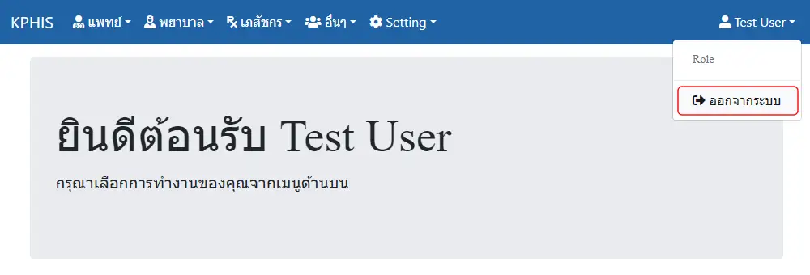

# การใช้งานทั่วไป

## การเข้าสู่ระบบ

1. กรอก `username` และ `password` เดียวกับการเข้าใช้งาน HOSxP
1. กดปุ่ม `เข้าสู่ระบบ`

## การใช้งานระบบต่างๆ

* เมนูสำหรับ `แพทย์` ประกอบด้วย
    * `รายการผู้ป่วยใน` : แสดงรายการผู้ป่วยใน ที่ยังไม่จำหน่าย จำแนกจาก `แผนก`, `แพทย์เจ้าของไข้`, `แพทย์ผู้ตอบ Consult` และ `HN, AN, ชื่อ-สกุล` ผู้ป่วย
    * `Order ล่วงหน้า` : แสดงรายการ `ใบ Order` หรือ `Template`(Order สั้นๆ ที่สามารถใช้ซ้ำได้) ที่สร้างไว้ล่วงหน้า ด้วยการ `เพิ่มใบ Order ใหม่`
    * `รายการผู้ป่วย Consult` : แสดงรายการผู้ป่วยที่มีการขอ `คำปรึกษา` เข้ามา จำแนกตาม `แผนกที่รับ Consult`, `แพทย์ผู้รับ Consult`, `แพทย์ผู้ตอบ Consult` และ `HN, AN, ชื่อ-สกุล` ผู้ป่วย
    * `ER` : แสดงรายการ `ผู้ป่วยนอก/อุบัติเหตุ` ที่เข้าสู่ระบบแล้ว ด้วยการ `เพิ่มใบ Order ใหม่` และยังไม่จำหน่าย จำแนกตาม `วันที่บันทึกรายการ`, `วันที่ส่งตรวจ`, `HN`, `QN`, `เตียง`, และ `สถานะ` ผู้ป่วย

* เมนูสำหรับ `พยาบาล` ประกอบด้วย
    * `รายการผุ้ป่วยใน` : แสดงรายการผู้ป่วยใน ที่ยังไม่จำหน่าย จำแนกจาก `แผนก`, `แพทย์เจ้าของไข้`, และ `HN, AN, ชื่อ-สกุล` ผู้ป่วย
    * `Vital Sign` : แสดงรายการผู้ป่วยใน จำแนกตาม `หน่วยงาน` และสามารถบันทึกข้อมูล `Vital Sign` ผู้ป่วยได้
    * `Nurse Planning` : แสดงรายการ `แผนการพยาบาล` ผู้ปวยใน จำแนกตาม `แผนก`, `วันที่`, `สุถานะ` และ `HN, AN, ชื่อ-สกุล` ผู้ป่วย
    * `Order ล่วงหน้า` : แสดงรายการ `ใบ Order` หรือ `Template`(Order สั้นๆ ที่สามารถใช้ซ้ำได้) ที่สร้างไว้ล่วงหน้า ด้วยการ `เพิ่มใบ Order ใหม่`
    * `รายการผุ้ป่วย Consult` : แสดงรายการผู้ป่วยที่มีการขอ `คำปรึกษา` เข้ามา จำแนกตาม `แผนกที่รับ Consult`, `แพทย์ผู้รับ Consult`, `แพทย์ผู้ตอบ Consult` และ `HN, AN, ชื่อ-สกุล` ผู้ป่วย
    * `ER` : แสดงรายการ `ผู้ป่วยนอก/อุบัติเหตุ` ที่เข้าสู่ระบบแล้ว ด้วยการ `เพิ่มใบ Order ใหม่` และยังไม่จำหน่าย จำแนกตาม `วันที่บันทึกรายการ`, `วันที่ส่งตรวจ`, `HN`, `QN`, `เตียง`, และ `สถานะ` ผู้ป่วย
    * `ER Nurse Planning` : แสดงรายการ `แผนการพยาบาล` ผู้ปวยนอก/อุบัติเหตุ จำแนกตาม `วันที่`, `สุถานะ` และ `HN, AN, ชื่อ-สกุล` ผู้ป่วย

* เมนูสำหรับ `เภสัชกร` ประกอบด้วย
    * `Order` : แสดงรายการใบสั่งยาผู้ป่วยใน โดยสามารถ Update อัตโนมัติ พร้อมเสียงเตือน จำแนกตาม `แผนก`, `แพทย์เจ้าของไข้`, `ช่วงวันที่ Order` และ `HN, AN, ชื่อ-สกุล` ผู้ป่วย
    * `รายการผู้ป่วยใน` : แสดงรายการผู้ป่วยใน ที่ยังไม่จำหน่าย จำแนกจาก `แผนก`, `แพทย์เจ้าของไข้`, `การประเมินข้อมูลแพ้ยาใบแรกรับ` และ `HN, AN, ชื่อ-สกุล` ผู้ป่วย
    * `Screen ใบสั่งยา` : โปรแกรม Screen ใบสั่งยา ซึ่งสามารถแสดง การแพ้ยา, Drug Interaction, แจ้งเตือนการใช้ยาซ้ำซ้อน รวมถึง แสดงประวัติผู้ป่วยเรียงตามใบสั่งยา และประวัติผลการตรวจทางห้องปฏิบัติการที่สำคัญ
    * `Order ล่วงหน้า` : แสดงรายการ `ใบ Order` หรือ `Template`(Order สั้นๆ ที่สามารถใช้ซ้ำได้) ที่สร้างไว้ล่วงหน้า ด้วยการ `เพิ่มใบ Order ใหม่`
    * `ER Order` : แสดงรายการใบสั่งยาผู้ป่วยนอก/อุบัตเหตุ โดยสามารถ Update อัตโนมัติ พร้อมเสียงเตือน จำแนกตาม `แพทย์เจ้าของไข้`, `ช่วงวันที่ Order` และ `HN, VN, ชื่อ-สกุล` ผู้ป่วย
    * `รายการผู้ป่วย ER` : แสดงรายการ `ผู้ป่วยนอก/อุบัติเหตุ` ที่เข้าสู่ระบบแล้ว และยังไม่จำหน่าย จำแนกตาม `วันที่บันทึกรายการ`, `วันที่ส่งตรวจ`, `HN`, `QN`, `เตียง`, และ `สถานะ` ผู้ป่วย

* เมนูสำหรับเจ้าหน้าที่ `อื่นๆ` ประกอบด้วย
    * `รายการผู้ป่วยใน` : แสดงรายการผู้ป่วยใน ที่ยังไม่จำหน่าย จำแนกจาก `แผนก`, `แพทย์เจ้าของไข้` และ `HN, AN, ชื่อ-สกุล` ผู้ป่วย
    * `Order ล่วงหน้า` : แสดงรายการ `ใบ Order` หรือ `Template`(Order สั้นๆ ที่สามารถใช้ซ้ำได้) ที่สร้างไว้ล่วงหน้า ด้วยการ `เพิ่มใบ Order ใหม่`
    * `ER` : แสดงรายการ `ผู้ป่วยนอก/อุบัติเหตุ` ที่เข้าสู่ระบบแล้ว และยังไม่จำหน่าย จำแนกตาม `วันที่บันทึกรายการ`, `วันที่ส่งตรวจ`, `HN`, `QN`, `เตียง`, และ `สถานะ` ผู้ป่วย

* เมนู `Setting` ประกอบด้วย
    * `Template Nurse` : บันทึก Template สำหรับการกรอกข้อมูลทางการพยาบาล เช่น `กลุ่มอาการ`, `ปัญหา (Focus)`, `เป้าหมาย (Goal)` และ `Intervention` 
    * `จัดการผู้ใช้งาน` : แสดงรายการ `ผู้ใช้งาน` จาก HOSxP และสามารถกำหนด `บทบาท (Role)` ให้กับผู้ใช้งานได้
    * `จัดการบทบาท` : แสดงรายการ `บทบาท (Role)` และสามารถกำหนด `สิทธิ (Permission)` ให้กับบทบาทได้

## การออกจากระบบ

1. กดปุ่มเมนู ด้านขวาบน ที่มีชื่อผู้ใช้งาน
1. กดปุ่ม `ออกจากระบบ`