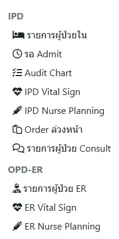
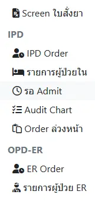
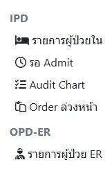
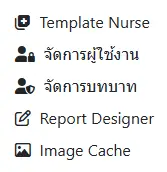

# การใช้งานทั่วไป

## การเข้าสู่ระบบ

1. กรอก `username` และ `password` ด้วยชื่อและรหัสผ่านเดียวกับการเข้าใช้งาน HOSxP
1. กดปุ่ม `เข้าสู่ระบบ`

โปรแกรมมีการตรวจสภาพการการเชื่อมต่อกับเครื่องแม่ข่ายตลอดเวลา  
หากขาดการเชื่อมต่อ ระบบจะให้ท่าน `ออกจากระบบ` โดยอัตโนมัติ  
หากการเชื่อมต่อกลับมาเป็นปกติ ระบบจะพยายาม `Update` ให้ก่อนใช้งานเสมอ

## การใช้งานระบบต่างๆ

ประกอบด้วยเมนูย่อย ได้แก่ `แพทย์`,`พยาบาล`,`เภสัชกร`,`อื่นๆ`,`Setting`,`ข้อความ` และ `ผู้ใช้งาน`
<!-- ANCHOR: service-visibility -->

ในหนังสือเล่มนี้ จะแสดงทุกระบบของ KPHIS  
แต่ในการใช้งานจริง บางเครื่องมือหรือปุ่มกด จะ `ไม่ปรากฏให้เห็น`  
หากระบบ `ไม่ได้เปิดให้บริการ` หรือท่าน `ไม่มีสิทธิการใช้งาน` ระบบนั้น

<!-- ANCHOR_END: service-visibility -->

### เมนูเจ้าหน้าที่ `แพทย์`

#### IPD
* [รายการผู้ป่วยใน](ipd/search-patient.md) : แสดงรายการผู้ป่วยใน ที่ยังไม่จำหน่าย จำแนกจาก `แผนก`, [passcode](ipd/search-patient.html#ward-passcode), `แพทย์เจ้าของไข้`, `แพทย์ผู้ตอบ Consult` และ `HN, AN, ชื่อ-สกุล` ผู้ป่วย
* [Order ล่วงหน้า](ipd/pre-order.md) : แสดงรายการ `ใบ Order` หรือ `Template`(Order สั้นๆ ที่สามารถใช้ซ้ำได้) ที่สร้างไว้ล่วงหน้า ด้วยการ `เพิ่มใบ Order ใหม่`
* [รายการผู้ป่วย Consult](ipd/consult.md) : แสดงรายการผู้ป่วยที่มีการขอ `คำปรึกษา` เข้ามา จำแนกตาม `แผนกที่รับ Consult`, `แพทย์ผู้รับ Consult`, `แพทย์ผู้ตอบ Consult` และ `HN, AN, ชื่อ-สกุล` ผู้ป่วย
#### OPD-ER
* [รายการผู้ป่วย ER](opd-er/order-list.md) : แสดงรายการ `ผู้ป่วยนอก/อุบัติเหตุ` ที่เข้าสู่ระบบแล้ว ด้วยการ `เพิ่มใบ Order ใหม่` และยังไม่จำหน่าย จำแนกตาม `วันที่บันทึกรายการ`, `วันที่ส่งตรวจ`, `HN`, `QN`, `เตียง`, และ `สถานะ` ผู้ป่วย

### เมนูเจ้าหน้าที่ `พยาบาล`

#### IPD
* [รายการผู้ป่วยใน](ipd/search-patient.md) : แสดงรายการผู้ป่วยใน ที่ยังไม่จำหน่าย จำแนกจาก `แผนก`, [passcode](ipd/search-patient.html#ward-passcode), `แพทย์เจ้าของไข้`, และ `HN, AN, ชื่อ-สกุล` ผู้ป่วย
* [IPD Vital Sign](shared/vital-sign.md) : แสดงรายการผู้ป่วยใน จำแนกตาม `หน่วยงาน` และสามารถบันทึกข้อมูล `Vital Sign` ผู้ป่วยได้
* [IPD Nurse Planning](ipd/nurse-planning.md) : แสดงรายการ `แผนการพยาบาล` ผู้ปวยใน จำแนกตาม `แผนก`, `วันที่`, `สุถานะ` และ `HN, AN, ชื่อ-สกุล` ผู้ป่วย
* [Order ล่วงหน้า](ipd/pre-order.md) : แสดงรายการ `ใบ Order` หรือ `Template`(Order สั้นๆ ที่สามารถใช้ซ้ำได้) ที่สร้างไว้ล่วงหน้า ด้วยการ `เพิ่มใบ Order ใหม่`
* [รายการผู้ป่วย Consult](ipd/consult.md) : แสดงรายการผู้ป่วยที่มีการขอ `คำปรึกษา` เข้ามา จำแนกตาม `แผนกที่รับ Consult`, `แพทย์ผู้รับ Consult`, `แพทย์ผู้ตอบ Consult` และ `HN, AN, ชื่อ-สกุล` ผู้ป่วย
#### OPD-ER
* [รายการผู้ป่วย ER](opd-er/order-list.md) : แสดงรายการ `ผู้ป่วยนอก/อุบัติเหตุ` ที่เข้าสู่ระบบแล้ว ด้วยการ `เพิ่มใบ Order ใหม่` และยังไม่จำหน่าย จำแนกตาม `วันที่บันทึกรายการ`, `วันที่ส่งตรวจ`, `HN`, `QN`, `เตียง`, และ `สถานะ` ผู้ป่วย
* [ER Vital Sign](shared/vital-sign.md) : แสดงรายการผู้ป่วยนอก/อุบัติเหตุ สามารถบันทึกข้อมูล `Vital Sign` ผู้ป่วยได้
* [ER Nurse Planning](opd-er/nurse-planning.md) : แสดงรายการ `แผนการพยาบาล` ผู้ปวยนอก/อุบัติเหตุ จำแนกตาม `วันที่`, `สุถานะ` และ `HN, AN, ชื่อ-สกุล` ผู้ป่วย

### เมนูเจ้าหน้าที่ `เภสัชกร` 

* [Screen ใบสั่งยา](shared/prescription-screen.md) : โปรแกรม Screen ใบสั่งยา ซึ่งสามารถแสดง การแพ้ยา, Drug Interaction, แจ้งเตือนการใช้ยาซ้ำซ้อน รวมถึง แสดงประวัติผู้ป่วยเรียงตามใบสั่งยา และประวัติผลการตรวจทางห้องปฏิบัติการที่สำคัญ
#### IPD
* [IPD Order](ipd/order-pharmacy.md) : แสดงรายการใบสั่งยาผู้ป่วยใน โดยสามารถ Update อัตโนมัติ พร้อมเสียงเตือน จำแนกตาม `แผนก`, `แพทย์เจ้าของไข้`, `ช่วงวันที่ Order` และ `HN, AN, ชื่อ-สกุล` ผู้ป่วย
* [รายการผู้ป่วยใน](ipd/search-patient.md) : แสดงรายการผู้ป่วยใน ที่ยังไม่จำหน่าย จำแนกจาก `แผนก`, `แพทย์เจ้าของไข้`, `การประเมินข้อมูลแพ้ยาใบแรกรับ` และ `HN, AN, ชื่อ-สกุล` ผู้ป่วย
* [Order ล่วงหน้า](ipd/pre-order.md) : แสดงรายการ `ใบ Order` หรือ `Template`(Order สั้นๆ ที่สามารถใช้ซ้ำได้) ที่สร้างไว้ล่วงหน้า ด้วยการ `เพิ่มใบ Order ใหม่`
#### OPD-ER
* [ER Order](opd-er/order-pharmacy.md) : แสดงรายการใบสั่งยาผู้ป่วยนอก/อุบัตเหตุ โดยสามารถ Update อัตโนมัติ พร้อมเสียงเตือน จำแนกตาม `แพทย์เจ้าของไข้`, `ช่วงวันที่ Order` และ `HN, VN, ชื่อ-สกุล` ผู้ป่วย
* [รายการผู้ป่วย ER](opd-er/order-list.md) : แสดงรายการ `ผู้ป่วยนอก/อุบัติเหตุ` ที่เข้าสู่ระบบแล้ว และยังไม่จำหน่าย จำแนกตาม `วันที่บันทึกรายการ`, `วันที่ส่งตรวจ`, `HN`, `QN`, `เตียง`, และ `สถานะ` ผู้ป่วย

### เมนูเจ้าหน้าที่ `อื่นๆ`  

#### IPD
* [รายการผู้ป่วยใน](ipd/search-patient.md) : แสดงรายการผู้ป่วยใน ที่ยังไม่จำหน่าย จำแนกจาก `แผนก`, [passcode](ipd/search-patient.html#ward-passcode), `แพทย์เจ้าของไข้` และ `HN, AN, ชื่อ-สกุล` ผู้ป่วย
* [Order ล่วงหน้า](ipd/pre-order.md) : แสดงรายการ `ใบ Order` หรือ `Template`(Order สั้นๆ ที่สามารถใช้ซ้ำได้) ที่สร้างไว้ล่วงหน้า ด้วยการ `เพิ่มใบ Order ใหม่`
#### OPD-ER
* [รายการผู้ป่วย ER](opd-er/order-list.md) : แสดงรายการ `ผู้ป่วยนอก/อุบัติเหตุ` ที่เข้าสู่ระบบแล้ว และยังไม่จำหน่าย จำแนกตาม `วันที่บันทึกรายการ`, `วันที่ส่งตรวจ`, `HN`, `QN`, `เตียง`, และ `สถานะ` ผู้ป่วย

### เมนู `Setting` 

* [Template Nurse](other/template-nurse.md) : บันทึก Template สำหรับการกรอกข้อมูลทางการพยาบาล เช่น `กลุ่มอาการ`, `ปัญหา (Focus)`, `เป้าหมาย (Goal)` และ `Intervention` 
* [จัดการผู้ใช้งาน](other/user-list.md) : แสดงรายการ `ผู้ใช้งาน` จาก HOSxP และสามารถกำหนด `บทบาท (Role)` ให้กับผู้ใช้งานได้
* [จัดการบทบาท](other/permission-list.md) : แสดงรายการ `บทบาท (Role)` และสามารถกำหนด `สิทธิ (Permission)` ให้กับบทบาทได้
* [Report Designer](extra/report-designer.md) : โปรแกรมสำหรับทดสอบการสร้างรายงานต่างๆ
* [Image Cache](extra/image.md) : แสดงรายการรูปภาพ ที่อุปกรณ์นี้เคยถ่ายรูปไว้

### เมนู `ชื่อผู้ใช้งาน`  

* `Light|Dark|Auto` : เปลี่ยน Theme ของโปรแกรม เป็นแบบ `โทนสีขาว`,`โทนสีดำ`,`ตาม Browser`
* `Update` : ค้นหาการ Update, และ Update ให้ทันทีหากค้นพบ 
* `Clear Caches and Reload` : ล้างโปรแกรมออกจาก Web Browser และโหลดใหม่จากเครื่องแม่ข่าย
* `ออกจากระบบ` : ออกจากระบบ และล้างข้อมูลส่วนบุคคล
