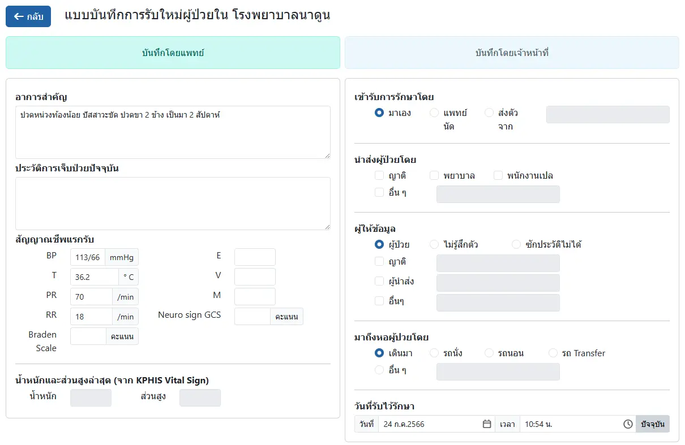
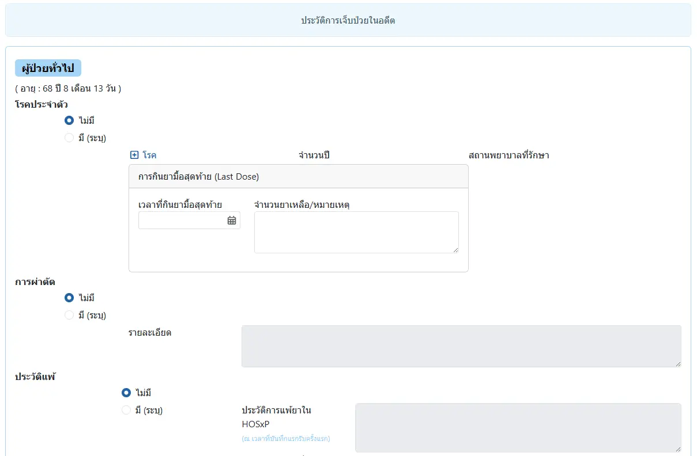
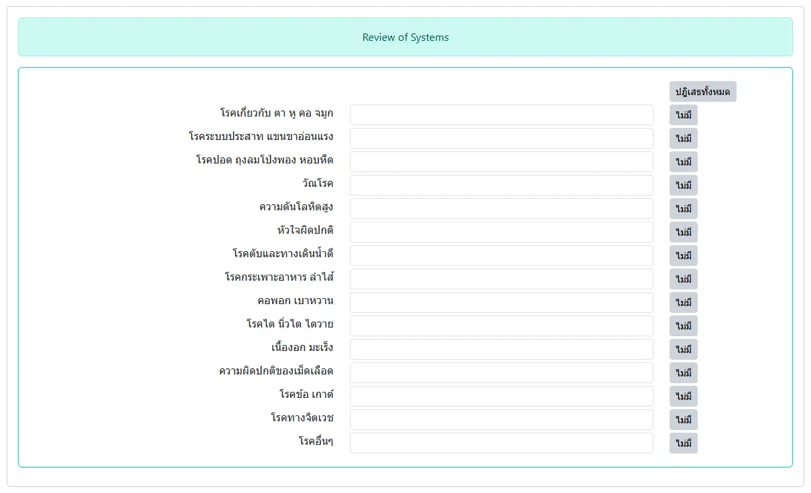
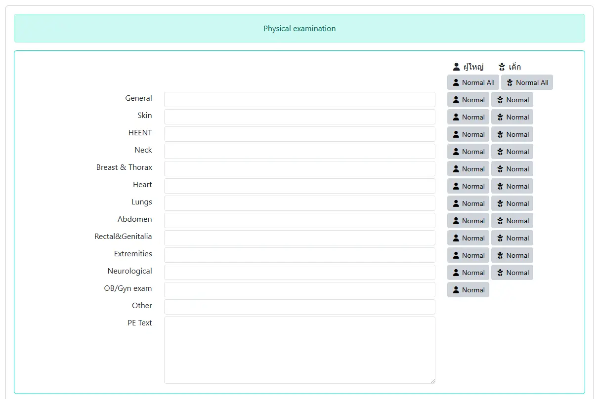
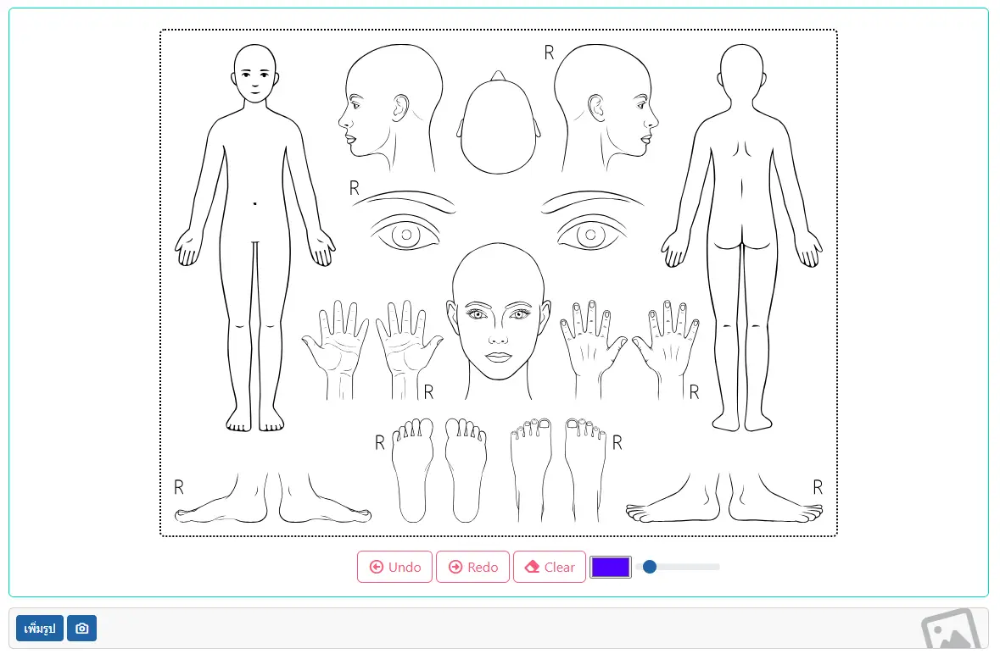
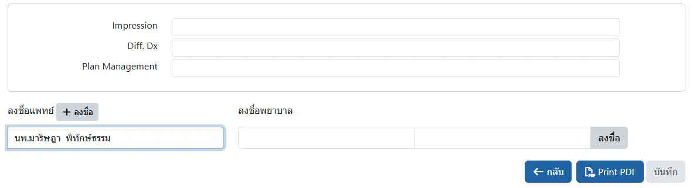

# บันทึกประวัติและตรวจร่างกายแรกรับ
ประกอบด้วย 

* `ข้อมูลแรกรับ`: ได้แก่ อาการสำคัญ, ประวัติปัจจุบัน และข้อมูลทั่วไป ซึ่งระบบจะดึง อาการสำคัญ และประวัติการเจ็บป่วยปัจจุบัน จาก HOSxP มาให้ ส่วนข้อมูลสัญญาณชีพแรกรับ (BT, PR, RR, BP) ระบบจะดึงจาก HOSxP ก่อน หากไม่พบ ระบบจะใช้ข้อมูลจากการบันทึกสัญญาณชีพครั้งแรกใน KPHIS ของ AN นั้นๆ แทน

    

* `ประวัติการเจ็บป่วยในอดีต`: แสดงตามเพศและกลุ่มอายุ ได้แก่
    - `ทุกกลุ่มอายุ`: โรคประจำตัว, การผ่าตัด, ประวัติแพ้, ประวัติการเจ็บป่วยในครอบครัว, การเข้ารับการรักษาในโรงพยาบาล
    - `อายุ 1 ปีขึ้นไป`: อาชีพ, พฤติกรรมเสี่ยง
    - `อายุน้อยกว่า 9 ปี`: ประวัติการฝากครรภ์ของมารดา, ประวัติการคลอดและการดูแลหลังคลอด, ประวัติการได้รับภูมิคุ้มกัน
    - `สตรี อายุมากกว่า 8 ปี`: ประวัติประจำเดือน, ประวัติด้านสูตินรีเวชกรรม

    

* `Review of Systems`: การซักประวัติโรคทุกระบบ

    

* `Physical Examination`: บันทึกการตรวจร่างกาย แยกตามระบบ

    

* `รูปภาพประกอบการตรวจร่างกาย`: สามารถวาดรูป และบันทึกรูปถ่ายได้

    

* `สรุปและลงนาม`: บันทึกการวินิจฉัยโรค, การวินิจฉัยแยกโรค, แผนการรักษา และการลงนามแพทย์ และพยาบาลที่บันทึกข้อมูล

    