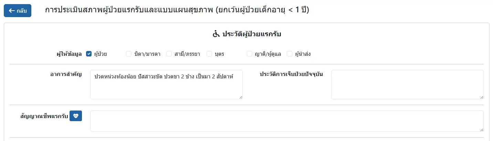
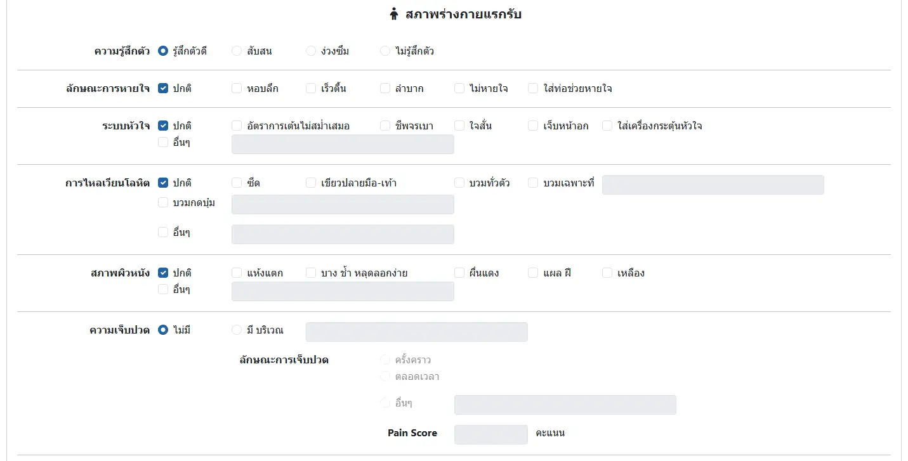
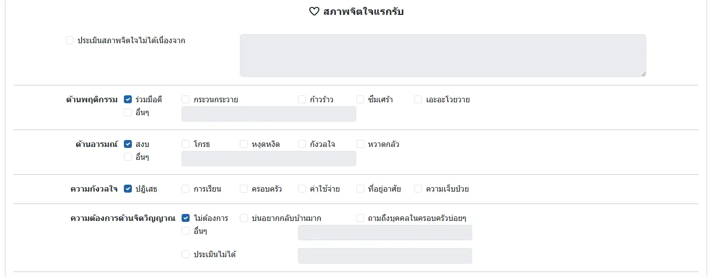
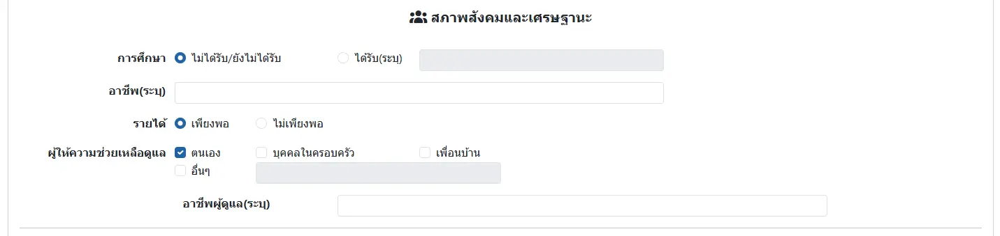
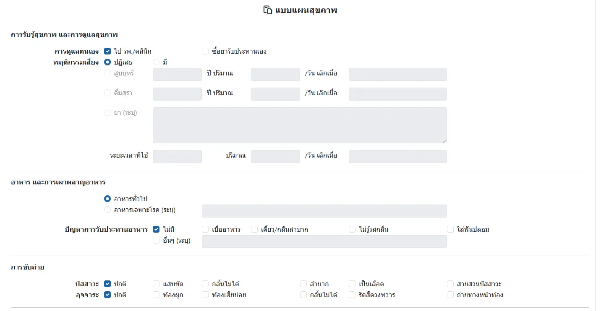
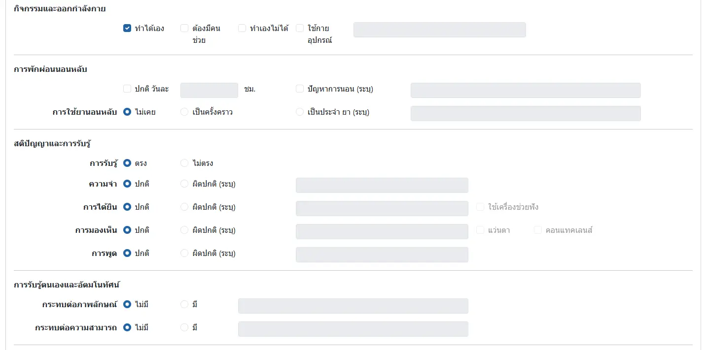
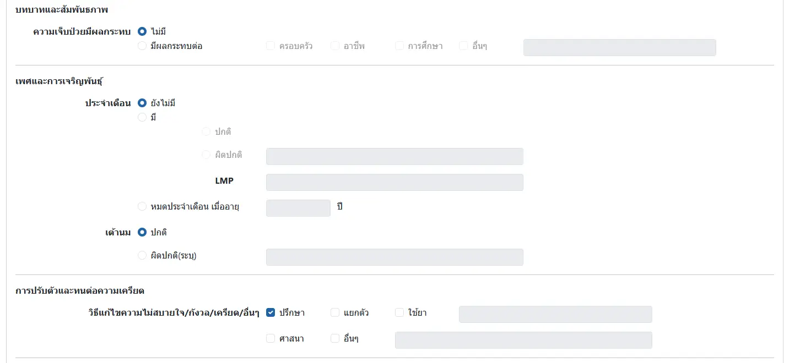
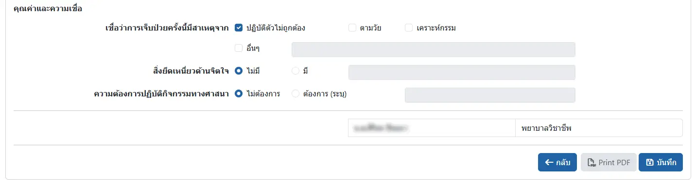

# ประเมินสภาพผู้ป่วยแรกรับ และแบบแผนสุขภาพ
ประกอบด้วย 

* `ประวัติผู้ป่วยแรกรับ`: ระบบจะดึง อาการสำคัญ และประวัติการเจ็บป่วยปัจจุบัน จาก HOSxP มาให้ และเจ้าหน้าที่สามารถเลือกสัญญาณชีพได้ที่ปุ่ม <i class="fas fa-heart-pulse"></i>

    

* `สภาพร่างกายแรกรับ`

    

* `สภาพจิตใจแรกรับ`

    

* `สภาพสังคมและเศรษฐานะ`

    

* `แบบแผนสุขภาพ`

    
    
    
    

    

    หัวข้อ `ประจำเดือน` ใน `เพศและการเจริญพันธุ์`  
    จะแสดงเฉพาะในเพศหญิงเท่านั้น
    
