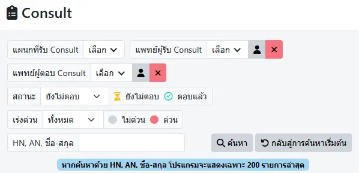

# ขอคำปรึกษา (Consult)

ตัวกรองในการค้นหา ได้แก่
* `แผนกที่รับ Consult` : แสดงเฉพาะการ `รับ Consult` ของแผนกที่ระบุ
* `แพทย์ผู้รับ Consult` : แสดงเฉพาะการ `รับ Consult` ของแพทย์ที่ระบุ
* `แพทย์ผู้ตอบ Consult` : แสดงเฉพาะการ `ตอบ Consult` ของแพทย์ที่ระบุ
* `สถานะ` : ทั้งหมด | ยังไม่ตอบ | ตอบแล้ว
* `เร่งด่วน` : ทั้งหมด | ด่วน | ไม่ด่วน
* `HN, AN, ชื่อ-สกุล` : กรอก HN, AN หรือชื่อ-สกุล ผู้ป่วย อย่างใดอย่างหนึ่ง
* <i class="fas fa-magnifying-glass" style="color:orange;"></i> `ค้นหา` : เพื่อสั่งการค้นหา
* <i class="fas fa-arrow-rotate-left" style="color:orange;"></i> `กลับสู่การค้นหาเริ่มต้น` : แก้ไขตัวกรองทั้งหมด กลับสู่จุดเริ่มต้น