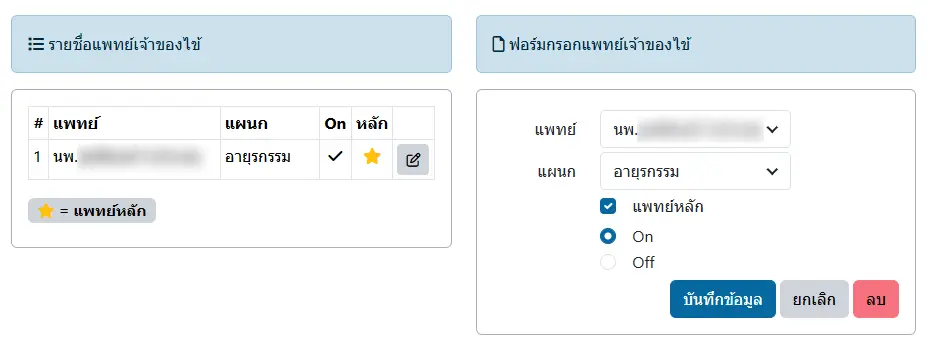

# ระบุแพทย์เจ้าของไข้

ประกอบด้วย 2 ส่วน ได้แก่
* `รายชื่อแพทย์เจ้าของไข้` : แสดงรายการแพทย์เจ้าของไข้

    - <i class="fa fa-pencil-square-o" style="color:orange;"></i> : คลิกเพื่อแก้ไข

* `ฟอร์มกรอกแพทย์เจ้าของไข้` : ฟอร์ม สำหรับเพิ่ม หรือแก้ไขแพทย์เจ้าของไข้

    - `แพทย์หลัก` : เลือกสถานะแพทย์หลัก
    - `On` | `Off` : เลือกสถานะแพทย์
    - `บันทึกข้อมูล` : บันทึกการเปลี่ยนแปลง
    - `ยกเลิก` : ยกเลิกการแก้ไข
    - `ลบ` : ลบรายการ