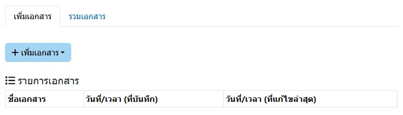
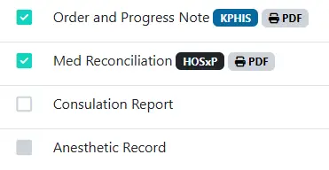

# จัดทำเอกสาร

ประกอบด้วย 2 หัวข้อ ได้แก่
* เพิ่มเอกสาร: สำหรับเพิ่มเอกสาร ได้แก่
    1. การประเมินสภาพผู้ป่วยแรกรับและแบบแผนสุขภาพ
    1. แบบบันทึกการรับใหม่ผู้ป่วยใน
    1. SUMMARY FORM

หากเอกสารดังกล่าวได้สร้างแล้ว จะแสดงในตาราง `รายการเอกสาร` พร้อมวันที่/เวลาที่บันทึกและแก้ไข

* รวมเอกสาร: สำหรับพิมพ์เอกสาร รวมถึง ใบปะหน้า โดยมีสัญลักษณ์ ได้แก่

    

    - <i class="fa fa-check-square"></i> หรือ <i class="fa fa-check-circle"></i> : รายการนี้ มีรายงาน สามารถคลิกได้ที่ปุ่ม <i class="fa fa-print"></i> PDF เพื่อแสดง [ตัวอย่างรายงาน](../tool/document-preview.md)
    - <i class="fa fa-square-o"></i> หรือ <i class="fa fa-circle-o"></i> : รายการนี้ ไม่มีรายงาน
    - <i class="fa fa-square"></i> หรือ <i class="fa fa-circle"></i> : รายการนี้ ระบบยังไม่รองรับ
    - กล่อง KPHIS และปุ่ม <i class="fa fa-print"></i> PDF : พิมพ์ด้วยข้อมูลจาก KPHIS
    - กล่อง HOSxP และปุ่ม <i class="fa fa-print"></i> PDF : พิมพ์ด้วยข้อมูลจาก HOSxP
