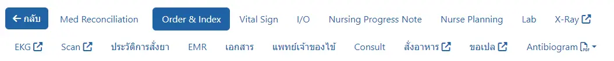

# แฟ้มผู้ป่วย IPD

## ระบบงานย่อยในแฟ้มผู้ป่วย

* [Med Reconciliation](../shared/med-reconciliation.md) : ทบทวนยาเดิมผู้ป่วย ทั้งจากข้อมูล HOSxP และบันทึกเพิ่มเองได้
* [Order & Index](../shared/order.md) : บันทึก Order และ Progress Note
* [Vital Sign](../shared/vital-sign.md) : บันทึก Vital Sign, แสดงกราฟสัญญาณชีพ
* [I/O](../shared/io.md) : บันทึกสมดุลน้ำ
* [Nursing Progress Note](../shared/focus-note.md) : แสดงความก้าวหน้าทางการพยาบาล, [บันทึกปัญหาทางการพยาบาล (Focus List)](../shared/focus-list.md), [บันทึกความก้าวหน้าทางการพยาบาล (Nurse Note)](..shared/focus-note.md) และ [บันทึกแผนการจำหน่าย (Discharge Plan)](../shared/discharge-plan.md)
* [Nurse Planning](../shared/index-plan.md) : บันทึกแผนและกิจกรรมทางการพยาบาล (Index Plan/Action)
* [Lab](../shared/lab.md) : แสดงผลการตรวจทางห้องปฏิบัติการ จาก HOSxP
* [X-Ray <i class="fa fa-external-link"></i>](../shared/out-source.md) : ไปสู่ระบบ PACs (โปรแกรมภายนอก, ถ้ามี)
* [EKG <i class="fa fa-external-link"></i>](../shared/out-source.md) : ไปสู่ระบบบันทึก EKG (โปรแกรมภายนอก, ถ้ามี)
* [Scan <i class="fa fa-external-link"></i>](../shared/out-source.md) : ไปสู่ระบบภาพ Scan (โปรแกรมภายนอก, ถ้ามี)
* [ประวัติการสั่งยา](../shared/prescription-screen.md) : ระบบ Screen ใบสั่งยา (ประวัติการสั่งยาใน HOSxP)
* [EMR](../shared/emr.md) : แสดงประวัติการรักษา (Electronic Medical Record: EMR)
* [เอกสาร](document.md) : แสดงและจัดพิมพ์เอกสารทางการแพทย์
* [แพทย์เจ้าของไข้](doctor-in-charge.md) : ระบุแพทย์เจ้าของไข้
* [Consult](consult.md) : ปรึกษาแผนก/แพทย์ท่านอื่น
* [สั่งอาหาร <i class="fa fa-external-link"></i>](../shared/out-source.md) : ไปสู่ระบบสั่งอาหารผู้ป่วย (โปรแกรมภายนอก, ถ้ามี)
* [ขอเปล <i class="fa fa-external-link"></i>](../shared/out-source.md) : ไปสู่ระบบขอเปลรับ-ส่งผู้ป่วย (โปรแกรมภายนอก, ถ้ามี)
* [Antibiogram <i class="fa fa-file-pdf-o"></i>](../shared/antibiogram.md) : แสดงข้อมูลการดื้อยา (Antibiogram)