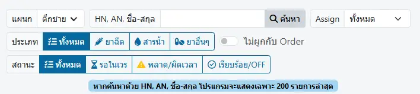
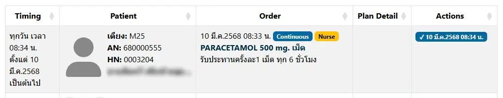

# IPD Nurse Planning

ตัวกรองในการค้นหา `Index Plan/Action` ผู้ป่วยใน ได้แก่
* `แผนก`
* `HN, AN, ชื่อ-สกุล` : แสดงเฉพาะผู้ป่วยรายเดียว ด้วยการกรอก HN, AN หรือชื่อ-สกุล ผู้ป่วย อย่างใดอย่างหนึ่ง
* `Assign` : แสดงเฉพาะที่มอบหมาย เช่น Incharge | Leader | Member 
* `ประเภท` : แสดงตามประเภท ได้แก่
    1. `ทั้งหมด` : แสดงแผนทั้งหมด (Order ทุกประเภท)
    2. `ยาฉีด` : แสดงเฉพาะ แผน Medication ประเภทยาฉีด เท่านั้น
    3. `สารน้ำ` : แสดงเฉพาะ แผน IV Fluid เท่านั้น
    4. `ยาอื่นๆ` : แสดงเฉพาะ แผน Medication ที่ไม่ใช่ยาฉีด เท่านั้น
* `ไม่ผูกกับ Order` : แสดงเฉพาะแผน ที่กำหนดขึ้น โดยไม่อ้างอิงกับ Order ใดๆ (สร้างด้วยปุ่ม `เพิ่ม Plan ที่ไม่ผูก Order` ใน [บันทึกแผนและกิจกรรมทางการพยาบาล (Index Plan/Action)](../shared/index-plan.md))
* `สถานะ` : แสดงแผนตามสถานะ ได้แก่
    1. `ทั้งหมด` : แผนทั้งหมด
    2. `รอในเวร` : แผนที่กำหนดเวลาไว้ ในเวร (ณ เวลาปัจจุบัน)
    3. `พลาด/ผิดเวลา` : แผนที่ไม่ตรงกำหนดเวลา หรือไม่ได้ทำในเวลา (ก่อน/หลังเวลาที่กำหนด 30 นาที)
    4. `เรียบร้อย/OFF` : แผนที่ดำเนินการเรียบร้อย หรือ OFF ไปแล้ว

ตัวเลือก `Assign` สามารถตั้งค่าได้โดยผู้ดูแลระบบเท่านั้น

กรุณาติดต่อผู้ดูแลระบบ หากต้องการปรับเปลี่ยนหรือแก้ไข

ระบบ จะแสดงรายการ Plan ตามเงื่อนไขที่เลือกไว้

คลิกรายการที่ต้องการ ระบบจะแสดงหน้าต่าง Plan/Action เช่นเดียวกับในระบบ [บันทึกแผนและกิจกรรมทางการพยาบาล (Index Plan/Action)](../shared/index-plan.md) ให้ท่าน สามารถดำเนินการเพิ่มหรือแก้ไข Plan/Action ต่อไป