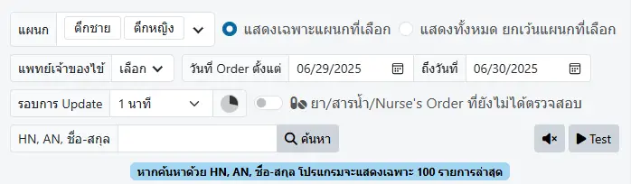
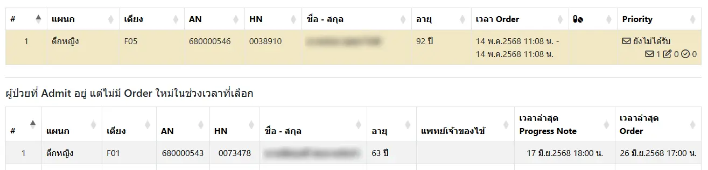

# ระบบรอรับใบสั่งยา (เภสัชกรรม)

การตั้งค่า ระบบรอรับใบสั่งยาผู้ป่วยใน ประกอบด้วย
* `แผนก` : สามารถเลือกได้หลายแผนก
* `แสดงเฉพาะแผนกที่เลือก` หรือ `แสดงทั้งหมด ยกเว้นแผนกที่เลือก` : ใช้ร่วมกับ `แผนก` เพื่อสลับการค้นหา
* `แพทย์เจ้าของไข้` : แสดงเฉพาะ Order จากแพทย์ที่เลือก (อ้างอิงจากการ [ระบุแพทย์เจ้าของไข้](doctor-in-charge.md))
* `วันที่ Order ตั้งแต่ .. ถึงวันที่ ..` : แสดงเฉพาะ Order ในช่วงวันที่กำหนด
* `รอบการ Update` : กำหนดเวลา ที่ระบบจะค้นหาซ้ำ เช่น ค้นหาทุก 1 นาที เป็นต้น
* `ยา/สารน้ำ/Nurse's Order ที่ยังไม่ได้ตรวจสอบ` : แสดงเฉพาะ Order ที่เป็น ยา หรือสารน้ำ หรือสั่งโดยพยาบาล ที่เภสัชกรยังไม่ได้รับรายการ
* `HN, AN, ชื่อ-สกุล` : แสดงเฉพาะผู้ป่วยที่กำหนด ด้วยการกรอก HN, AN หรือชื่อ-สกุล ผู้ป่วย อย่างใดอย่างหนึ่ง
* <i class="fa fa-search"></i> ค้นหา : สั่งการค้นหา
* <i class="fa fa-volume-off"></i>x : เสียงเรียกถูกปิดไว้
* <i class="fa fa-volume-up"></i> : เสียงเรียกพร้อมใช้งาน
* <i class="fa fa-play"></i> Test : ทดสอบเสียงเรียก

ผลจากการค้นหา ประกอบด้วย 2 ส่วน ได้แก่
* `รายการ Order ใหม่` : แสดงข้อมูลผู้ป่วยที่มี Order ใหม่ ร่วมกับข้อมูล
    1. `เวลา Order` น้อยที่สุด - มากที่สุด ในช่วง `วันที่ Order ตั้งแต่ .. ถึงวันที่ ..` ที่กำหนด
    2. เป็นรายการยา/สารน้ำ หรือไม่
    3. `Priority` : แสดงสถานะ และหมายเหตุ ยา Stat หรือ Home-Med (ถ้ามี)
        - <i class="fa fa-envelope-o"></i> : จำนวน Order ที่เภสัชกรยังไม่รับรายการ
        - <i class="fa fa-pencil-square-o"></i> : จำนวน Order ที่เภสัชกรรับรายการแล้ว
        - <i class="fa fa-check-circle-o"></i> : จำนวน Order ที่เภสัชกรตรวจสอบแล้ว

    

    Stat Order ที่เภสัชกรยังไม่รับรายการ จะแสดงแถบสีชมพู เพื่อเตือนเภสัชกร  
    Order อื่น ที่เภสัชกรยังไม่รับรายการ จะแสดงแถบสีเหลือง  
    Order ที่เภสัชกรรับรายการแล้ว (รอตรวจสอบ) จะแสดงแถบสีฟ้า  
    Order ที่เภสัชกรตรวจสอบแล้ว จะไม่มีแถบสี 
    

* `ผู้ป่วยที่ Admit อยู่ แต่ไม่มี Order ใหม่ในช่วงเวลาที่เลือก` : แสดงรายการผู้ป่วยตาม `แผนก` ที่เลือก ที่ไม่มี Order ใหม่ ในช่วง `วันที่ Order ตั้งแต่ .. ถึงวันที่ ..` ที่กำหนด ท่านสามารถคลิกที่รายการ เพื่อไปดูใบ Order ของผู้ป่วยได้