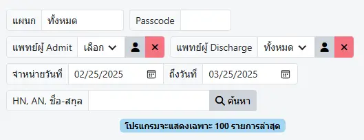

# สรุป Chart

เพื่อแสดงรายการผู้ป่วยที่ `จำหน่ายแล้ว` พร้อมช่องทางในการดูเวชระเบียนผู้ป่วย, [บันทึกประวัติและตรวจร่างกายแรกรับ](admission-note-dr.md) และ [บันทึกการสรุปเวชระเบียน (In-Patient Summary)](summary.md)

ตัวกรองในการค้นหา ได้แก่ 
* `แผนก`
* [Passcode](search-patient.html#ward-passcode) (เฉพาะเปิดด้วยเมนู `แพทย์`, `พยาบาล`, และ `อื่นๆ`)
* `แพทย์ผู้ Admit`
* `แพทย์ผู้ Discharge`
* `วันที่จำหน่าย` : ระบุช่วงวันที่จำหน่ายที่ต้องการค้นหา
* `HN, AN, ชื่อ-สกุล` : กรอก HN, AN หรือชื่อ-สกุล ผู้ป่วย อย่างใดอย่างหนึ่ง