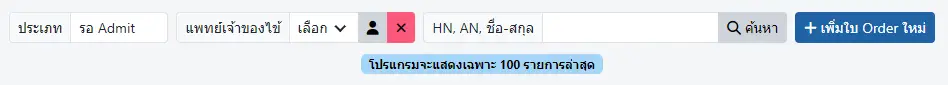
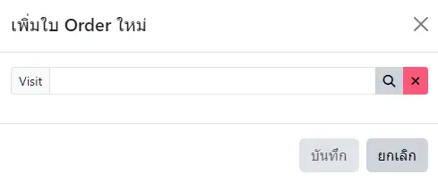

# รอ Admit

ตัวกรองในการค้นหา ได้แก่
* `ประเภท`
    - `รอ Admit` : ผู้ป่วยที่ลงทะเบียนในระบบ `รอ Admit` และยังไม่ได้บันทึก `Admit` ใน HOSxP
    - `Admit แล้ว` : ผู้ป่วยที่ลงทะเบียนในระบบ `รอ Admit` และได้บันทึก `Admit` ใน HOSxP แล้ว
    - `ยกเลิก Admit` : ผู้ป่วยที่ได้ `ยกเลิก Admit` ใน HOSxP แล้ว และมีข้อมูลในระบบ KPHIS
* `แพทย์เจ้าของไข้` : แพทย์ที่เคยบันทึกคำสั่งแพทย์ ให้กับผู้ป่วยในการ Admit ครั้งนี้
* `HN, AN, ชื่อ-สกุล` : กรอก HN, AN หรือชื่อ-สกุล ผู้ป่วย อย่างใดอย่างหนึ่ง

## การเพิ่มผู้ป่วยรอ Admit
ด้วยการกดปุ่ม `+ เพิ่มใบ Order ใหม่`

* กดปุ่ม <i class="fa fa-search" style="color:orange;"></i> เพื่อค้นหาผู้ป่วยที่ต้องการ
* กดปุ่ม `บันทึก`
* รายชื่อผู้ป่วยจะปรากฎในตาราง ท่านสามารถคลิกที่ชื่อผู้ป่วย เพื่อสร้าง [บันทึกคำสั่งแพทย์](order.md) และบันทึก [บันทึกประวัติและตรวจร่างกายแรกรับ](admission-note-dr.md) ได้