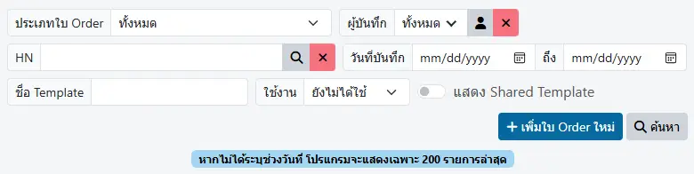
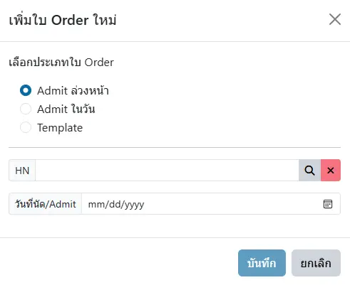
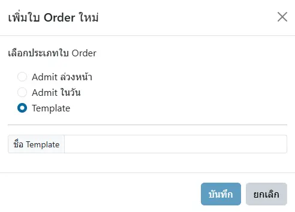

# Order ล่วงหน้า

ตัวกรองในการค้นหา ได้แก่
* `ประเภท ใบ Order`
    - `ทั้งหมด`
    - `Admit ล่วงหน้า และ Admit ในวัน`
    - `Admit ล่วงหน้า` : ใบ Order สำหรับ Visit ในวันอื่น
    - `Admit ในวัน` : ใบ Order สำหรับ Visit ในวันนี้
    - `Template` : คำสั่งแพทย์ ที่สามารถสำเนา และแทรกในใบ Order ได้
* `ผู้บันทึก` : ค้นหาจากผู้บันทึก ใบ Order ล่วงหน้า หรือ Template
* `HN` : ค้นหาจาก HN, ชื่อ-สกุล หรือเลขประจำตัวประชาชน ผู้ป่วย
* `วันที่บันทึก` : ช่วงเวลาที่บันทึกใบ Order ล่วงหน้า หรือ Template
* `ชื่อ Template` : ค้นหา Template ด้วยชื่อ
* `ใช้งาน` : ค้นหาเฉพาะใบ Order ล่วงหน้า `ทั้งหมด` หรือถูก `ใช้แล้ว` หรือ `ยังไม่ได้ใช้`
* `แสดง Shared Template` : แสดง/ไม่แสดง Template ที่อนุญาตให้ จนท.อื่น ใช้งานได้

## การสร้าง Order ล่วงหน้า ใหม่
ด้วยการกดปุ่ม `+ เพิ่มใบ Order ใหม่` แล้วเลือกประเภทใบ Order ที่ต้องการ

1. `Admit ล่วงหน้า` : คือใบ Order ที่สร้างไว้ล่วงหน้า เฉพาะสำหรับผู้ป่วยที่ระบุไว้ เพื่อ `Admit` ใน `วันที่นัดหมาย`
1. `Admit ในวัน` : คือใบ Order ที่สร้างไว้ล่วงหน้า เฉพาะสำหรับผู้ป่วยที่ระบุไว้ เพื่อ `Admit` ใน `วันนี้`

    

    * กดปุ่ม <i class="fa fa-search"></i> เพื่อค้นหาผู้ป่วยที่ต้องการ
    * เลือกวันนัด `Admit` (ประเภท `Admit ในวัน` จะระบุเป็น `วันนี้` โดยอัตโนมัติ)
    * กดปุ่ม `บันทึก`

1. `Template` : คือ Standing Order ที่กำหนด Order และ Progress Note ไว้ล่วงหน้า ผู้ใช้งานสามารถนำไปวางใน Order ได้ตามต้องการ

    

    * ตั้งชื่อ `Template` ตามต้องการ 
    * กดปุ่ม `บันทึก`

    

    
    ชื่อ `Template` ควรเป็นชื่อที่สั้นและเข้าใจง่าย เช่น `แก้ HyperK ชุดใหญ่`  
    หรือกำหนดโครงสร้างของชื่อ เพื่อใช้ร่วมกันในโรงพยาบาล  
    เช่น `[PED] Septic work-up`, `[MED] Septic work-up` เป็นต้น
    

`Order ล่วงหน้า` โดยทั่วไป จะสามารถใช้ได้เฉพาะผู้ที่บันทึกเท่านั้น  
ยกเว้น `Template` ที่กำหนดเป็น `Shared Template` แล้วเท่านั้น  
ที่เจ้าหน้าที่ท่านอื่นจะสามารถนำไปใช้ได้

