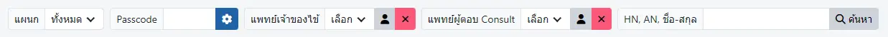
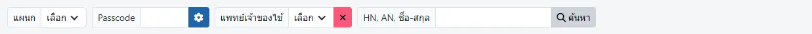
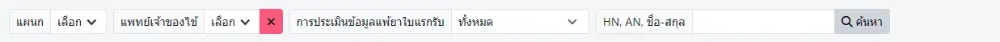
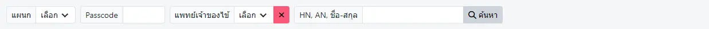
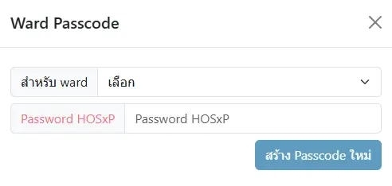

# รายการผู้ป่วยใน

แพทย์

พยาบาล

เภสัชกร

อื่นๆ

ตัวกรองในการค้นหา `ผู้ป่วยใน` ที่มีในระบบ KPHIS ได้แก่
* `แผนก`
* `Passcode` 
* `แพทย์เจ้าของไข้`
* `แพทย์ผู้ตอบ Consult`
* `การประเมินข้อมูลแพ้ยาใบแรกรับ`
* `HN, AN, ชื่อ-สกุล`

### Ward Passcode
ระบบ `Passcode` ใช้สำหรับปกปิดการแสดง `แผนก` ที่ต้องการ (`แผนก` ที่มี `Passcode` กำหนดไว้ จะไม่ปรากฏในกล่องตัวเลือก `แผนก`)

หากใส่รหัส `Passcode` ของ `แผนก` นั้นๆ ได้ถูกต้อง ระบบจะแสดงข้อมูลของ `แผนก` ที่ปกปิดนั้นให้  

การสร้าง `Passcode` สามารถทำได้ ด้วยการเลือก `สำหรับ ward` เป็น `แผนก` ที่ต้องการปกปิด  
หลังจากยืนยันรหัสผ่านของท่าน และกดปุ่ม `สร้าง Passcode ใหม่` ระบบจะส่ง `Passcode` ให้ท่าน

* ปุ่ม <i class="fa fa-cog"></i> สำหรับเปลี่ยน `Passcode` จะปรากฏเฉพาะผู้ได้รับสิทธิจากผู้ดูแลระบบเท่านั้น
* `Passcode` ของแต่ละ `แผนก` จะมีเพียงรหัสเดียวเท่านั้น, หากสร้างใหม่ จะยกเลิก `Passcode` เก่าทันที

