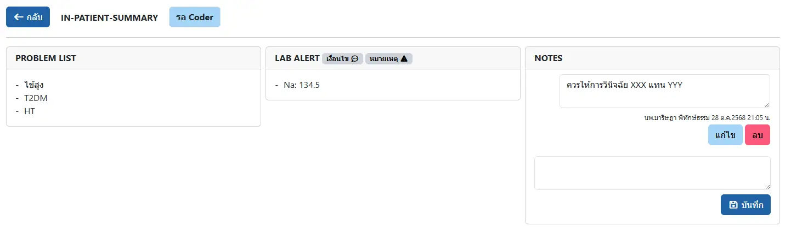
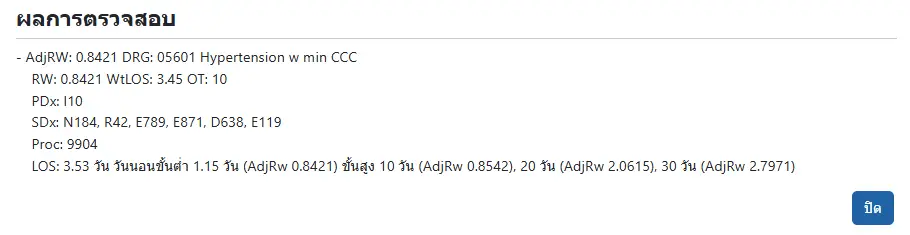
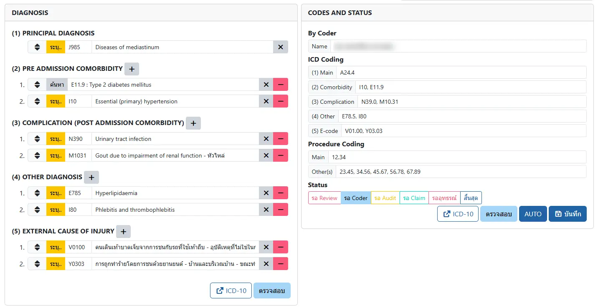
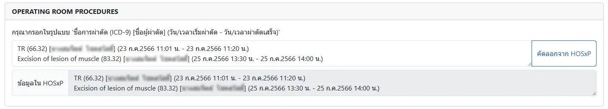
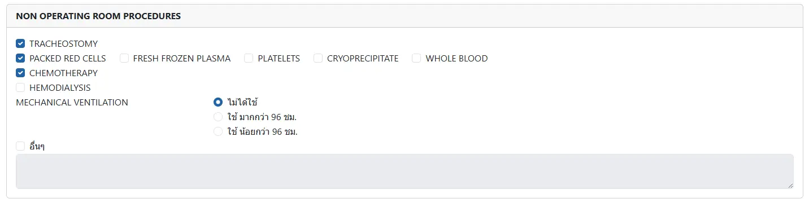
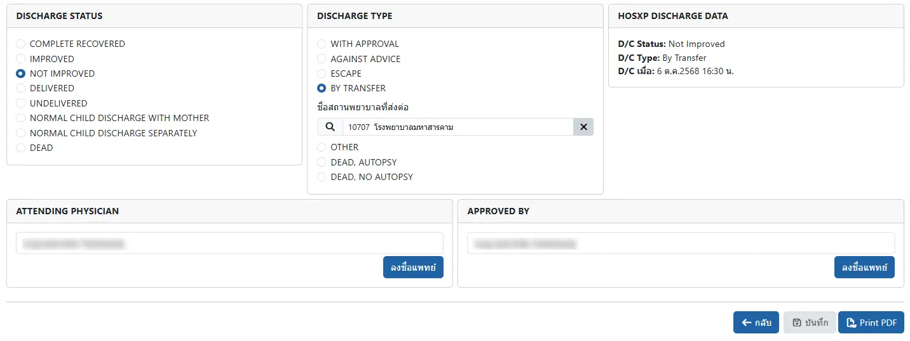

# บันทึกการสรุปเวชระเบียน (In-Patient Summary)
ประกอบด้วย

* `PROBLEM LIST`: ระบบจะดึง Problem list ที่บันทึกใน Progress Note ในใบคำสั่งแพทย์ทั้งหมดมาให้
* `LAB ALERT`: แสดงเฉพาะ ผลการตรวจทางห้องปฏิบัติการที่ตรงกับ เงื่อนไข <i class="fa fa-commenting-o"></i> 
* `NOTES`: สำหรับบันทึกการสื่อสาร ระหว่าง แพทย์ และ Coder/Auditor

    

* `DIAGNOSIS`: สามารถบันทึกการวินิจฉัยได้ 2 วิธี ได้แก่
    1. `ค้นหา`: จะแสดงรายการของรหัสการวินิจฉัย จากคำค้นหา
    2. `ระบุ..`: บันทึก `icd10` และ `Diagnosis` ด้วยตนเอง

    

    ท่านสามารถเปลี่ยนวิธีการบันทึกได้ ด้วยการคลิกที่ `ค้นหา` หรือ `ระบุ..` และสลับวิธีบันทึกได้ เช่น

    - `ค้นหา` จนได้โรคที่ต้องการ แล้วค่อย `ระบุ..` เพื่อแก้ไขให้ถูกต้องและเหมาะสม
    - `ระบุ..` แล้วค่อย `ค้นหา` เพื่อหารหัสโรคที่ต้องการ
    
    หรือค้นหารหัสโรคที่เวปไซต์ของ [WHO](https://icd.who.int/browse10/2016/en) ด้วยการกดปุ่ม `ICD-10`
    

    ท่านสามารถคลิก `ตรวจสอบ` เพื่อตรวจรหัสโรค ตาม TDRG Grouper v.6.3.3

    

    

    หากบันทึกด้วยวิธี `ระบุ..` โดยไม่ได้กรอก `icd10`
    ระบบจะใส่ `???` ในช่อง `icd10` ให้ท่าน
    เพื่อให้ Coder/Auditor ค้นหารหัสโรคให้ท่าน
    แต่ท่านจะ `ตรวจสอบ` ไม่สำเร็จ เนื่องจากรหัสโรค `???` นั้น ไม่สามารถใช้ได้ 
    

* `CODES AND STATUS`: **(สำหรับ Coder/Auditor เท่านั้น)** เพื่อบันทึกรหัสโรค ซึ่งจะปรากฎในเอกสาร Summary ด้านขวา โดยท่านสามารถ
    - กดปุ่ม `ICD-10` เพื่อเปิดหน้าเวปไซต์ของ [WHO](https://icd.who.int/browse10/2016/en)
    - กดปุ่ม `ตรวจสอบ` เพื่อตรวจรหัสโรค ตาม TDRG Grouper v.6.3.3
    - กดปุ่ม `AUTO` เพื่อนำรหัสโรคของแพทย์ในกล่อง `DIAGNOSIS` รวมถึงหัตถการต่างๆ มากรอกให้อัตโนมัติ
    - บันทึก Status ของเวชระเบียน ได้แก่
        1. `ยังไม่สรุป`: ค่าเริ่มต้น `ก่อน`ลงชื่อแพทย์ `APPROVED BY` แล้ว `บันทึก`
        1. `รอ Review`: Coder/Auditor ส่งกลับให้แพทย์ทบทวนการวินิจฉัยใหม่
        1. `รอ Coder`: ค่าเริ่มต้น `หลัง`จากมีแพทย์ `APPROVED BY` แล้ว และ `บันทึก` จากสถานะ `ยังไม่สรุป`
        1. `รอ Audit`: ค่าเริ่มต้น `หลัง`จากมีแพทย์ `APPROVED BY` แล้ว และ `บันทึก` จากสถานะ `รอ Review`
        1. `รอ Claim`
        1. `รออุทธรณ์`
        1. `สิ้นสุด`

    

* `OPERATING ROOM PROCEDURES`: แสดงข้อมูลการผ่าตัดที่บันทึกใน HOSxP และสามารถคัดลอกเพื่อแก้ไขให้เหมาะสมได้

    

* `NON OPERATING ROOM PROCEDURES`: แสดงรายการหัตถการที่พบบ่อย (ทุกรายการ ยกเว้น `อิื่นๆ` ระบบสามารถให้รหัสหัตถการได้ เมื่อกดปุ่ม `AUTO`)

    

* `SPECIAL INVESTIGATIONS`: เพื่อระบุผลการตรวจพิเศษ

    

* `DISCHARGE STATUS`: เพื่อระบุสถานะการจำหน่าย
* `DISCHARGE TYPE`: เพื่อระบุประเภทการจำหน่าย
* `HOSXP DISCHARGE DATA`: เป็นข้อมูลการจำหน่ายที่บันทึกใน HOSxP
* `ATTENDING PHYSICIAN` และ `APPROVED BY`: เพื่อ `ลงชื่อแพทย์` ผู้บันทึก/ยืนยันข้อมูล

    