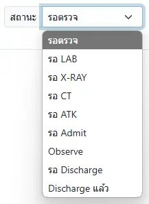

# ระบบงานห้องอุบัติเหตุและฉุกเฉิน (ER)

{{#include order-list.md:opd-er-order-new}}

## กระบวนการบริการ
- แพทย์/พยาบาล บันทึก [ประวัติผู้ป่วย ER](medical-history.md)
- [บันทึกสัญญาณชีพ](../shared/vital-sign.md) หากมีการเปลี่ยนแปลง
- แพทย์/พยาบาล บันทึกการให้บริการใน HOSxP
- เภสัชกร [รอรับใบสั่งยา](order-pharmacy.md)
- เภสัชกร บันทึกจ่ายยาใน HOSxP
- แก้ไขสถานะผู้ป่วย หากมีการเปลี่ยนแปลง

    

### แพทย์ให้สังเกตอาการ
- [บันทึกคำสั่งแพทย์](order.md)
- [บันทึกปัญหาทางการพยาบาล (Focus List)](../shared/focus-list.md)
- [บันทึกความก้าวหน้าทางการพยาบาล (Nurse Note)](../shared/focus-note.md)
- [บันทึกแผนและกิจกรรมทางการพยาบาล (Index Plan/Action)](../shared/index-plan.md)
- [บันทึกสัญญาณชีพ](../shared/vital-sign.md)
- [บันทึกสมดุล (Intake-Output: I/O)](../shared/io.md)
### แพทย์ให้ Admit
- [แรกรับ ผู้ป่วยใน](../ipd/index.html#แรกรับ)
- [ระบบงานผู้ป่วยใน](../ipd/index.html)

### แพทย์ให้ Discharge ได้
{{#include main.md:opd-er-discharge}}

- บันทึกการวินิจฉัย หัตถการ การจ่ายยา การนัดหมาย ใน HOSxP ให้ครบถ้วน
- ปิด `Visit` ใน HOSxP
- [จัดทำเอกสาร](document.md)

## เครื่องมือทำงาน
- [แสดงผลการตรวจทางห้องปฏิบัติการ จาก HOSxP](../shared/lab.md)
- [เวชระเบียนอิเล็กทรอนิกส์ (Electronic Medical Record: EMR)](../shared/emr.md)
- [ระบบ Screen ใบสั่งยา และค้นประวัติการสั่งยาใน HOSxP](../shared/prescription-screen.md)
- [เอกสาร Antibiogram](../shared/antibiogram.md)
- [ทางลัดสู่ระบบภายนอก](../shared/out-source.md)