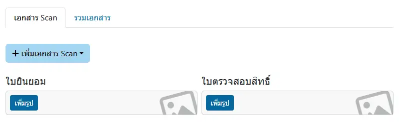
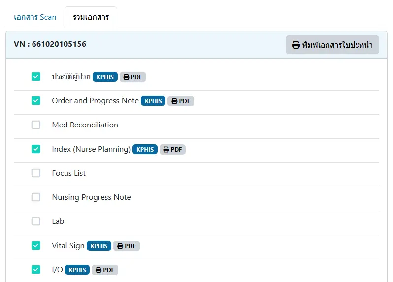

# จัดทำเอกสาร

ประกอบด้วย 2 เมนูย่อย ได้แก่

## เอกสาร Scan

`เอกสาร Scan` : สำหรับเพิ่มรูปภาพจากการ Scan แยกตามประเภทเอกสาร

- <i class="fa fa-plus" style="color:orange;"></i> `เพิ่มเอกสาร Scan` : เลือกประเภทเอกสารที่ต้องการ

## รวมเอกสาร

`รวมเอกสาร` : สำหรับพิมพ์เอกสารทุกประเภทในระบบ รวมถึง ใบปะหน้า โดยมีสัญลักษณ์ ได้แก่

- <i class="fa fa-check-square" style="color:orange;"></i> หรือ <i class="fa fa-check-circle" style="color:orange;"></i> : รายการนี้ มีรายงาน สามารถคลิกได้ที่ปุ่ม <i class="fa fa-print" style="color:orange;"></i> `PDF` เพื่อแสดง [ตัวอย่างรายงาน](../tool/document-preview.md)
- <i class="fa fa-square-o" style="color:orange;"></i> หรือ <i class="fa fa-circle-o" style="color:orange;"></i> : รายการนี้ ไม่มีรายงาน
- กล่อง `KPHIS` และปุ่ม <i class="fa fa-print" style="color:orange;"></i> `PDF` : พิมพ์ด้วยข้อมูลจาก KPHIS
- กล่อง `HOSxP` และปุ่ม <i class="fa fa-print" style="color:orange;"></i> `PDF` : พิมพ์ด้วยข้อมูลจาก HOSxP
- กล่อง `SCAN` : มีภาพใน `เอกสาร Scan` สามารถพิมพ์เอกสารได้ในเมนูย่อย `เอกสาร Scan`