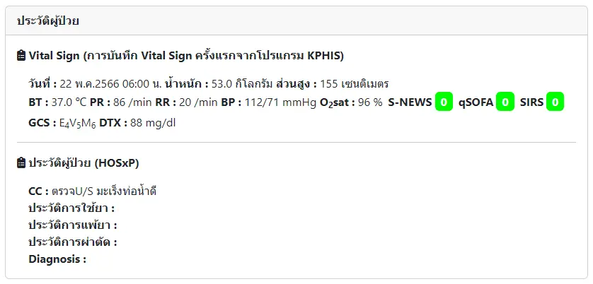
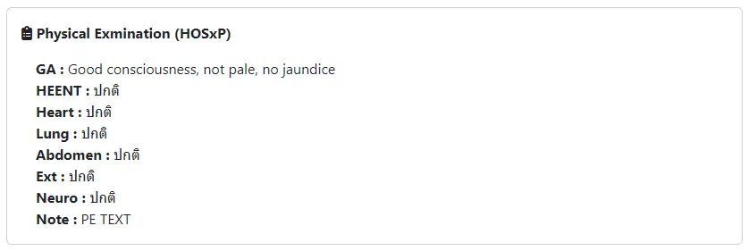
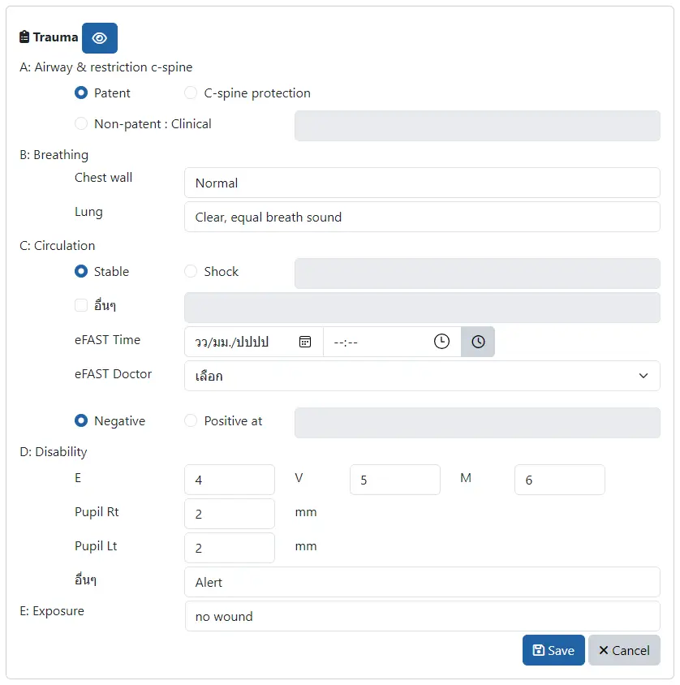
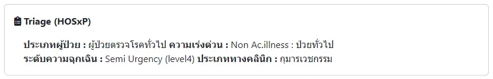
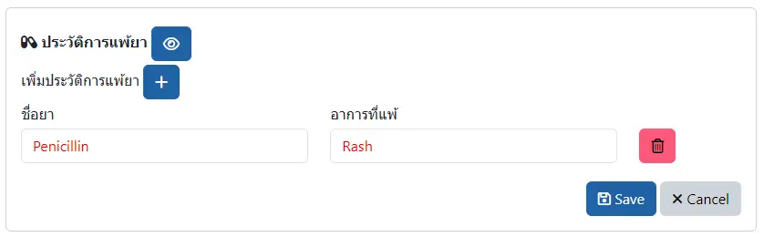
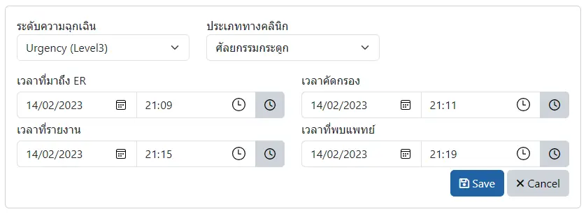
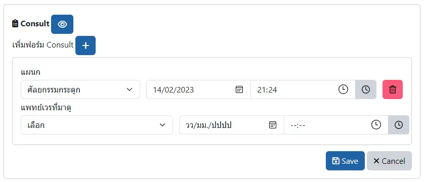
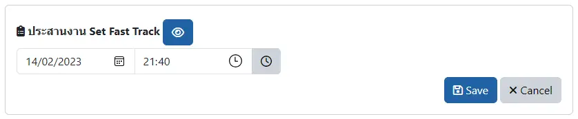

# ประวัติผู้ป่วย ER

## ประวัติผู้ป่วย

แสดงข้อมูลสัญญาณชีพ จากการ[บันทึกสัญญาณชีพ (Vital Sign)](../shared/vital-sign.md) ครั้งแรกของ visit นี้ ใน KPHIS 

## ตรวจร่างกาย

แสดงข้อมูลการตรวจร่างกายจาก HOSxP (หัวข้อ NOTE หมายถึงข้อมูลที่บันทึกใน PE Text ของ HOSxP)

## Trauma

บันทึกข้อมูลอุบัติเหตุ ตามหลัก ABCDE `โดยแพทย์`
- <i class="fa fa-eye"></i> : เปิด/ปิด การแสดงผล
- <i class="fa fa-save"></i> Save : บันทึก
- <i class="fa fa-times"></i> Cancel : ยกเลิก  

## Triage

แสดงข้อมูลการคัดกรองผู้ป่วยฉุกเฉินจาก HOSxP

## ประวัติการแพ้ยา

บันทึกข้อมูลการแพ้ยา ที่ซักถามได้ในห้องฉุกเฉิน
- <i class="fa fa-eye"></i> : เปิด/ปิด การแสดงผล
- <i class="fa fa-plus"></i> : เพิ่มรายการแพ้ยา
- <i class="fa fa-trash" style="color:red;"></i> : ยกเลิกรายการแพ้ยา
- <i class="fa fa-save"></i> Save : บันทึก
- <i class="fa fa-times"></i> Cancel : ยกเลิกการแก้ไข

## Screening

บันทึกการจัดประเภท และเวลารับบริการ
- <i class="fa fa-clock-o"></i> : ใช้เวลาปัจจุบัน
- <i class="fa fa-save"></i> Save : บันทึก
- <i class="fa fa-times"></i> Cancel : ยกเลิก  

## Consult

บันทึกการปรึกษาจากห้องฉุกเฉิน
- <i class="fa fa-eye"></i> : เปิด/ปิด การแสดงผล
- <i class="fa fa-plus"></i> : เพิ่มรายการแพ้ยา
- <i class="fa fa-trash" style="color:red;"></i> : ยกเลิกรายการแพ้ยา
- <i class="fa fa-clock-o"></i> : ใช้เวลาปัจจุบัน
- <i class="fa fa-save"></i> Save : บันทึก
- <i class="fa fa-times"></i> Cancel : ยกเลิกการแก้ไข

## Set FT

บันทึกการประสานงาน Set Fast Track
- <i class="fa fa-eye"></i> : เปิด/ปิด การแสดงผล
- <i class="fa fa-clock-o"></i> : ใช้เวลาปัจจุบัน
- <i class="fa fa-save"></i> Save : บันทึก
- <i class="fa fa-times"></i> Cancel : ยกเลิกการแก้ไข