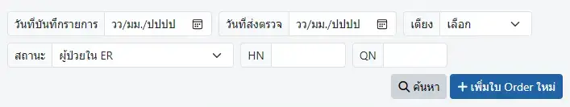

# รายการผู้ป่วย ER

ตัวกรองในการค้นหา `ผู้ป่วยนอก/อุบัติเหตุ` ที่มีในระบบ KPHIS ได้แก่
* `วันที่บันทึกรายการ` : วันที่ `เพิ่มใบ Order ใหม่` ใน KPHIS
* `วันที่ส่งตรวจ` : วันที่ Visit ใน HOSxP
* `เตียง`
* `สถานะ` : ผู้ป่วยใน ER | Discharge แล้ว | ทุกสถานะ
* `HN`
* `QN` : เฉพาะ QN ในวันปัจจุบัน

<!-- ANCHOR: opd-er-order-new -->
## ผู้ป่วยใหม่
1. เพิ่ม `Visit` ผู้ป่วยในระบบ HOSxP
1. เพิ่มผู้ป่วยเข้าระบบ KPHIS ด้วยการคลิกที่ `+ เพิ่มใบ Order ใหม่` ในเมนู [รายการผู้ป่วย ER](order-list.md)
    

    ปุ่ม `+ เพิ่มใบ Order ใหม่`  
    จะปรากฏเฉพาะเมื่อเปิดจากเมนู `แพทย์` และ `พยาบาล` เท่านั้น
    

    

1. กดปุ่ม <i class="fa fa-search"></i> เพื่อค้นหา `visit` ที่ต้องการ, ระบุ `Note`, เลือก `เตียง` แล้วกดปุ่ม `บันทึก`
1. คลิกที่ ผู้ป่วยที่ต้องการ เพื่อเข้าสู่ [แฟ้มผู้ป่วย ER](main.md)
<!-- ANCHOR_END: opd-er-order-new -->
