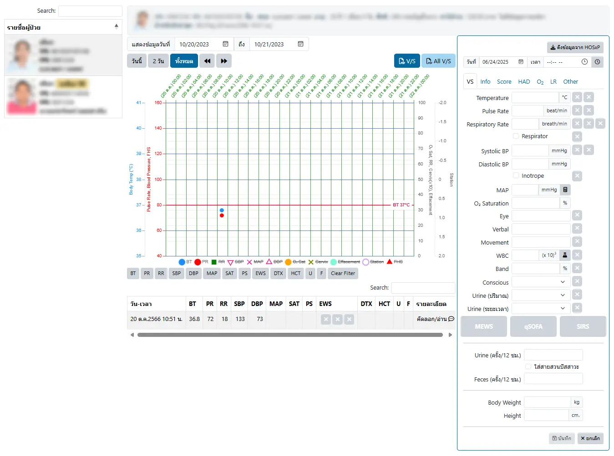

# ER Vital Sign

ระบบสำหรับบันทึกสัญญาณชีพโดยเฉพาะ ประกอบด้วย 4 ส่วน
1. `รายชื่อผู้ป่วย` : ที่ด้านซ้ายของระบบ เพื่อค้นหาและเลือกผู้ป่วยไปแสดงในส่วนด้านขวาของระบบ
2. `ข้อมูลผู้ป่วย` : ที่ด้านบนของระบบ แสดงรูปภาพและข้อมูลทั่วไปของผู้ป่วย
3. `การแสดงสัญญาณชีพ` : ที่ส่วนกลางของระบบ สามารถเลือกช่วงเวลาแสดงผลได้ ประกอบด้วย 3 ส่วน ได้แก่
    * ส่วนควบคุม : สามารถเลือกช่วงวันที่แสดงข้อมูล และแสดงรายงานได้
    * กราฟแสดงสัญญาณชีพ : สามารถเลือก แสดง/ไม่แสดง กราฟที่ต้องการได้ ด้วยการคลิกที่รายการใต้กราฟ
    * ตารางแสดงสัญญาณชีพ : แสดงสัญญาณชีพ เรียงจากวัน-เวลาล่าสุด ลงไปตามลำดับ 
        - คลิกที่ปุ่มรายการ เช่น `BT`, `PR`, `RR`, `SBP` เหนือตาราง เพื่อกรองสัญญาณชีพที่ต้องการได้
        - คลิกที่รายการสัญญาณชีพ เพื่อเลือกแก้ไขสัญญาณชีพ
        - คลิกที่ `คัดลอก/อ่าน` <i class="fa-regular fa-comment-dots" style="color:orange;"></i> เพื่อคัดลอกลง Clipboard และสามารถ วาง(Paste) ในโปรแกรมอื่นได้
4. `บันทึกสัญญาณชีพ` : ที่ด้านขวาของระบบ
    - <i class="fas fa-plus" style="color:orange;"></i> `เพิ่ม` : เพิ่มรายการใหม่
    - <i class="fas fa-download" style="color:orange;"></i> `ดึงข้อมูลจาก HOSxP` : นำเข้าสัญญาณชีพแรกรับ จาก HOSxP
    - <i class="fa-regular fa-clock" style="color:orange;"></i> : ใช้วันที่และเวลาปัจจุบัน
    - <i class="fas fa-calculator" style="color:orange;"></i> : คำนวนจากค่าที่เกี่ยวข้อง เช่น MAP จาก SBP และ DBP
    - <i class="fas fa-flask" style="color:orange;"></i> : ค้นหารายการ Lab ที่ต้องการใช้ค่า WBC และ Band
    - <i class="fa-regular fa-trash-can" style="color:red;"></i> `ลบ` : ลบรายการนี้
    - <i class="fa-regular fa-floppy-disk" style="color:orange;"></i> `บันทึก` : บันทึกรายการ
    - <i class="fas fa-xmark" style="color:orange;"></i> `ยกเลิก` : ยกเลิกการแก้ไข

อ่านข้อมูลเพิ่มเติม ได้ที่ [บันทึกสัญญาณชีพ (Vital Sign)](../shared/vital-sign.md)