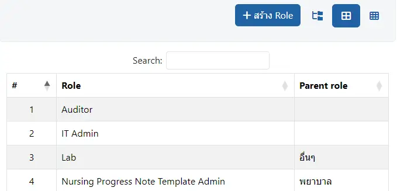

# ระบบจัดการบทบาทผู้ใช้งาน

ตัวกรองในการค้นหา ได้แก่
* `Role` : แสดงเฉพาะ `Role` ที่ต้องการ
* `Permission` : แสดงเฉพาะ `User Permission` ที่ต้องการ

ระบบสามารถแสดง `User Permission` ในแต่ละ `Role` รวมถึง `Parent role` ได้ใน 3 รูปแบบ ได้แก่
1. ผังต้นไม้ แสดงจำนวน `User Permission` ในแต่ละ `Role`

    

1. แบบตาราง แสดง `Role` และ `Parent role`

    

1. แบบตารางรายละเอียด แสดง `Role`, `User Permission` ทั้งหมด และ `Parent role`

    

## การเพิ่ม และแก้ไข `Role`
* คลิกที่ปุ่ม `+ สร้าง Role` เพื่อเพิ่ม `Role` ใหม่
* คลิกที่รายการในตาราง หรือผังต้นไม้ เพื่อทำการแก้ไข

* `Role` : สำหรับแก้ไข ชื่อ `Role`
* `Role Description` : สำหรับแก้ไข ชื่อแสดงของ `Role`
* `Parent Role` : สำหรับแก้ไข `Parent role`
* `Permissions` : เลือก `User Premission` ที่ต้องการ (สามารถเลือกได้หลายรายการ)