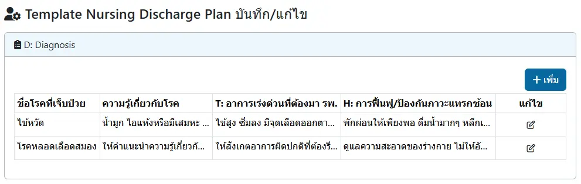
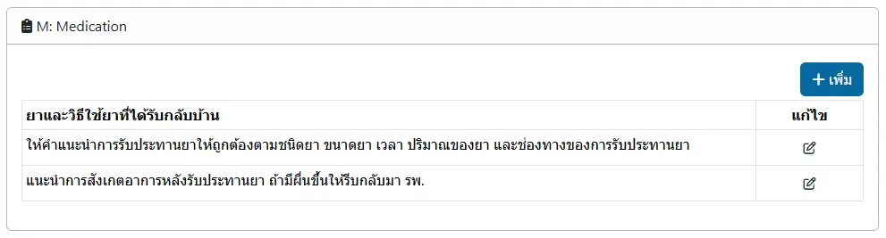
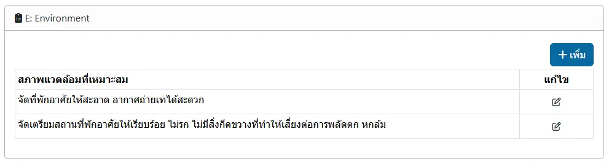
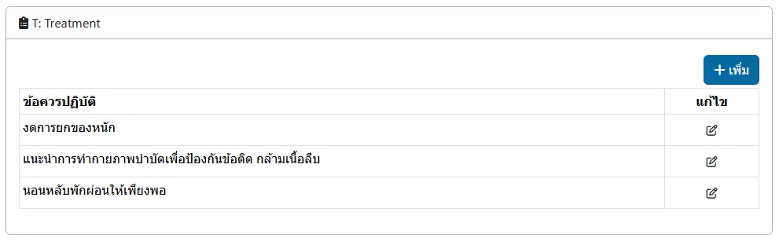
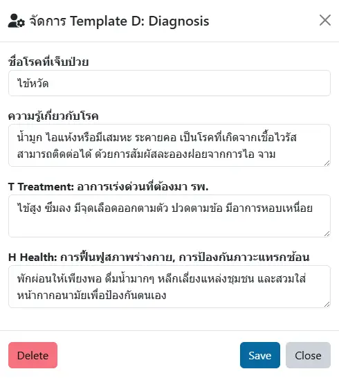
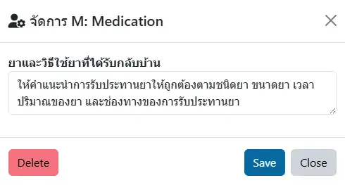
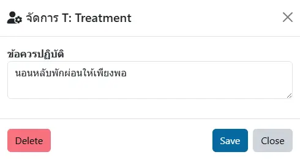

# Template Discharge Plan
Discharge Plan ตามหลัก `D METHOD` ได้แก่การบันทึก `Diagnosis`, `Medicine`, `Environment`, `Treatment`, `Health`, `Out Patient` และ `Diet`

การบันทึก Discharge Plan สามารถทำได้ 2 รูปแบบ ได้แก่
1. บันทึกในระบบ [บันทึกความก้าวหน้าทางการพยาบาล (Nurse Note)](../shared/focus-note.md) โดยสร้าง [Template Nurse Note](template-nurse.md) ด้วยการบันทึก `D METHOD` แต่ละข้อลงใน `Intervention` เช่น ภาวะ Sepsis จะบันทึกตัวเลือก `Intervention` ในกลุ่ม Sepsis เช่น
    - D: ภาวะติดเชื้อในกระแสโลหิต เป็น...
    - M: แนะนำให้รับประทานยา...
    - M: หากมีอาการแพ้ยาให้...
    - E: แนะนำการดูแลสิ่งแวดล้อม...

2. บันทึกในระบบ [บันทึกแผนการจำหน่าย (Discharge Plan)](shared/discharge-plan.md) โดยสร้าง Template ดังนี้
## Diagnosis

สำหรับบันทึกคำแนะนำในส่วนต่าง ๆ `แยกรายโรค` ประกอบด้วย
- D: Diagnosis: ชื่อโรคที่เจ็บป่วย
- D: Diagnosis: ความรู้เกี่ยวกับโรค
- T: Treatment: อาการเร่งด่วนที่ต้องมา รพ.
- H: Health: การฟื้นฟู/ป้องกันภาวะแทรกซ้อน

## Medication

สำหรับสร้างตัวเลือก เพื่อใช้ร่วมกัน `ทุกโรค`

## Environment

สำหรับสร้างตัวเลือก เพื่อใช้ร่วมกัน `ทุกโรค`

## Treatment

สำหรับสร้างตัวเลือก เพื่อใช้ร่วมกัน `ทุกโรค`

## Medicine

สำหรับสร้างตัวเลือก เพื่อใช้ร่วมกัน `ทุกโรค`

## การเพิ่ม หรือแก้ไข
ด้วยการกดปุ่ม `+ เพิ่ม` เพื่อสร้างรายการใหม่ หรือกดปุ่ม <i class="fa fa-pencil-square-o" style="color:orange;"></i> เพื่อแก้ไข
* `Save` บันทึก
* `Close` ปิดหน้าต่างการแก้ไข
* `Delete` ลบรายการ (หากถูกใช้งานแล้ว จะไม่สามารถลบได้)

    
    
    
    
    