# Template การบันทึกทางการพยาบาล (Focus Charting)
KPHIS จัดระบบการบันทึกทางการพยาบาลในรูปแบบ Focus Charting ซึ่งประกอบด้วย
* ประเด็นสำคัญ หรือ ปัญหา (Focus)
* การประเมินผู้ป่วยแรกรับ (Assessment)
* การบันทึกกิจกรรมการพยาบาล (Intervention)
* การประเมินผลการพยาบาล (Evaluation)

และได้เพิ่มการจัด กลุ่มอาการ (Group), กลุ่มอาการย่อย (Subgroup), เป้าหมาย (Goal) และ Daily Care เพิ่มเติม

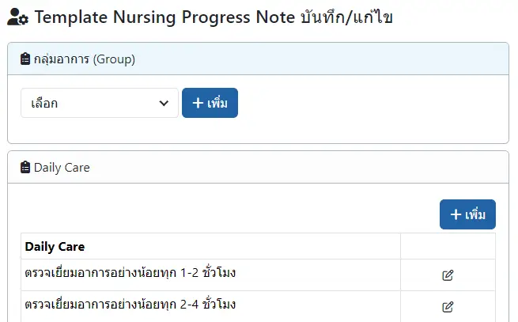

1. `กลุ่มอาการ (Group)` ประกอบด้วย หลาย `กลุ่มอาการย่อย (Subgroup)`

1. `กลุ่มอาการย่อย (Subgroup)` มี 2 ประเภท ได้แก่
    * `ไม่ระบุ(แสดงเสมอ)` : เมื่อเลือก `กลุ่มอาการ (Group)` ของกลุ่มย่อยนี้ จะแสดง `ปัญหา (Focus)` + `เป้าหมาย (Goal)` + `Intervention` ของกลุ่มย่อยนี้โดยอัตโนมัติ
    * `ระบุชื่อ` : เพื่อแบ่งกลุ่มอาการ เป็นกลุ่มย่อย (Subgroup)

    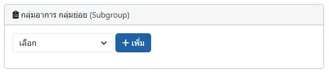
    
    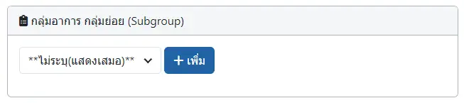

    

    ประเภท `ไม่ระบุ(แสดงเสมอ)` ช่วยให้ท่านสามารถเลือก `ปัญหา (Focus)` + `เป้าหมาย (Goal)` + `Intervention` ได้โดยอัตโนมัติ ในทุกๆ `ปัญหา (Focus)` ที่ตรงกับ `กลุ่มอาการ (Group)` 

    เช่น  `กลุ่มอาการ (Group)` ไข้ มี
    - `ไม่ระบุ(แสดงเสมอ)` ที่มี `ปัญหา (Focus)` F-A, `เป้าหมาย (Goal)` G-A และ `Intervention` I-A
    - `ระบุชื่อ` <u>หนาวสั่น</u> ทีมี `ปัญหา (Focus)` F-X, `เป้าหมาย (Goal)` G-X และ `Intervention` I-X
    - `ระบุชื่อ` <u>ซึม</u> ทีมี `ปัญหา (Focus)` F-Y, `เป้าหมาย (Goal)` G-Y และ `Intervention` I-Y
    หากเลือก `ปัญหา (Focus)` F-X จะแสดง `เป้าหมาย (Goal)` G-X และ G-A  
    หากเลือก `ปัญหา (Focus)` F-Y จะแสดง `เป้าหมาย (Goal)` G-Y และ G-A 
    

1. ในแต่ละ `กลุ่มอาการย่อย (Subgroup)` จะประกอบไปด้วย `ปัญหา (Focus)` + `เป้าหมาย (Goal)` + `Intervention` ประจำกลุ่มย่อย

    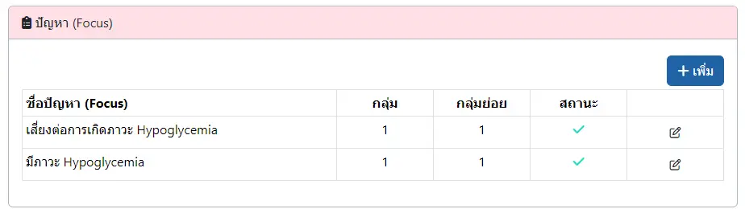

    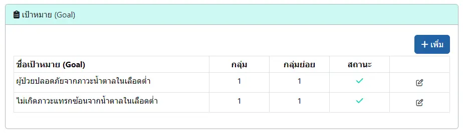

    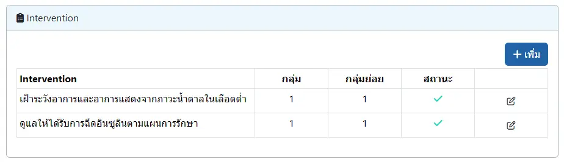

1. `Daily Care` จะแสดงตลอดเวลา ไม่เกี่ยวข้องกับ `กลุ่มอาการ (Group)`, `กลุ่มอาการย่อย (Subgroup)`, `ปัญหา (Focus)`, `เป้าหมาย (Goal)` หรือ `Intervention`

## การเพิ่ม หรือแก้ไข
ด้วยการกดปุ่ม `+ เพิ่ม` เพื่อสร้างรายการใหม่ หรือกดปุ่ม <i class="fa-regular fa-pen-to-square" style="color:orange;"></i> เพื่อแก้ไข
* `ยกเลิกการใช้งาน` ทำให้ไม่สามารถใช้รายการนี้ได้ จนกว่าจะเปลี่ยนเป็น `ยังใช้งานอยู่`
* `Save` บันทึก
* `Close` ปิดหน้าต่างการแก้ไข
* `Delete` ลบรายการ (หากถูกใช้งานแล้ว จะไม่สามารถลบได้)

    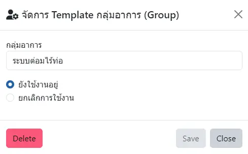

    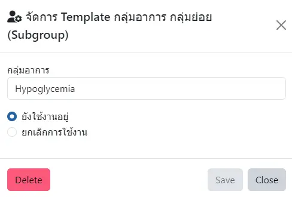

    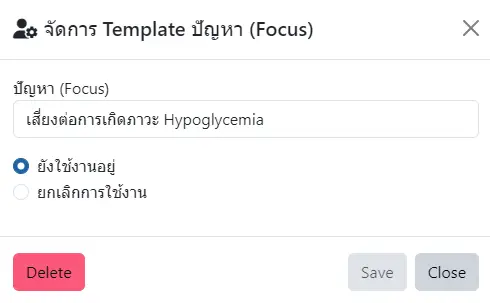

    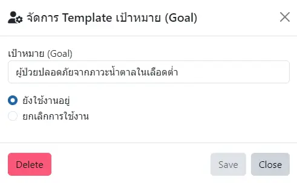

    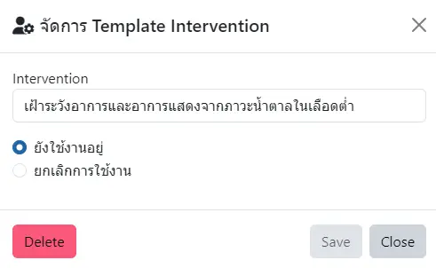

    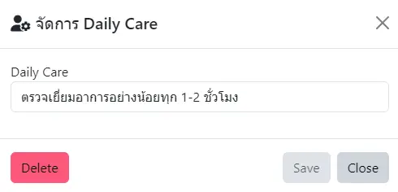