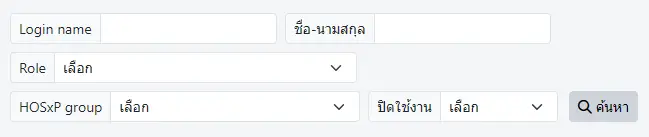
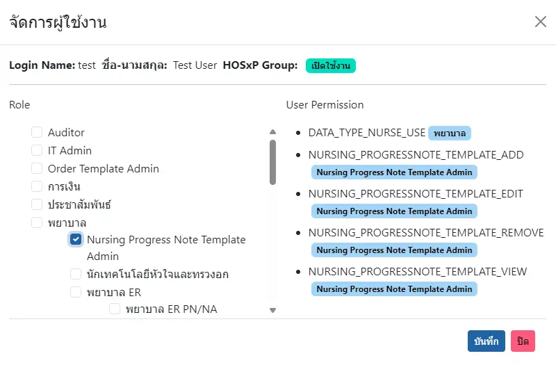

# ระบบจัดการผู้ใช้งาน
KPHIS ใช้รายการผู้ใช้งานจาก HOSxP โดยตรง และเพิ่มระบบ `Role` และ `User Permission` เพื่อควบคุมการใช้งานในโปรแกรม
* `Role` : หรือ บทบาท คือ กลุ่มของ `User Permission` ที่แบ่งตามหน้าที่ หรือวิชาชีพ และมี `Role` ย่อย ใน `Role` หลัก เช่น 
    - `พยาบาล` แบ่งเป็น `พยาบาล ER`, `พยาบาล IPD` และอื่นๆ  
    - `พยาบาล ER` แบ่งเป็น `พยาบาล ER PN/NA` และ `พยาบาล ER RN/EMT`
* `User Permission` : สิทธิ์การใช้งานแต่ละระบบใน KPHIS เช่น การใช้บางเมนู, การแสดงปุ่ม, ความสามารถในการแก้ไข หรือการลบข้อมุลแต่ละประเภท

ตัวกรองในการค้นหา ได้แก่
* `Login name` : ชื่อที่ใช้ในการเข้าสู่ระบบ (HOSxP)
* `ชื่อ-นามสกุล` : ชื่อ-นามสกุลที่ลงทะเบียนใน HOSxP
* `Role` : บทบาทใน KPHIS
* `HOSxP group` : กลุ่มใน HOSxP
* `ปิดใช้งาน` : การเปิด/ปิด การใช้งานใน HOSxP

## จัดการผู้ใช้งาน

หน้าต่างประกอบด้วย 2 ส่วน คือ `Role` ทางด้านซ้าย และ `User Permission` ทางด้านขวา  
* หน้าต่าง `Role` แสดงบทบาทของผู้ใช้งาน สามารถเลือกได้หลายรายการ
* หน้าต่าง `User Permission` แสดงสิทธิ์<u>ทั้งหมด</u> ที่ผู้ใช้งานได้รับ พร้อมแสดง `Role` ของสิทธิ์นั้น ในแถบข้อความสีฟ้า