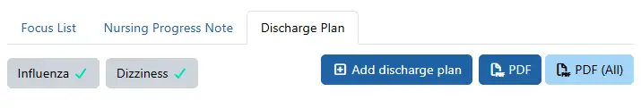
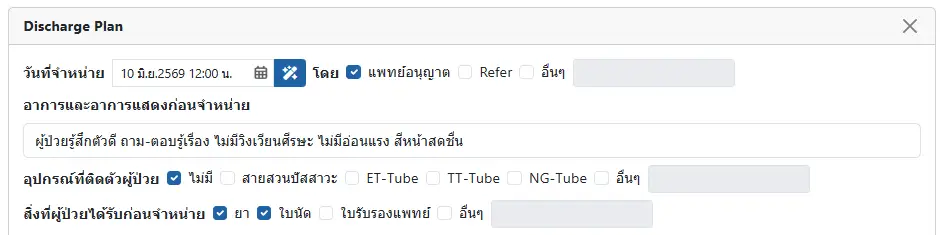
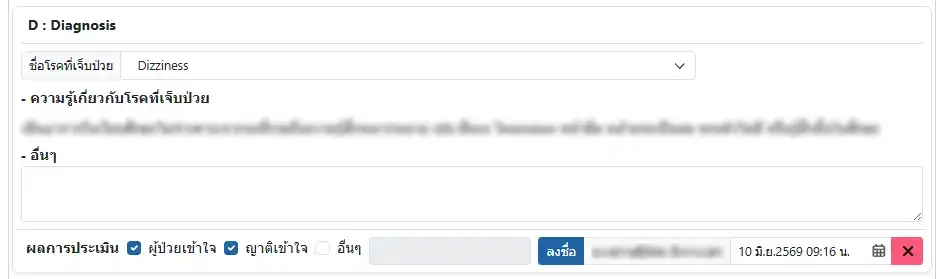
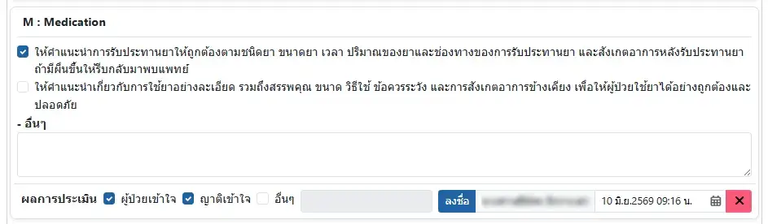
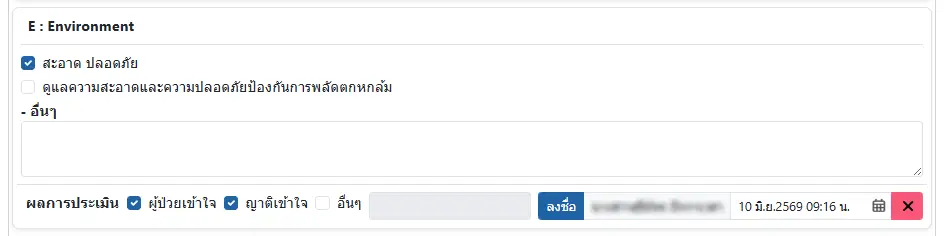
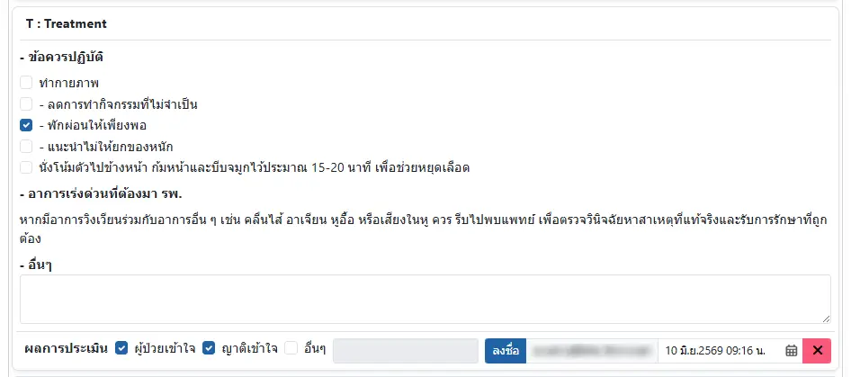
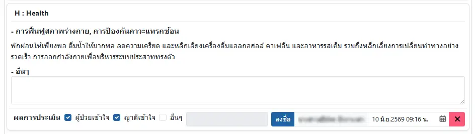
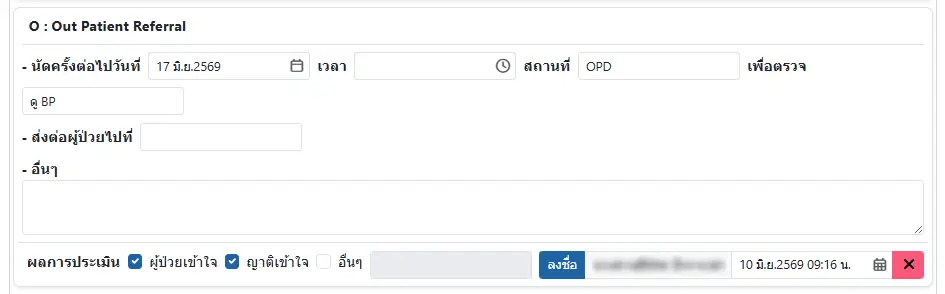
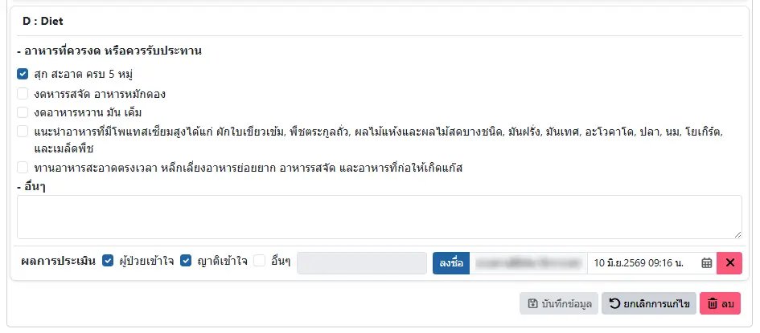

# บันทึกแผนการจำหน่าย (Discharge Plan)

ท่านสามารถบันทึกแผนการจำหน่ายตามหลักการ D-METHOD ด้วยการเลือกรายการวินิจฉัย จาก [Template Discharge Plan](../other/template-discharge-plan.md)ซึ่งจะนำข้อมูลในส่วน Diagnosis, Treatment และ Health มาให้ท่านเลือก

ส่วนรายการ Medication, Environment, Treatment และ Diet

ท่านสามารถสร้าง Discharge Plan ได้หลายโรค ตามการวินิจฉัยของผู้ป่วย

ปุ่มเครื่องมือ
* <i class="fa-regular fa-square-plus" style="color:orange;"></i> `Add discharge plan`: เพิ่ม Discharge Plan ใหม่
* <i class="fa-regular fa-file-pdf" style="color:orange;"></i> `PDF` : แสดงรายงาน

เมื่อลงนามครบทุกหัวข้อ ตามหลัก D-METHOD แล้ว

ถึงจะมีเครื่องหมาย <i class="fa-solid fa-check" style="color:green;"></i> หลังคำวินิจฉัย

### ข้อมูลทั่วไป

### D: Diagnosis

เลือกการวินิจฉัยที่ต้องการ ระบบจะนำ `ความรู้เกี่ยวกับโรคที่เจ็บป่วย` มาจาก `Diagnosis` ใน [Template Discharge Plan](../other/template-discharge-plan.md)

### M: Medication

ประกอบด้วยตัวเลือก จาก `Medication` ใน [Template Discharge Plan](../other/template-discharge-plan.md)

### E: Environment

ประกอบด้วยตัวเลือก จาก `Environment` ใน [Template Discharge Plan](../other/template-discharge-plan.md)

### T: Treatment

ประกอบด้วย
* `ข้อควรปฏิบัติ` จาก `Treatment` ใน [Template Discharge Plan](../other/template-discharge-plan.md) 
* `อาการเร่งด่วนที่ต้องมา รพ.` จาก `Diagnosis` ใน [Template Discharge Plan](../other/template-discharge-plan.md) 

### H: Health

แสดงข้อความจาก `Diagnosis` (การฟื้นฟู/ป้องกันภาวะแทรกซ้อน) ใน [Template Discharge Plan](../other/template-discharge-plan.md) 

### O: Out Patient Referral

### D: Diet

ประกอบด้วยตัวเลือก จาก `Diet` ใน [Template Discharge Plan](../other/template-discharge-plan.md)

และปุ่มเครื่องมือ ได้แก่

* <i class="fa-regular fa-floppy-disk" style="color:orange;"></i> `บันทึกข้อมูล` : บันทึก Discharge Plan
* <i class="fa-solid fa-arrow-rotate-left" style="color:orange;"></i> `ยกเลิกการแก้ไข` : ยกเลิกการแก้ไข Discharge Plan (หากบันทึกแล้ว จะยกเลิกไม่ได้)
* <i class="fa-regular fa-trash-can" style="color:red;"></i> `ลบ` : ลบ Discharge Plan

ในทุกหัวข้อ D-METHOD ท่านสามารถเพิ่ม `อื่นๆ`

ในลักษณะ `- XXX` หลายบรรทัดได้

