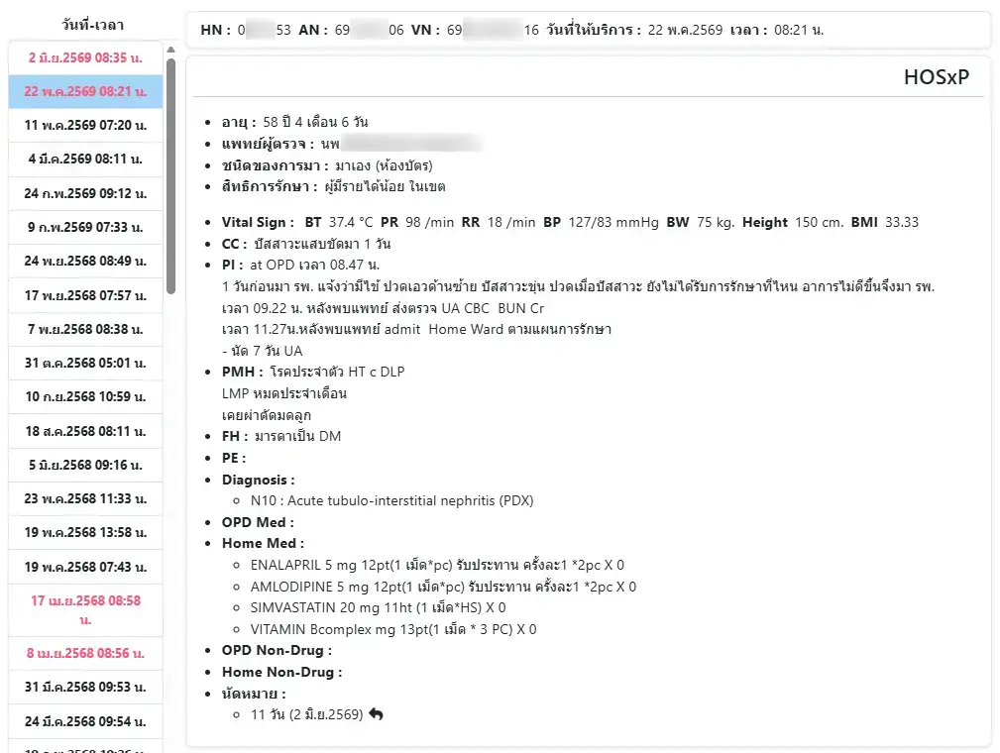
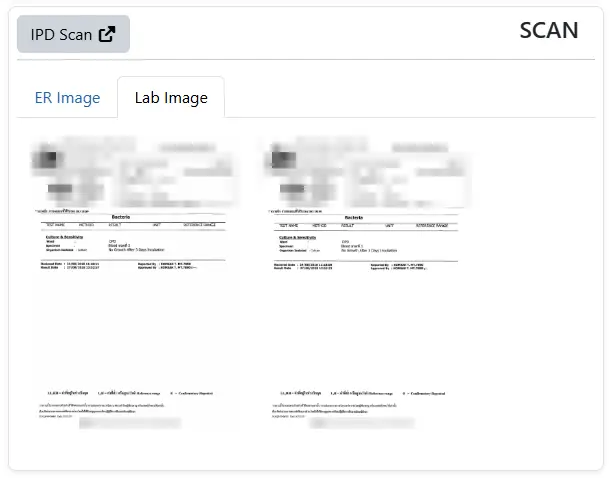
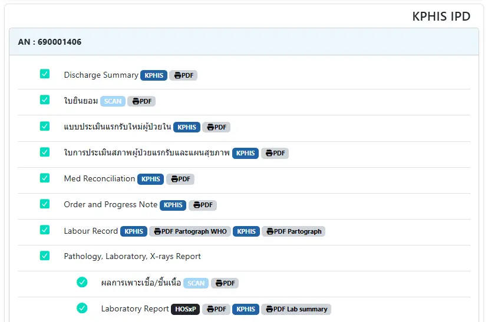
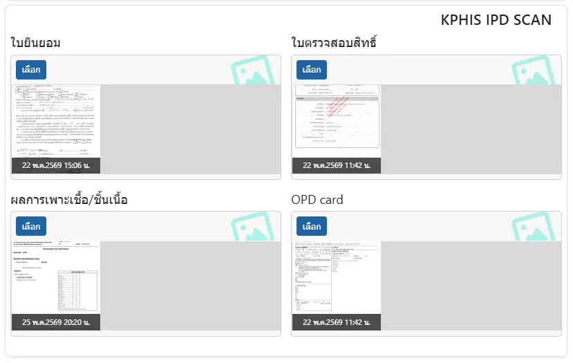

# เวชระเบียนอิเล็กทรอนิกส์ (Electronic Medical Record: EMR)

ประกอบด้วย 2 ส่วนหลัก ได้แก่
* `วันที่-เวลา` : สำหรับเลือกรายการรับบริการของผู้ป่วย ตามวันที่และเวลา โดยหากเป็นผู้ป่วยใน จะเป็นตัวอักษรสีแดง
* รายละเอียด ซึ่งประกอบด้วย
    - `HOSxP` : ข้อมูลการรับบริการใน HOSxP
    - `SCAN` : รูปภาพที่บันทึกใน HOSxP (การตรวจร่างกาย, Opd, Er และ Lab) โดยหากมีระบบเก็บแฟ้มผู้ป่วยใน จะแสดงปุ่มทางลัด `IPD Scan` <i class="fa-solid fa-up-right-from-square" style="color:orange;"></i> 
    - `KPHIS IPD` : กรณีผู้ป่วยใน ที่บันทึกใน KPHIS จะแสดงรายงานทั้งหมดที่นี่
    - `KPHIS IPD SCAN` : กรณีผู้ป่วยใน ที่บันทึกใน KPHIS จะแสดงรูปภาพที่เกี่ยวข้องไว้ที่นี่

ในหัวข้อ `นัดหมาย` ใน HOSxP ท่านสามารถคลิกที่ <i class="fa-solid fa-reply" style="color:orange;"></i>

เพื่อไปยังวันที่รับบริการได้ (เฉพาะกรณีที่ผู้ป่วยมาตรงกับวันนัดเท่านั้น)

