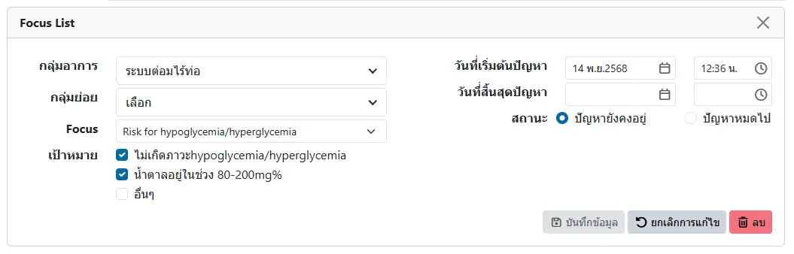
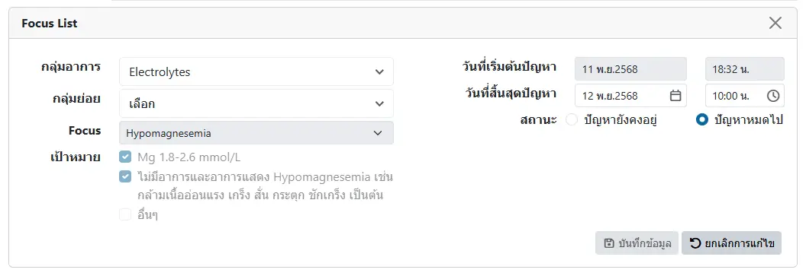

# บันทึกปัญหาทางการพยาบาล (Focus List)

ในหัวข้อ `Nursing Progress Note` ในแฟ้มผู้ป่วย จะมีหัวข้อย่อย `Add Focus List` สำหรับเพิ่มและแก้ไข Focus List

ประกอบด้วยตัวกรอง ได้แก่
* `วันที่เริ่มต้นปัญหา`: เลือกช่วงของวันที่ ที่ต้องการแสดง
* `สถานะ`: เลือกสถานะของ Focus ประกอบด้วย `ทั้งหมด`, `ปัญหายังคงอยู่` และ `ปัญหาหมดไป`
* `ปุ่มเลือกช่วงเวลา`: เลือกช่วงของวันที่ ด้วยการเลือกวันที่ต้องการ

และปุ่มเครื่องมือ ได้แก่
* <i class="fa-regular fa-square-plus" style="color:orange;"></i> `Add focus list`: เพิ่ม Focus ใหม่
* <i class="fa-regular fa-file-pdf" style="color:orange;"></i> `PDF`: แสดงรายงาน
* <i class="fa-regular fa-pen-to-square" style="color:orange;"></i>: แก้ไข Focus

## การเพิ่ม/แก้ไข Focus

ท่านสามารถเลือก `กลุ่มอาการ (Group)`, `กลุ่มย่อย (Subgroup)`, `ปัญหา (Focus)` และ `เป้าหมาย (Goal)` ได้จาก [Template การบันทึกทางการพยาบาล (Focus Charting)](other/template-nurse.md) ที่บันทึกไว้ล่วงหน้าแล้ว เพื่อมากำหนดปัญหาและเป้าหมายที่ต้องการ ทั้งนี้ ท่านสามารถบันทึก `วันที่เริ่มต้นปัญหา`, `วันที่สิ้นสุดปัญหา` และ `สถานะ`ของปัญหา ได้ด้วย

หาก Focus ดังกล่าว อยู่ระหว่างดำเนินการ (มีการบันทึก Nurse Note ของ Focus นั้นแล้ว)  
จะไม่สามารถแก้ไข `กลุ่มอาการ (Group)`, `กลุ่มย่อย (Subgroup)`, `ปัญหา (Focus)`, `เป้าหมาย (Goal)` และ `วันที่เริ่มต้นปัญหา` ได้อีก  
โดยท่านยังสามารถแก้ไข `วันที่สิ้นสุดปัญหา` และ `สถานะ`ของปัญหาได้   
และไม่สามารถลบ Focus นั้นได้

รูปแสดง Focus ที่ไม่สามารถแก้ไข หรือลบได้
