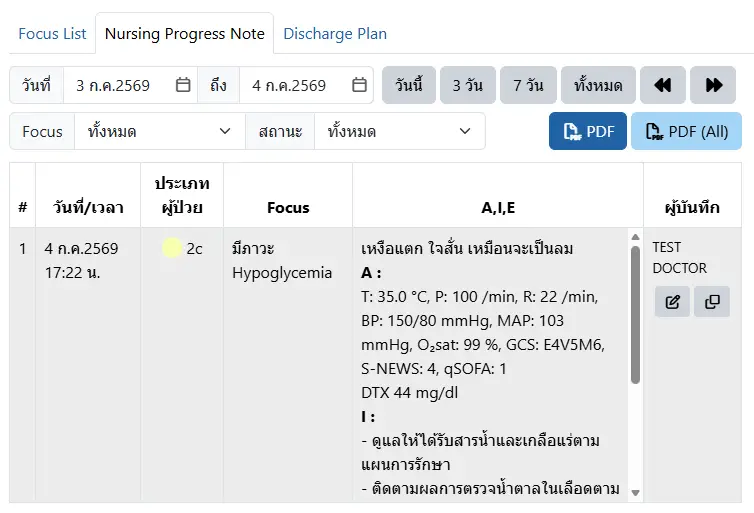
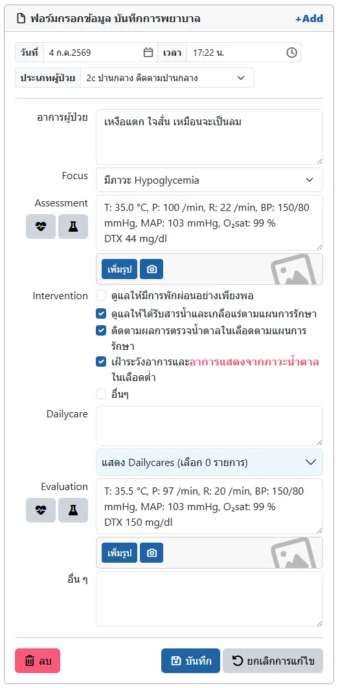

# บันทึกความก้าวหน้าทางการพยาบาล (Focus Note)

ในหัวข้อ `Nursing Progress Note` ในแฟ้มผู้ป่วย จะมีหัวข้อย่อย `Nursing Progress Note` สำหรับเพิ่มและแก้ไข Focus Note

ประกอบด้วยตัวกรอง ได้แก่
* `วันที่` : เลือกช่วงวันที่ ที่ต้องการแสดง
* `Focus` : เลือก Focus ที่ต้องการแสดง
* `สถานะ` : เลือกสถานะของ Focus ประกอบด้วย `ทั้งหมด`, `ปัญหายังคงอยู่` และ `ปัญหาหมดไป`

และปุ่มเครื่องมือ ได้แก่
* <i class="fa-regular fa-file-pdf" style="color:orange;"></i> `PDF` : แสดงรายงาน
* <i class="fa-regular fa-pen-to-square" style="color:orange;"></i> : แก้ไข Focus Note
* <i class="fa-regular fa-clone" style="color:orange;"></i> : คัดลอก Focus Note

## การเพิ่ม/แก้ไข Focus Note

ท่านสามารถเพิม/แก้ไข Focus Note ตามหลัก AIE ได้ดังรูป โดยมีปุ่มเครื่องมือ ได้แก่
* `+ Add` : เพิ่มเพิ่มรายการใหม่
* <i class="fa-solid fa-heart-pulse" style="color:orange;"></i> : นำ Vital Sign มากรอกในช่อง Assessment และ Evaluation 
* <i class="fa-solid fa-flask" style="color:orange;"></i> : นำผลการตรวจทางห้องปฏิบัติการ มากรอกในช่อง Assessment และ Evaluation 
* <i class="fa-regular fa-trash-can" style="color:red;"></i> `ลบ` : ลบ Focus Note
* <i class="fa-regular fa-floppy-disk" style="color:orange;"></i> `บันทึก` : บันทึก Focus Note
* <i class="fa-solid fa-arrow-rotate-left" style="color:orange;"></i> `ยกเลิกการแก้ไข` : ยกเลิกการแก้ไข Focus Note (หากบันทึกแล้ว จะยกเลิกไม่ได้)

ท่านสามารถเพิ่มรูป ลงใน Assessment และ Evaluation ได้

ด้วย [ระบบรูปภาพ](../extra/image.md)

