# บันทึกแผนและกิจกรรมทางการพยาบาล (Index Plan/Action)

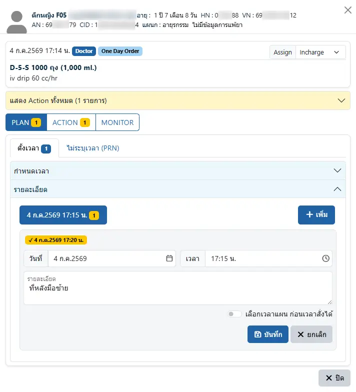

ประกอบด้วย 4 ส่วน เรียงจากบนลงล่าง ได้แก่
* `ข้อมูลผู้ป่วย` : แสดงข้อมูลผู้ป่วย เพื่อยืนยันตัวบุคคลขณะให้บริการ
* `คำสั่งแพทย์` : แสดงรายละเอียดคำสั่งแพทย์ เช่น
    - สั่งโดยแพทย์ `Doctor` หรือสั่งโดยพยาบาล `Nurse`
    - เป็น `One Day Order` หรือ `Continuous Order`
    - `Assign` มอบหมายให้ใครเป็นผู้ดูแล เช่น Incharge / Member เป็นต้น
    - ระบุประเภทยา (เฉพาะคำสั่ง `Medication` เท่านั้น) เป็น ยากิน <i class="fa-solid fa-pills" style="color:orange;"></i> หรือ ยาฉีด <i class="fa-solid fa-syringe" style="color:red;"></i> ประกอบการกรองการให้บริการ และการแสดง `Current Injection` ในหน้า [บันทึกคำสั่งแพทย์](order.md) ด้วยการคลิก เพื่อสลับระหว่าง <i class="fa-solid fa-pills" style="color:orange;"></i> และ <i class="fa-solid fa-syringe" style="color:red;"></i>
    - ชื่อยา และวิธีบริหารยา รวมถึงคำเตือนสำคัญ เช่น ยา `STAT`, ยาเดิมผู้ป่วย `MR`, High Alert Drug `HAD`, ยา Look Alike Sound Alike `LASA`, `แพ้ยา/เฝ้าระวัง` เป็นต้น
* `เครื่องมือ` ได้แก่
    - กล่อง `แสดง Action ทั้งหมด` : รวบรวม Action ทั้งหมดของ Order นี้ เรียงตามวันที่และเวลา (เก่าอยู่ล่าง ใหม่อยู่บน)
    - กล่องเลือกรายละเอียด : ประกอบด้วย `PLAN`, `ACTION` และ `MONITOR` พร้อมจำนวนที่บันทึกไว้แล้ว
    - `X ปิด` : ปิดหน้้าต่าง
* `รายละเอียด` : แสดง `PLAN`, `ACTION` และ `MONITOR` ตามการเลือกในกล่องเลือกรายละเอียด

### PLAN
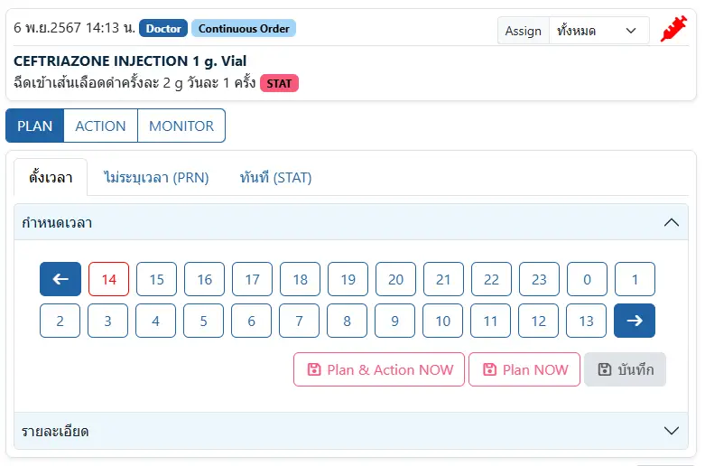

Plan มี 3 ประเภท ได้แก่

* `ตั้งเวลา` : สำหรับคำสั่งแพทย์ ที่ระบุวันที่และเวลาไว้แล้ว เช่น เช้า/กลางวัน/เย็น, ทุก 8 ชั่วโมง, พรุ่งนี้เช้า เป็นต้น
สามารถเลือกแสดงผลได้ 2 รูปแบบ ได้แก่

    - `กำหนดเวลา` : แสดงตัวเลือก `ชั่วโมง` เพื่อกำหนดเวลา โดยระบบจะแสดงเวลาที่แพทย์สั่งด้วยปุ่มสีแดง และไม่อนุญาตให้เลือกเวลาของวันที่ ก่อนวันที่สั่ง

        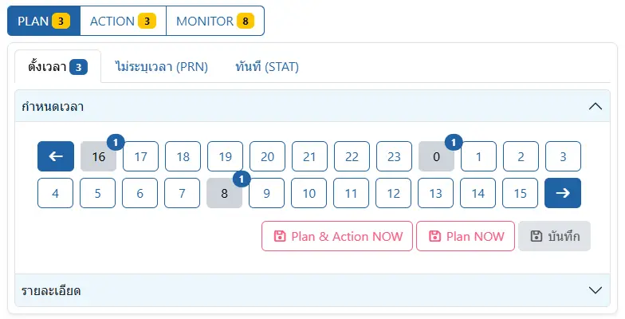

    - `รายละเอียด` : แสดงแต่ละ PLAN ตามวันที่เริ่มต้น

        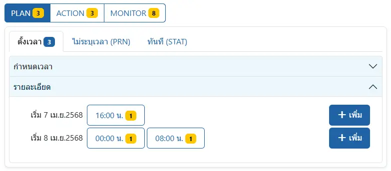

* `ไม่ระบุเวลา (PRN)` : สำหรับคำสั่งแพทย์ ที่ไม่ระบุเวลา เจ้าหน้าที่สามารถให้บริการได้หากตรงตามเงื่อนไข (PRN)

    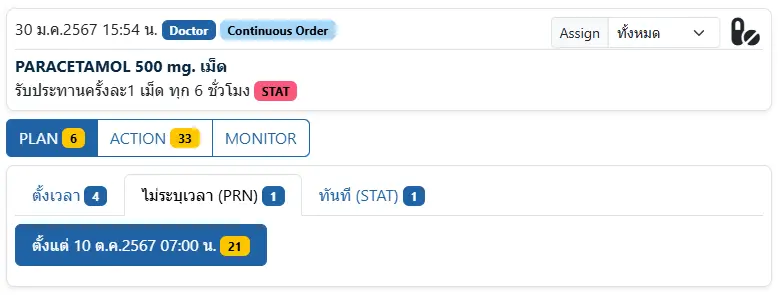

* `ทันที (STAT)` : สำหรับคำสั่งแพทย์ ที่ต้องให้บริการทันทีร่วมด้วย (สามารถบันทึก PLAN และ ACTION ได้เพียงครั้งเดียวเท่านั้น)

    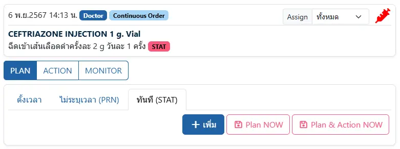

การบันทึก PLAN

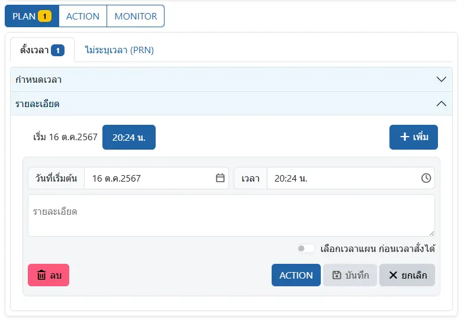

ประกอบด้วยเครื่องมือ
* `เลือกเวลาแผน ก่อนเวลาสั่งได้` : สำหรับบางบริการ ที่ต้องวางแผนด้วยเวลาก่อนคำสั่งแพทย์ เช่น แพทย์สั่งฉีดยาทุก 8 ชั่วโมง เวลา 14:30 และเจ้าหน้าที่ ต้องการจัดรอบการฉีดยาเป็น 06:00, 14:00 และ 22:00 จึงต้องเริ่ม PLAN ด้วยเวลา 14:00 ของวันที่ของคำสั่งแพทย์ 
* <i class="fa-regular fa-trash-can" style="color:red;"></i> `ลบ` : ลบ PLAN
* `ACTION` : ไปยัง ACTION เพิ่มเพิ่ม ACTION ใหม่
* <i class="fa-regular fa-floppy-disk" style="color:orange;"></i> `บันทึก` : บันทึก PLAN
* `X ยกเลิก` : ยกเลิกการแก้ไข

### ACTION
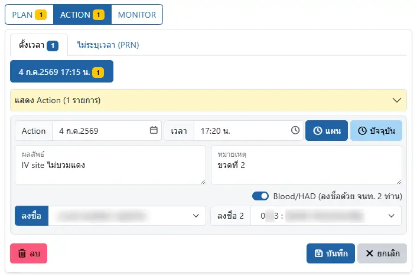

สำหรับบันทึกการ ACTION ตาม PLAN ที่เลือก ประกอบด้วยเครื่องมือ
* <i class="fa-regular fa-clock" style="color:orange;"></i> `แผน` : บันทึก ACTION ด้วยเวลาตามแผน
* <i class="fa-regular fa-clock" style="color:orange;"></i> `ปัจจุบัน` : บันทึก ACTION ด้วยเวลาปัจจุบัน
* `Blood/HAD (ลงชื่อด้วย จนท. 2 ท่าน)` : สำหรับบริการ ที่กำหนดให้ต้องมี เจ้าหน้าที่ 2 ท่านให้บริการ เพื่อป้องกันความผิดพลาด 
* <i class="fa-regular fa-trash-can" style="color:red;"></i> `ลบ` : ลบ ACTION
* <i class="fa-regular fa-floppy-disk" style="color:orange;"></i> `บันทึก` : บันทึก ACTION
* `X ยกเลิก` : ยกเลิกการแก้ไข

ในการบันทึก ACTION ของยา จะมีขั้นตอนการ `จัดยา` เพิ่มขึ้นมา ก่อนการบันทึกรายละเอียดของ ACTION

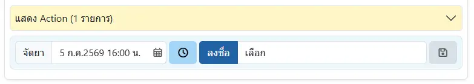

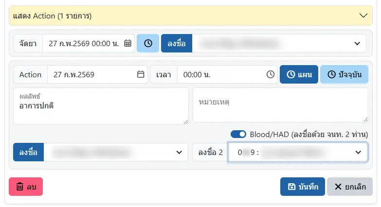

การบันทึก `ลงชื่อ 2` สามารถใช้ `doctorcode`

ซึ่งมักเป็นตัวเลข 3-4 หลัก ในการค้นหาได้ด้วย 

### MONITOR

สำหรับบันทึกการ MONITOR ตาม ACTION ที่เลือก เพื่อบันทึกการเฝ้าระวังหลังให้บริการ ยา/สารน้ำ ที่ต้องการการเฝ้าระวังเป็นพิเศษ

ระบบจะนำ `จำนวนการติดตามอาการหลังได้รับยา อย่างน้อย XX (ครั้ง)` และ `ควรได้รับการติดตามเป็นเวลา อย่างน้อย XX (นาที)` ตามที่กำหนดไว้ใน `การบริหารยา การติดตามอาการ และการแก้ปัญหาเบื้องต้น (Monitor)` ของ [ระบบข้อมูลยา (Drug information)](../extra/drug-information.md) มาคำนวนผลกระ Monitor

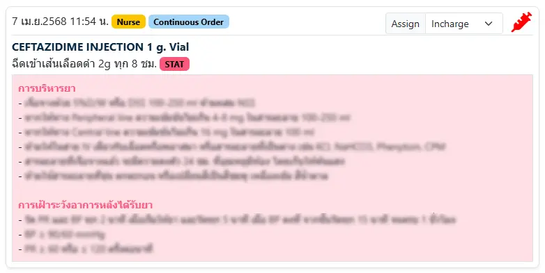

โดยมี `สถานะ` 3 อย่าง ได้แก่
* <i class="fa-regular fa-hourglass-half" style="color:gold;"></i> `รอประเมิน` : สำหรับบันทึกการประเมินไว้ล่วงหน้า ค่อยบันทึกผลทีหลัง
* <i class="fa-regular fa-circle-check" style="color:green;"></i> `ปกติ` : ประเมินแล้ว ผู้ป่วยมีลักษณะปกติตามเกณฑ์
* <i class="fa-solid fa-triangle-exclamation" style="color:red;"></i> `ผิดปกติ` : ประเมินแล้ว ผู้ป่วยมีความผิดปกติเกิดขึ้น

ประกอบด้วยเครื่องมือ
* `ขณะ Action` : ใช้เวลา Action
* `+ 5 นาที` : เพิ่ม Monitor ด้วยเวลาที่ห่างจากเวลา Monitor ครั้งล่าสุด 5 นาที 
* `+ 15 นาที` : เพิ่ม Monitor ด้วยเวลาที่ห่างจากเวลา Monitor ครั้งล่าสุด 15 นาที 
* `+ 30 นาที` : เพิ่ม Monitor ด้วยเวลาที่ห่างจากเวลา Monitor ครั้งล่าสุด 30 นาที 
* `+ 60 นาที` : เพิ่ม Monitor ด้วยเวลาที่ห่างจากเวลา Monitor ครั้งล่าสุด 60 นาที 
* `+ เพิ่ม` : เพิ่ม Monitor ด้วยเวลาปัจจุบัน
<i class="fa-regular fa-clock" style="color:orange;"></i> : เปลี่ยนเวลา เป็นเวลาปัจจุบัน
* <i class="fa-regular fa-floppy-disk" style="color:orange;"></i> `บันทึก` : บันทึก ACTION
* `X ยกเลิก` : ยกเลิกการแก้ไข

ในกล่อง `แสดง Action ทั้งหมด` จะมีสัญลักษณ์แสดง `ผลการ Monitor` ได้แก่
* <i class="fa-regular fa-circle-check" style="color:green;"></i> : ประเมินครบ ผลสุดท้าย ปกติ
* <i class="fa-solid fa-triangle-exclamation" style="color:red;"></i> : ประเมินครบ ผลสุดท้าย ผิดปกติ
* <i class="fa-regular fa-hourglass-half" style="color:green;"></i> : ประเมินยังไม่ครบ ผลล่าสุด ปกติ
* <i class="fa-regular fa-hourglass-half" style="color:red;"></i> : ประเมินยังไม่ครบ ผลล่าสุด ผิดปกติ
* <i class="fa-regular fa-hourglass-half" style="color:gold;"></i> : ประเมินยังไม่ครบ ผลล่าสุด รอประเมิน

