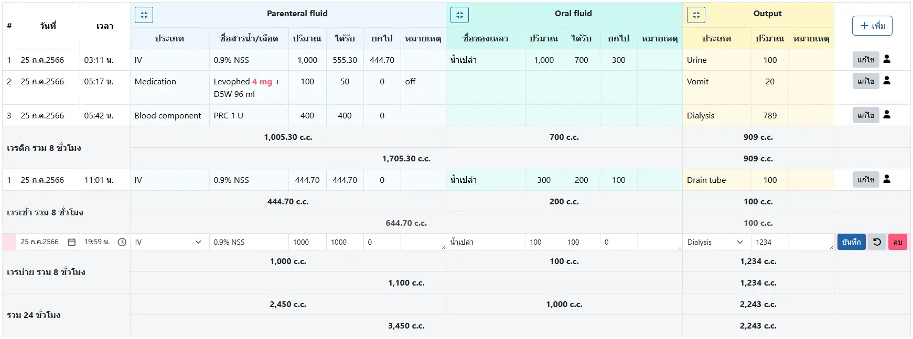
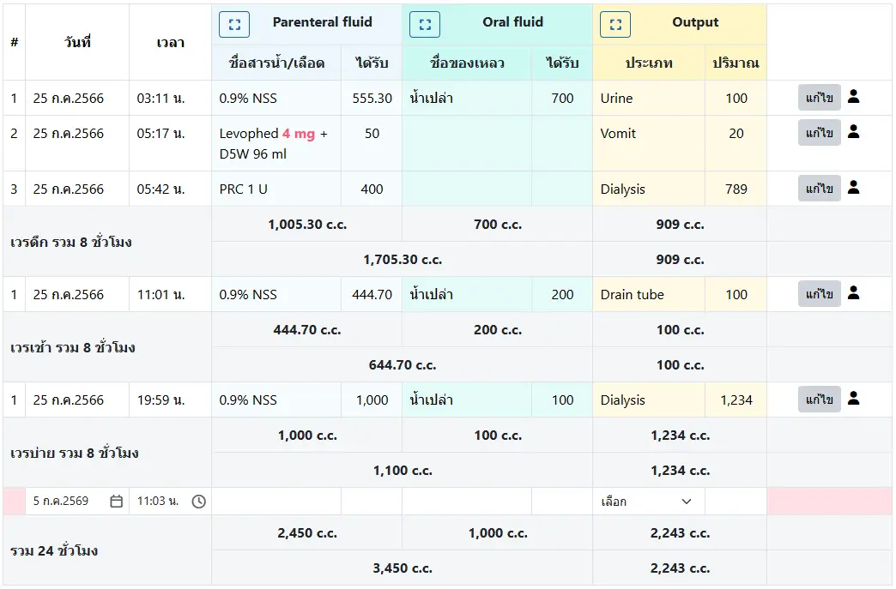

# บันทึกสมดุลน้ำ (Intake-Output: I/O)

ประกอบด้วยข้อมูล `Parenteral fluid`, `Oral fluid` และ `Output` โดยเรียงรายการตามวันที่และเวลา พร้อมทั้งแสดงปริมาณรวมปริมาณในเวร และปริมาณรวมใน 24 ชั่วโมง

โดยระบบ จะใช้ข้อมูล `ได้รับ` ในหัวข้อ `Parenteral fluid` และ `Oral fluid` หรือ `ปริมาณ` ในหัวข้อ `Output` เท่านั้น ในการคำนวนปริมาณรวม

รายการที่แก้ไข หรือรายการใหม่ จะมีแถบสีชมพูแสดงแทนตัวเลข ที่หัวข้อ `#`

เครื่องมือ ได้แก่
* `+ เพิ่ม` : สำหรับเพิ่มรายการใหม่ (แสดงเมื่อกำลังเลือกรายการอื่นอยู่เท่านั้น)
* `แก้ไข` : เลือกรายการเพื่อแก้ไข
* `บันทึก` : บันทึกการเพิ่ม/แก้ไข
* <i class="fa-solid fa-arrow-rotate-left" style="color:orange;"></i> : ยกเลิกการแก้ไข (หากบันทึกแล้ว จะแก้ไขไม่ได้)
* ลบ : ลบรายการที่เลือก

ท่านสามารถย่อขนาด (เมื่อแสดงแบบเต็ม) ได้ด้วยปุ่ม <i class="fa-solid fa-compress" style="color:orange;"></i>

หรือขยายขนาด (เมื่อแสดงแบบย่อ) ได้ด้วยปุ่ม <i class="fa-solid fa-expand" style="color:orange;"></i>

ในแบบย่อ ระบบจะแสดงเฉพาะชื่อและ `ได้รับ` ของ Input และ `ปริมาณ` ของ Output เท่านั้น

ท่านสามารถเปลี่ยนข้อความเป็น สีแดง ได้ด้วยการใส่ `[` และ `]` ครอบข้อความที่ต้องการ

เช่น `ข้อความนี้ มี[ความสำคัญ] ต้องแสดงให้ชัดเจน` จะแสดงเป็น

`ข้อความนี้ มี`ความสำคัญ` ต้องแสดงให้ชัดเจน`

