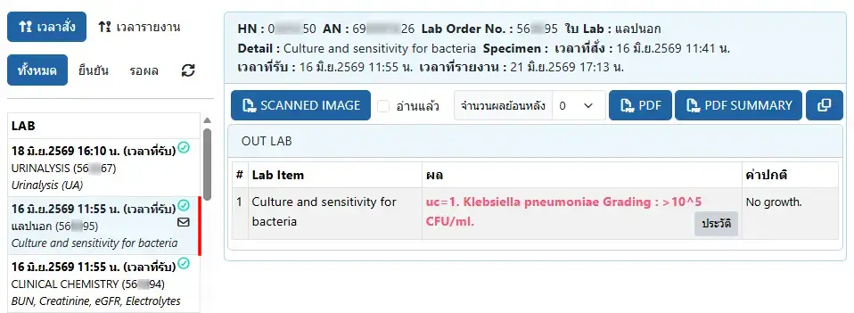
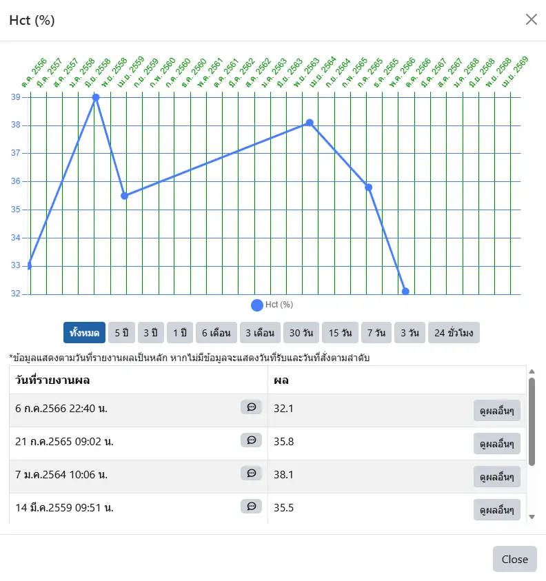

# ผลการตรวจทางห้องปฏิบัติการ จาก HOSxP

ระบบประกอบด้วย 3 ส่วน ได้แก่ การเรียงและกรองข้อมูล, รายการ LAB และผลการตรวจ LAB

### การเรียงและกรองข้อมูล
อยู่ด้านบนซ้ายของจอ ประกอบด้วย
* การเรียงด้วยเวลา : เป็นการเรียงในลักษณะ `รายการใหม่อยู่บน` โดยสามารถเลือกเรียงด้วย `เวลาสั่ง` หรือ `เวลารายงาน` ได้
* กรองประเภท LAB : สามารถเลือกแสดงเฉพาะการตรวจ LAB `ทั้งหมด` หรือที่ `ยืนยัน` ผลแล้ว หรืออยู่ระหว่างการ `รอผล`
* <i class="fa-solid fa-arrows-rotate" style="color:orange;"></i> : ดึงข้อมูลตามการเรียงและการกรองเดิม อีกครั้ง

### รายการ LAB
อยู่ด้านซ้ายของจอ แสดงวันที่ ชื่อการตรวจ และมีสัญลักษณ์ได้แก่
* <i class="fa-regular fa-circle-check" style="color:green;"></i> : ผลตรวจที่ยืนยันแล้ว
* <i class="fa-regular fa-hourglass-half" style="color:gold;"></i> : อยู่ระหว่างการรอผล
* <i class="fa-regular fa-envelope" style="color:orange;"></i> : ผลตรวจที่ยังไม่ได้อ่านผล

### ผลการตรวจ LAB
อยู่ด้านขวาของจอ ประกอบด้วย 3 ส่วน ได้แก่ หัวข้อ, เครื่องมือ และ รายละเอียด

* หัวข้อ : แสดงข้อมูลการสั่ง LAB
* เครื่องมือ : ประกอบด้วย
    - <i class="fa-regular fa-file-pdf" style="color:orange;"></i> `SCANNED IMAGE` : แสดงภาพ scan ของผล LAB ที่บันทึกใน HOSxP (ถ้ามี)
    - กล่องบันทึก `อ่านแล้ว` ที่เมื่อคลิกซ้ำ จะเป็นการ ยกเลิก
    - `จำนวนผลย้อนหลัง` : กำหนดจำนวนผล LAB ชนิดเดียวกันย้อนหลัง ที่ต้องการแสดงเพิ่มเติม (หากเลือก 3 จะแสดง 1 + 3 = 4 รายการ หากมีข้อมูลเพียงพอ)
    - <i class="fa-regular fa-file-pdf" style="color:orange;"></i> `PDF` : แสดงรายงานผล ในรูปแบบใบ LAB
    - <i class="fa-regular fa-file-pdf" style="color:orange;"></i> `PDF SUMMARY` : แสดงรายงานผล ในรูปแบบตาราง โดยแสดงตาม `จำนวนผลย้อนหลัง` ที่ระบุ
    - <i class="fa-regular fa-clone" style="color:orange;"></i> : คัดลอกผล LAB เป็นข้อความ ลงใน Clipboard ของ Web browser
* รายละเอียด : แสดงผลการตรวจ และค่าปกติ โดยหากผลตรวจ `ผิดปกติ` จะแสดงด้วยตัวอักษรสีแดง ร่วมกับ `H` หรือ `L` เมื่อผลการตรวจมีค่า สูง หรือต่ำกว่า ค่าปกติ

ท่านสามารถดูประวัติค่า LAB เฉพาะแต่ละรายการ ในรูปแบบกราฟเส้นได้ ด้วยปุ่ม `ประวัติ`

และสามารถย้อนไป `ดูผลอื่นๆ` ในใบ LAB นั้นได้ (ออกจากการแสดงกราฟ แล้วแสดงผลการตรวจ LAB รายการที่เลือก แทนรายการเดิม)

