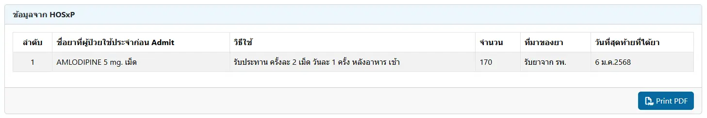
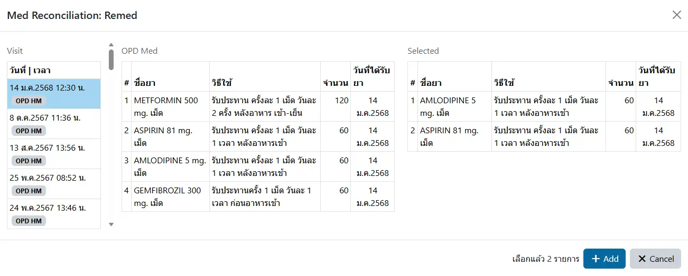
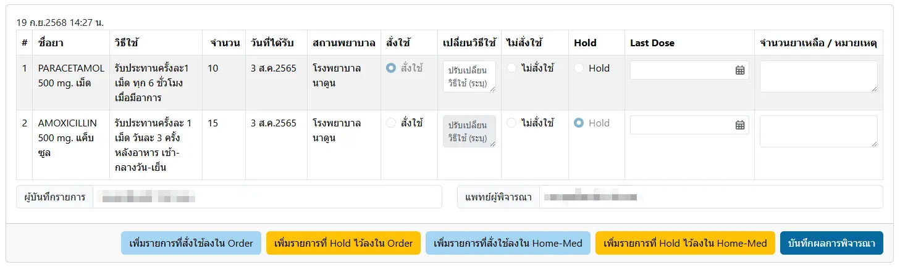

# บันทึกการทบทวนยา (Medical Reconciliation)

## ข้อมูลจาก HOSxP
หากมีการทบทวนยาใน HOSxP แล้ว ระบบจะนำมาแสดง ดังรูป

## การเพิ่มรายการใหม่

สามารถทำได้ 3 วิธี ได้แก่
1. `เลือกจากรายการในอดีต (Remed)`: ด้วยการคลิกที่ปุ่ม <i class="fa fa-plus" style="color:orange;"></i>`Remed` ระบบจะแสดงหน้าต่างรายการดังรูป

เลือก `Visit` ที่ต้องการ แล้วจึงคลิกเลือกรายการยาที่ต้องการ รายการยาจะไปแสดงในตาราง `Selected` ทางด้านขวา หรือหากคลิกซ้ำ ระบบจะยกเลิกรายการนั้นๆ ให้  
หากเลือกเรียบร้อยแล้ว ให้กดปุ่ม <i class="fa fa-plus" style="color:orange;"></i> `Add` ระบบจะเพิ่มรายการที่เลือกไว้ให้
2. `เพิ่มยาที่มีใน รพ.`: ด้วยการคลิกที่ <i class="fa fa-plus"></i> <i class="fa fa-search"></i> เพื่อเลือกรายการยา, กรอกข้อมูลอื่นจนครบถ้วน แล้วคลิกที่ <i class="fa fa-plus" style="color:orange;"></i> `Add Item`
3. `เพิ่มยาที่ไม่มีใน รพ.`: ด้วยการกรอก `ชื่อยา` ในกล่อง `ยาเดิมผู้ป่วย`, กรอกข้อมูลอื่นจนครบถ้วน แล้วคลิกที่ <i class="fa fa-plus" style="color:orange;"></i> `Add Item`

## การแก้ไขโดยเจ้าหน้าที่ หรือเภสัชกร

เจ้าหน้าที่ หรือเภสัชกร สามารถแก้ไขข้อมูลได้ ยกเว้นชื่อยา แล้วจึงคลิก `ยืนยันรายการ`

หากยังไม่ `ยืนยันรายการ` ท่านสามารถเพิ่มรายการใหม่ได้อีก  
โดยระบบจะนำรายการใหม่ มาใส่ให้ท่านในกล่องเดิมให้  
แล้วท่านค่อยคลิก `ยืนยันรายการ` ทีเดียว

## การพิจารณาโดยแพทย์

แพทย์สามารถพิจารณา `สั่งใช้`, `ไม่สั่งใช้` หรือ `Hold` แต่ละรายการได้ โดยหากแพทย์พิจารณา `สั่งใช้` จะสามารถปรับเปลี่ยนวิธีใช้ได้  
หลังจากแพทย์ `บันทึกผลการพิจารณา` แล้ว แพทย์สามารถ เพิ่มรายการที่สั่งใช้/รายการที่ Hold ไว้ ลงใน Continuous Order/Home-Medication ได้
