# บันทึกคำสั่งแพทย์

## หน้าต่างหลัก
ตัวอย่างหน้าต่างหลัก สำหรับแพทย์
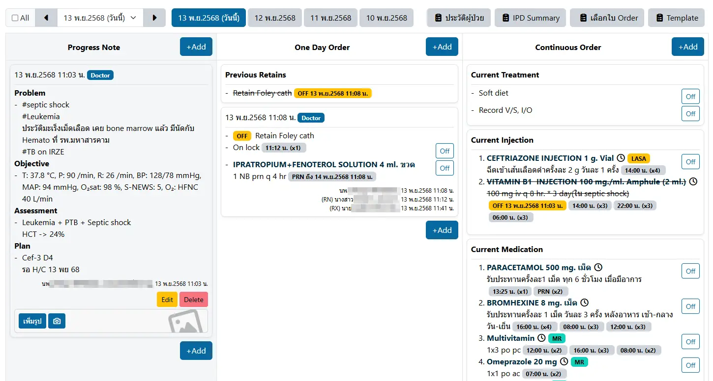

ตัวอย่างหน้าต่างหลัก สำหรับพยาบาล
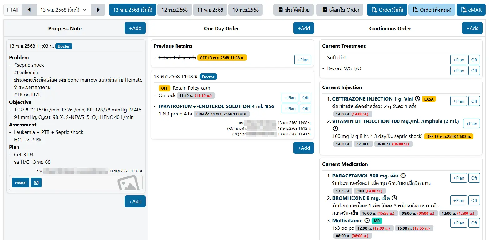

หน้าต่างหลัก ประกอบด้วย
* `กล่องเลือกวันที่`: แสดงรายการวันที่ เฉพาะที่มี Order/Progress Note เท่านั้น (หากคลิกเลือก All จะแสดงทุกวัน รวมวันที่ไม่มีข้อมูลด้วย)
* `ปุ่มวันที่`: แสดงปุ่มเลือกวันที่ คราวละ 7 วัน
* `ปุ่มทางลัด`: แสดงปุ่มทางลัดไปยังระบบงานอื่น ตามวิชาชีพ เช่น
    1. `แพทย์` จะแสดงปุ่ม 
        - <i class="fas fa-clipboard-list" style="color:orange;"></i>`ประวัติผู้ป่วย`: แสดงข้อมูลแรกรับใน HOSxP และปุ่ม [บันทึกการรับใหม่ผู้ป่วยใน](../ipd/admission-note-dr.md)
        - <i class="fas fa-clipboard-list" style="color:orange;"></i>`IPD Summary`: ไปยังระบบ [IPD Summary](../ipd/summary.md)
        - <i class="fas fa-clipboard-list" style="color:orange;"></i>`เลือกใบ Order`: เปิดหน้าต่างเพื่อเลือก [Order ล่วงหน้า](../ipd/pre-order.md) ประเภท `Admit ล่วงหน้า` หรือ `Admit ในวัน` มาใส่ใน Order
        - <i class="fas fa-clipboard-list" style="color:orange;"></i>`Template`: เปิดหน้าต่างเพื่อเลือก [Order ล่วงหน้า](../ipd/pre-order.md) ประเภท `Template` มาใส่ใน Order
    2. `พยาบาล` จะแสดงปุ่ม
        - <i class="fas fa-clipboard-list" style="color:orange;"></i>`ประวัติผู้ป่วย`: แสดงข้อมูลแรกรับใน HOSxP และปุ่ม [บันทึกการรับใหม่ผู้ป่วยใน](../ipd/admission-note-dr.md)
        - <i class="fas fa-clipboard-list" style="color:orange;"></i>`เลือกใบ Order`: เปิดหน้าต่างเพื่อเลือก [Order ล่วงหน้า](../ipd/pre-order.md) ประเภท `Admit ล่วงหน้า` หรือ `Admit ในวัน` มาใส่ใน Order
        - <i class="fa-regular fa-file-pdf" style="color:orange;"></i>`Order(วันนี้)`: แสดงตัวอย่างรายงานใน Order เฉพาะวันที่เลือก
        - <i class="fa-regular fa-file-pdf" style="color:orange;"></i>`Order(ทั้งหมด)`: แสดงตัวอย่างรายงานใน Order ทั้งหมดทุกวัน
        - <i class="fa-regular fa-file-pdf" style="color:orange;"></i>`eMAR`: แสดงตัวอย่างรายงาน eMAR
    3. `เภสัชกร` จะแสดงปุ่ม
        - <i class="fas fa-clipboard-list" style="color:orange;"></i>`ประวัติผู้ป่วย`: แสดงข้อมูลแรกรับใน HOSxP และปุ่ม [บันทึกการรับใหม่ผู้ป่วยใน](../ipd/admission-note-dr.md)
        - <i class="fa-regular fa-file-pdf" style="color:orange;"></i>`eMAR`: แสดงตัวอย่างรายงาน eMAR
* `บันทึกรายการ`: ประกอบด้วย 3 ส่วน ได้แก่
    1. `Progress Note`: แสดงรายการ Progress Note ในส่วน Problem List, Subjective, Objective, Assessment และ Plan, สามารถเพิ่ม Progress Note ได้ ด้วยการคลิกที่ปุ่ม <i class="fas fa-plus" style="color:orange;"></i>`Add`
    2. `One Day Order`: แสดงรายการ One Day Order ในส่วน
        - `Previous Retains`: แสดง Retain ใน One Day Order จากวันก่อนหน้า ที่ยังไม่ Off
        - `Order ในวัน`: แสดง Order ในวันที่เลือก
        - <i class="fas fa-plus" style="color:orange;"></i>`Add` เพื่อเพิ่ม One Day Order ใหม่
    3. `Continuous Order`: แสดงรายการ Continuous Order ในส่วน
        - `Current Treatment`: แสดง Continuous Order จากวันก่อนหน้า ที่ยังไม่ off เฉพาะรายการที่ไม่ใช่ยา
        - `Current Injection`: แสดง Continuous Order จากวันก่อนหน้า ที่ยังไม่ off เฉพาะรายการที่อยู่ในกลุ่มยาฉีด (อาจรวมถึงยาอื่นที่พยาบาลต้องทำหัตการ เช่น Nebulizer)
        - `Current Medication`: แสดง Continuous Order จากวันก่อนหน้า ที่ยังไม่ off เฉพาะรายการที่ไม่อยู่ในกลุ่มยาฉีด
        - `Held Med Reconciliation`: แสดงรายการใน Med Reconciliation ที่ Hold ไว้ทั้งหมด
        - `Offed Med Reconciliation`: แสดงรายการใน Med Reconciliation ที่ Off ไว้ทั้งหมด
        - `Order ในวัน`: แสดง Order ในวันที่เลือก
        - <i class="fas fa-plus" style="color:orange;"></i>`Add` เพื่อเพิ่ม Continuous Order ใหม่

## การเพิ่ม Progress Note
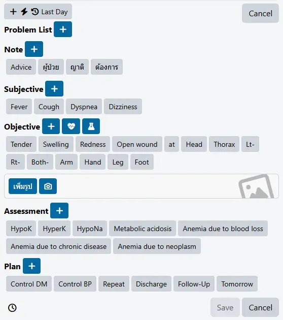

ท่านสามรถคลิกที่ปุ่มข้อความ เพื่อเพิ่ม Progress Note หรือคลิกที่ปุ่ม <i class="fas fa-plus" style="color:orange;"></i> เพื่อเพิ่มกล่องข้อความเปล่าก็ได้

ปุ่มทางลัด ได้แก่
- <i class="fas fa-plus" style="color:orange;"></i> <i class="fas fa-bolt" style="color:orange;"></i> <i class="fas fa-arrow-rotate-left" style="color:orange;"></i>`Last Day`: นำ Progress Note ของเมื่อวาน มาเป็นต้นแบบ เพื่อแก้ไข และใช้ในวันนี้
- <i class="fas fa-heart-pulse" style="color:orange;"></i> : เปิดหน้าต่าง เพื่อเลือกรายการ Vital Sign มากรอก
- <i class="fas fa-flask" style="color:orange;"></i> : เปิดหน้าต่าง เพื่อเลือกรายการ Lab มากรอก

## การเพิ่ม One Day Order
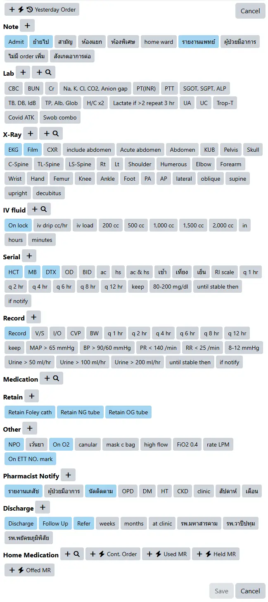

ท่านสามรถคลิกที่ปุ่มข้อความ เพื่อเพิ่ม One Day Order (ปุ่มสีฟ้า จะเปิดกล่องข้อความใหม่, กล่องสีเทา จะต่อข้อความในกล่องล่างสุด) หรือคลิกที่ปุ่ม <i class="fas fa-plus" style="color:orange;"></i> เพื่อเพิ่มกล่องข้อความเปล่าก็ได้

ปุ่มทางลัด ได้แก่
- <i class="fas fa-plus" style="color:orange;"></i> <i class="fas fa-magnifying-glass" style="color:orange;"></i> : เปิดหน้าต่าง เพื่อค้นหา
- <i class="fas fa-plus" style="color:orange;"></i> <i class="fas fa-bolt" style="color:orange;"></i> <i class="fas fa-arrow-rotate-left" style="color:orange;"></i>`Yesterday Order`: นำ One Day Order ของเมื่อวาน มาเป็นต้นแบบ เพื่อแก้ไข และใช้ในวันนี้
- <i class="fas fa-plus" style="color:orange;"></i> <i class="fas fa-bolt" style="color:orange;"></i>`Cont.Order`: นำ Continuous Order ในส่วน Current Medication และ Current Injection มาเป็น Home Medication
- <i class="fas fa-plus" style="color:orange;"></i> <i class="fas fa-bolt" style="color:orange;"></i>`Used MR`: นำ Med Reconciliation ที่ `สั่งใช้` ทั้งหมด มาเป็น Home Medication
- <i class="fas fa-plus" style="color:orange;"></i> <i class="fas fa-bolt" style="color:orange;"></i>`Held MR`: นำ Med Reconciliation ที่ `Hold` ทั้งหมด มาเป็น Home Medication
- <i class="fas fa-plus" style="color:orange;"></i> <i class="fas fa-bolt" style="color:orange;"></i>`Offed MR`: นำ Med Reconciliation ที่ `ไม่สั่งใช้` ทั้งหมด มาเป็น Home Medication

`Pharmacist Notify` ใช้สำหรับบันทึกการปรึกษาเภสัชกร  
ระบบ จะให้เภสัชกรลงนามรับรายการ เฉพาะ Order ที่เป็นยา และ `Pharmacist Notify` เท่านั้น  
โดยระบบ จะแจ้งเตือนไปยัง [รอรับใบสั่งยา (เภสัชกรรม)](../ipd/order-pharmacy.md) หลังจากยืนยันรายการแล้ว

## การเพิ่ม Continuous Order
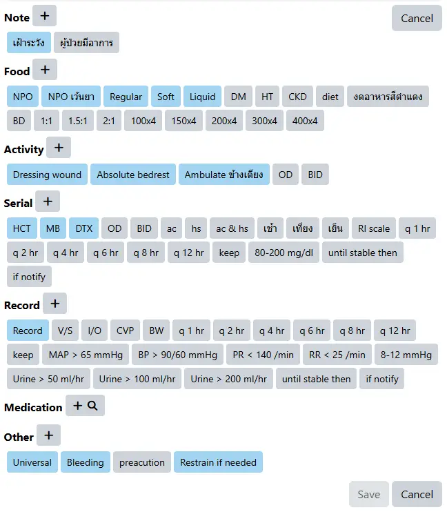

ท่านสามรถคลิกที่ปุ่มข้อความ เพื่อเพิ่ม Continuous Order (ปุ่มสีฟ้า จะเปิดกล่องข้อความใหม่, กล่องสีเทา จะต่อข้อความในกล่องล่างสุด) หรือคลิกที่ปุ่ม <i class="fas fa-plus" style="color:orange;"></i> เพื่อเพิ่มกล่องข้อความเปล่าก็ได้

ปุ่มทางลัด ได้แก่
- <i class="fas fa-plus" style="color:orange;"></i> <i class="fas fa-magnifying-glass" style="color:orange;"></i> : เปิดหน้าต่าง เพื่อค้นหา

## การรับคำสั่งแพทย์
* `ระบบงานปกติ` ได้แก่ แพทย์ <i class="fas fa-circle-arrow-right"></i> พยาบาล <i class="fas fa-circle-arrow-right"></i> ห้องยา
    1. แพทย์ยันยันคำสั่ง

    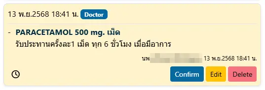

    2. พยาบาลรับรายการ

    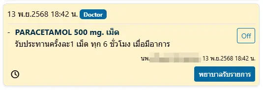

    3. ห้องยารับรายการ

    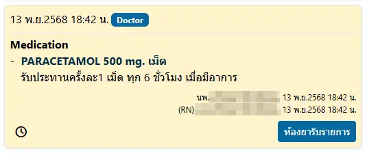

    4. ห้องยาตรวจสอบ

    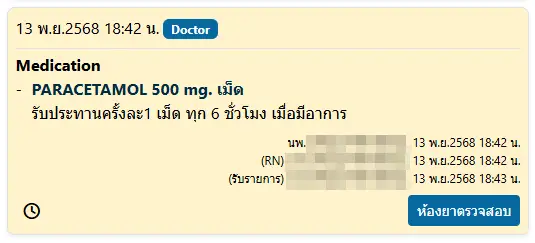

    5. ห้องยาจ่ายยา

    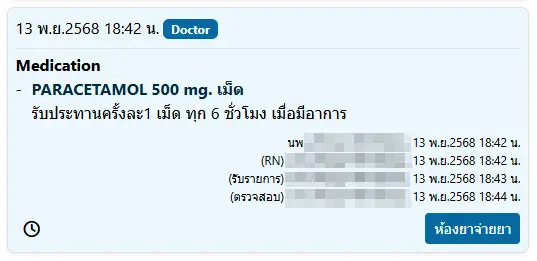

    6. สำเร็จ (มุมมองห้องยา)

    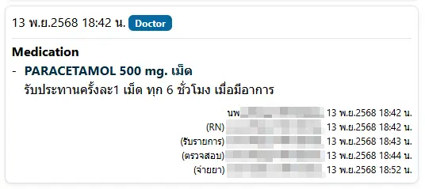

    มุมมองพยาบาล

    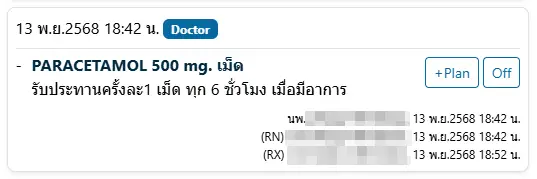

* `ระบบงาน รคส` ได้แก่ พยาบาล <i class="fas fa-circle-arrow-right"></i> แพทย์ <i class="fas fa-circle-arrow-right"></i> ห้องยา
    1. พยายาลระบุแพทย์ที่ รคส

    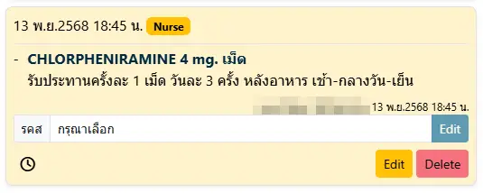

    2. แพทย์ยืนยัน รคส

    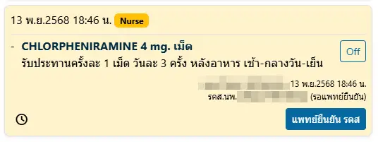

    3. ห้องยารับรายการ

    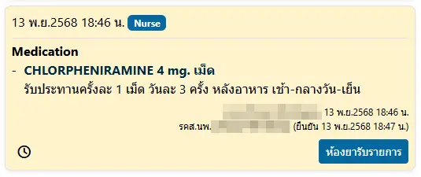

    4. ห้องยาตรวจสอบ และจ่ายยา (เช่นเดียวกับระบบงานปกติ)

`ระบบงานปกติ` ห้องยาสามารถรับรายการ ได้ก่อนที่พยาบาลจะรับรายการ  
`ระบบงาน รคส` ห้องยาสามารถรับรายการ ได้ก่อนที่แพทย์จะยืนยัน รคส  
ทั้งนี้ ขั้นตอนการบันทึก ขึ้นอยู่กับนโยบายของแต่ละโรงพยาบาล

