# ระบบ Screen ใบสั่งยา และค้นประวัติการสั่งยาใน HOSxP

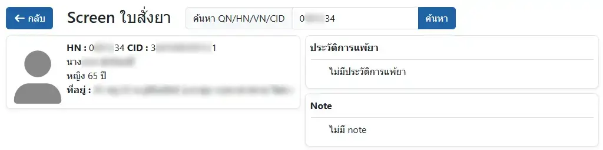

ท่านสามารถค้นหาใบสั่งยาใน HOSxP ด้วยการระบุ QN, HN, VN หรือ เลขประจำตัวประชาชน (CID) แล้วคลิก `ค้นหา` หรือกดปุ่ม Enter

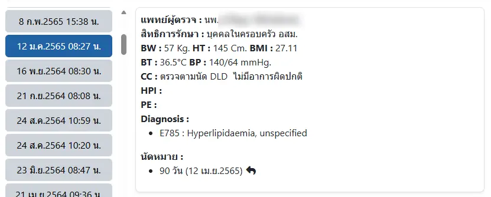

หลังจากค้นหา จะได้รายการใบสั่งยา เรียงตามวันที่และเวลา จากใหม่ ลงไปหาเก่า

ระบบจะนำใบสั่งยาล่าสุด มาแสดงรายละเอียดให้อัตโนมัติ ซึ่งท่านสามารถเลือกดูใบสั่งยาอื่นได้เช่นกัน

ในหัวข้อ `นัดหมาย` ท่านสามารถคลิกที่ <i class="fa-solid fa-reply" style="color:orange;"></i>

เพื่อไปยังวันที่รับบริการได้ (เฉพาะกรณีที่ผู้ป่วยมาตรงกับวันนัดเท่านั้น)

### รายการยา
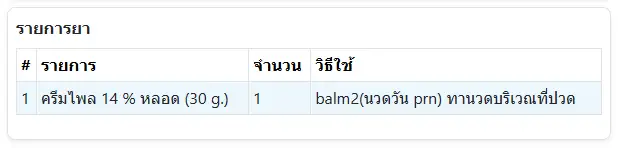

แสดงรายการยาในใบสั่งยา โดยหากเป็นยาใหม่ หรือเปลี่ยนวิธีใช้ ระบบจะแสดงด้วยพื้นหลังสีฟ้า

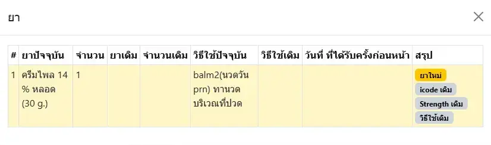

เมื่อคลิกที่รายการยา จะเปิดหน้าต่างแสดงรายการยาทุกตัว พร้อมข้อมูลการจ่ายยาชนิดเดียวกันครั้งล่าสุด เพื่อตรวจสอบและให้คำแนะนำได้ถูกต้อง

### Drug Interaction
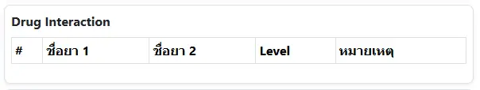

หากมีคู่ยา ที่มีอันตรกิริยาระหว่างกัน (drug interaction) ตรงตามที่บันทึกคู่ยาไว้ใน HOSxP ระบบจะนำมาแสดงไว้ที่นี้

### LAB
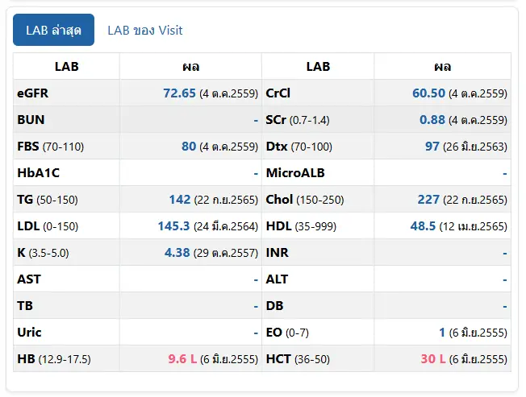

แสดงรายการ `LAB ล่าสุด` และ `LAB ของ Visit` ตามรายการที่เลือกไว้ในระบบ (กรุณาติดต่อผู้ดูแลระบบ หากต้องการเพิ่ม/ลดรายการ) 

ท่านสามารถคลิกที่ ค่าผลตรวจ (ตัวเลขสีน้ำเงิน)

เพื่อแสดงค่าผลตรวจดังกล่าวในอดีต ในรูปแบบกราฟเส้นได้ ดังรูป

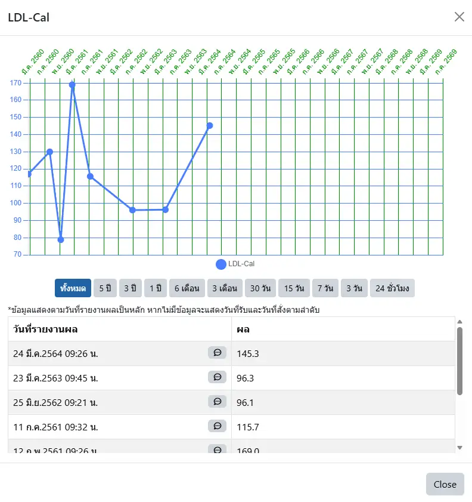

### ข้อความเตือนการใช้ยา
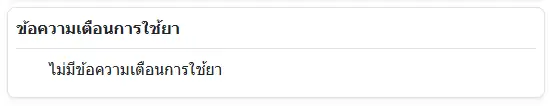

แสดงคำเตือนตามเงื่อนไข เช่น การใช้ยา NSAIDs, ACEIs, CCBs มากกว่า 1 ตัวยาในกลุุ่มเดียวกัน เป็นต้น (กรุณาติดต่อผู้ดูแลระบบ หากต้องการเพิ่ม/ลดเงื่อนไข) 

### บันทึกเวลาดำเนินการ
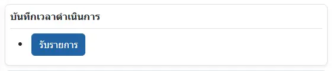

รองรับการบันทึกเวลาในการ รับรายการ ตรวจสอบ และจ่ายยา ของเจ้าหน้าที่ห้องยา (หากคลิกที่ ปุ่มอักษรสีแดง จะบันทึกเวลาของขั้นตอนนั้นๆ ใหม่ด้วยเวลาปัจจุบัน)

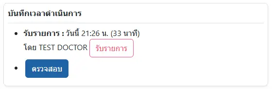

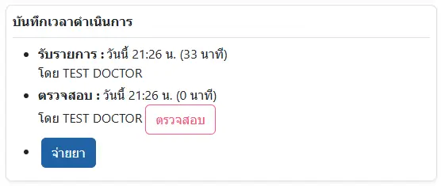

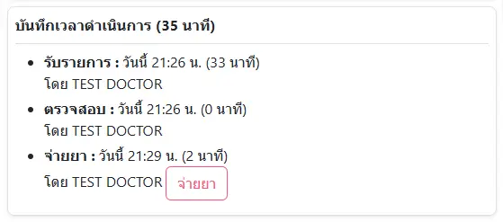

### บันทึกการส่งยาทางไปรษณีย์
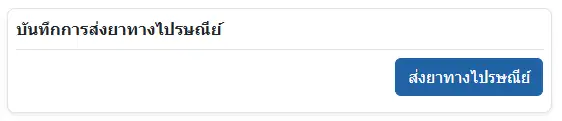

รองรับการบันทึก การส่งยาทางไปรษณีย์ (ส่ง/ไม่ส่ง) พร้อมเวลาและผู้บันทึก

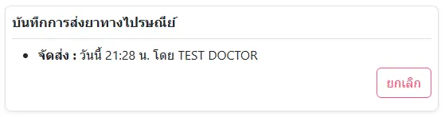

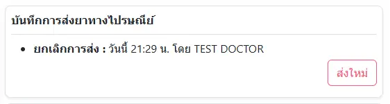

### อื่นๆ
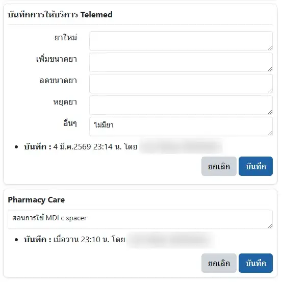

เช่น การบันทึกการปรับยา ระหว่างให้บริการ Telemed, การบันทึกการให้บริการทางเภสัชกรรม เป็นต้น