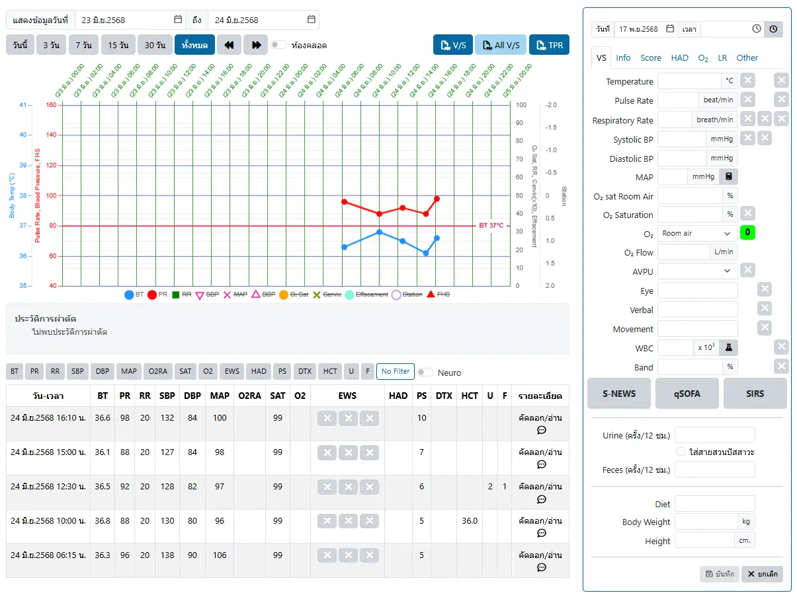
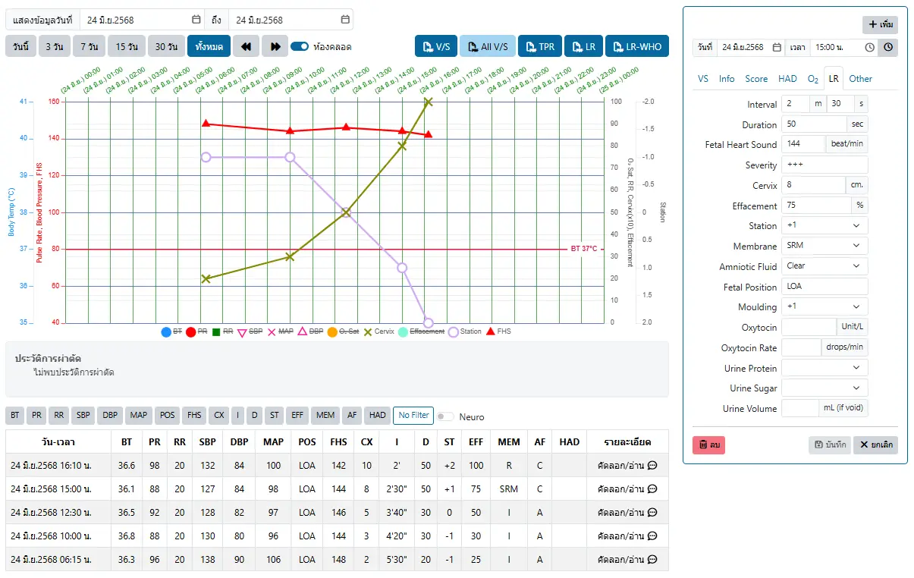
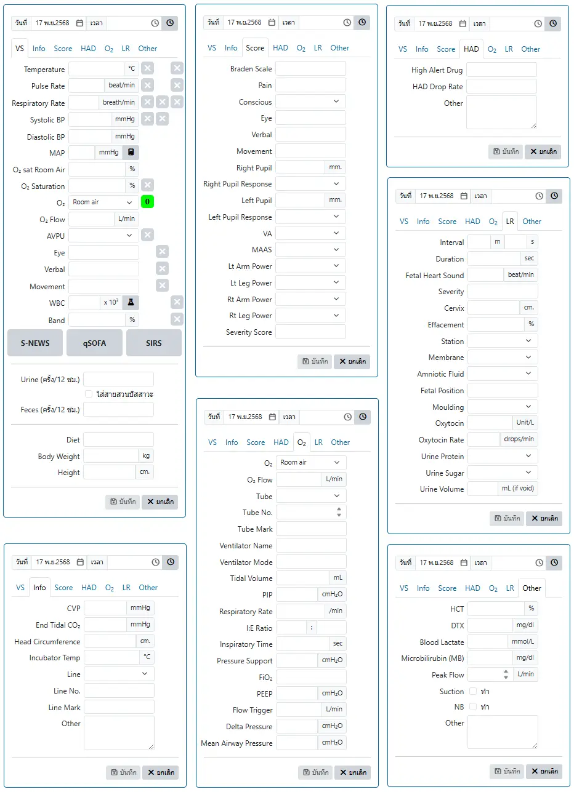
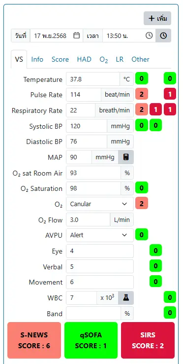

# บันทึกสัญญาณชีพ (Vital Sign)

ระบบสำหรับแสดงและบันทึกสัญญาณชีพ ประกอบด้วย 2 ส่วน
1. `การแสดงสัญญาณชีพ` : ที่ด้านซ้ายของระบบ สามารถเลือกช่วงเวลาแสดงผลได้ ประกอบด้วย 3 ส่วน ได้แก่
    * ส่วนควบคุม : สามารถเลือกช่วงวันที่แสดงข้อมูล การแสดงผลแบบปกติหรือแบบห้องคลอด และแสดงรายงานได้
    * กราฟแสดงสัญญาณชีพ : สามารถเลือก แสดง/ไม่แสดง กราฟที่ต้องการได้ ด้วยการคลิกที่รายการใต้กราฟ
    * ตารางแสดงสัญญาณชีพ : แสดงสัญญาณชีพ เรียงจากวัน-เวลาล่าสุด ลงไปตามลำดับ 
        - คลิกที่ปุ่มรายการ เช่น `BT`, `PR`, `RR`, `SBP` เหนือตาราง เพื่อกรองสัญญาณชีพที่ต้องการได้
        - คลิกที่รายการสัญญาณชีพ เพื่อเลือกแก้ไขสัญญาณชีพ
        - คลิกที่ `คัดลอก/อ่าน` <i class="fa fa-commenting-o" style="color:orange;"></i> เพื่อคัดลอกลง Clipboard และสามารถ วาง(Paste) ในโปรแกรมอื่นได้

    ตัวอย่างหน้าต่างสัญญาณชีพปกติ

    

    ตัวอย่างหน้าต่างสัญญาณชีพห้องคลอด

    

2. `บันทึกสัญญาณชีพ` : ที่ด้านขวาของระบบ (เฉพาะผู้มีสิทธิ์)
    - <i class="fa fa-plus" style="color:orange;"></i> `เพิ่ม` : เพิ่มรายการใหม่
    - <i class="fa fa-clock-o" style="color:orange;"></i> : ใช้วันที่และเวลาปัจจุบัน
    - <i class="fa fa-calculator" style="color:orange;"></i> : คำนวนจากค่าที่เกี่ยวข้อง เช่น MAP จาก SBP และ DBP
    - <i class="fa fa-flask" style="color:orange;"></i> : ค้นหารายการ Lab ที่ต้องการใช้ค่า WBC และ Band
    - <i class="fa fa-trash" style="color:red;"></i> `ลบ` : ลบรายการนี้
    - <i class="fa fa-save" style="color:orange;"></i> `บันทึก` : บันทึกรายการ
    - <i class="fa fa-times" style="color:orange;"></i> `ยกเลิก` : ยกเลิกการแก้ไข

    รูปแสดงกล่องบันทึกสัญญาณชีพ ทั้ง 7 กล่อง

    

    

    บางการประเมิน จะปรากฎในหลายกล่อง เช่น O₂, O₂ Flow, Eye, Verbal, Movement และ Other  
    การกรอกข้อมูลในกล่องใดกล่องหนึ่ง จะเปลียนแปลงข้อมูลในทุกๆกล่อง เพื่อความสะดวกในการใช้งาน
    

    ตัวอย่างการบันทึกสัญญาณชีพ เพื่อประเมิน Early warning sign, qSOFA และ SIRS score

    

    

    การประเมิน Early warning sign, qSOFA และ SIRS score แต่ละข้อคะแนน  
    ระบบจะแสดงคะแนนของ Early warning sign, qSOFA และ SIRS score ตามลำดับในกล่องสีทางด้านขวา  
    และรวมคะแนน ที่กล่องสีด้านล่าง
    
