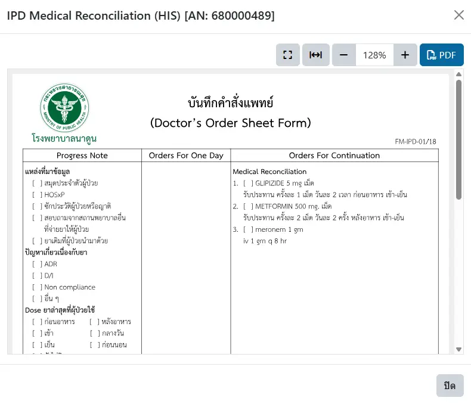

# ตัวอย่างรายงาน

แสดงเป็นกล่องโต้ตอบกับผู้ใช้งาน (Modal) เพื่อแสดงตัวอย่างรายงาน ที่สามารถย่อ/ขยายขนาด และดาวน์โหลดไฟล์ PDF ได้

ประกอบด้วย
* ชื่อรายงาน และรหัสของผู้ป่วย เช่น `AN` หรือ `VN`
* ปุ่ม <i class="fa fa-times" style="color:orange;"></i> ด้านบนขวา หรือปุ่ม `ปิด` ด้านล่างขวา สำหรับปิดกล่องโต้ตอบนี้
* เครื่องมือ เรียงลำดับจากซ้ายไปขวา ได้แก่ 
    - ปุ่มแสดงกล่องตอบโต้แบบเต็มจอ/ขนาดปกติ
    - ปุ่มคำสั่งให้แสดงรายงานเต็มความกว้างของกล่องตอบโต้
    - ปุ่มลด/เพิ่มขนาดรายงาน
    - ปุ่ม <i class="fa fa-file-pdf-o" style="color:orange;"></i> `PDF` สำหรับดาวน์โหลดรายงาน
* หน้าต่างรายงาน สามารถเลื่อน ขึ้น/ลง/ซ้าย/ขวา เพื่อดูรายงานแต่ละส่วนได้